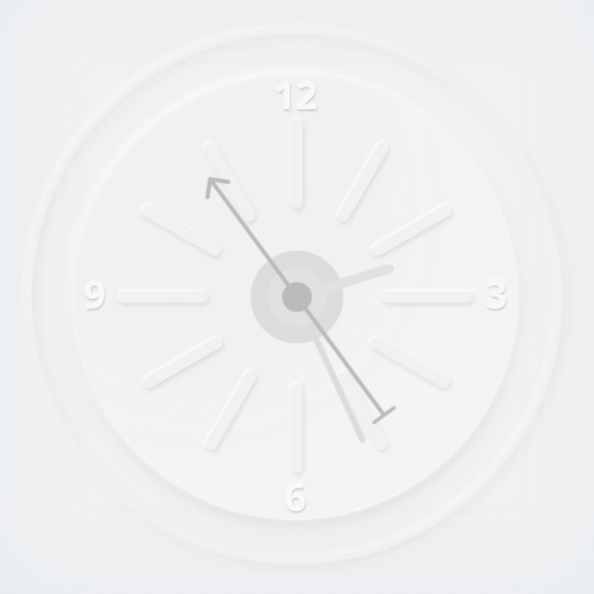

# An Analog Clock

Clocks show up everywhere in HMIs, and happen to be simple to create in **Incari**.

Load up the '**Analog Clock**' project file from **Incari Hub**. The included scenes are a version with a ticking animation and a basic one.

Basic Version           |  Ticking Version
:-------------------------:|:-------------------------:
  |  

## 1. The Basic Version

Open the '**AnalogueClock**' project from the **Incari Hub** _Remote Projects_ tab. In the **Project Outliner** look for '**Basic**' and make sure its visibility toggle is active. You can press **Run** (`Ctrl+R`) to preview how the **Scene** looks.

Now we can dive into how it works. In the top menu bar, go to **View** -> **Logic Editor** if it isn't already visible. Double click '**Basic**' in the **Project Outliner** to load up the **Scene** **Logic**. Make sure the '**Basic**' tab is selected in the **Logic Editor** module- the **Project** **Logic** is explained later.

