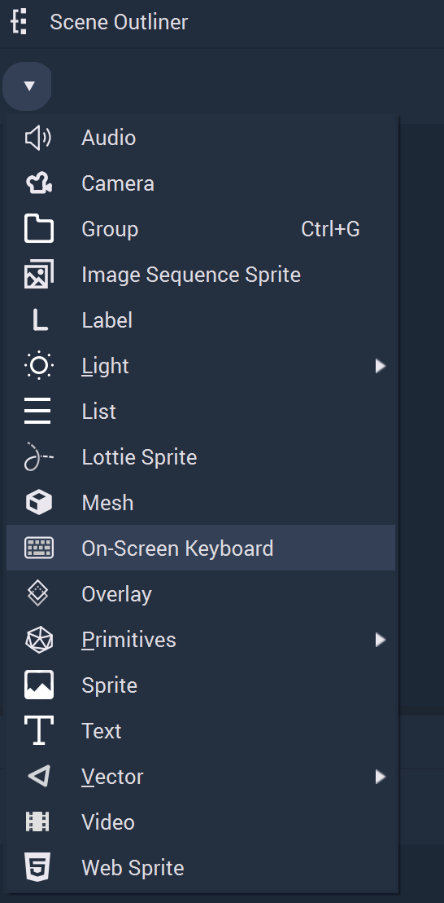
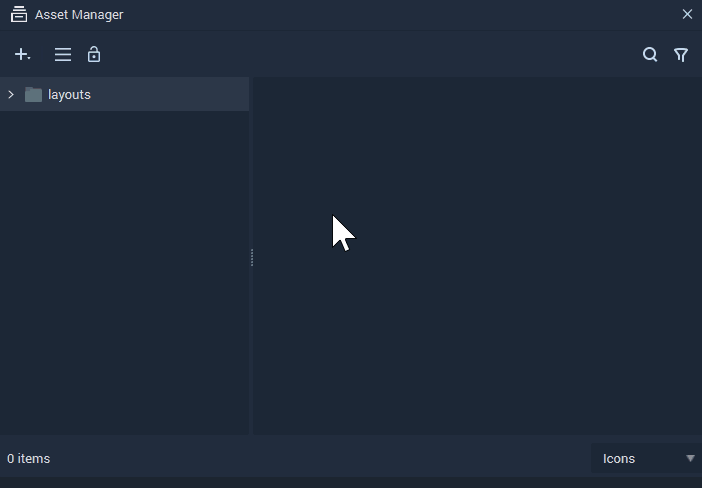
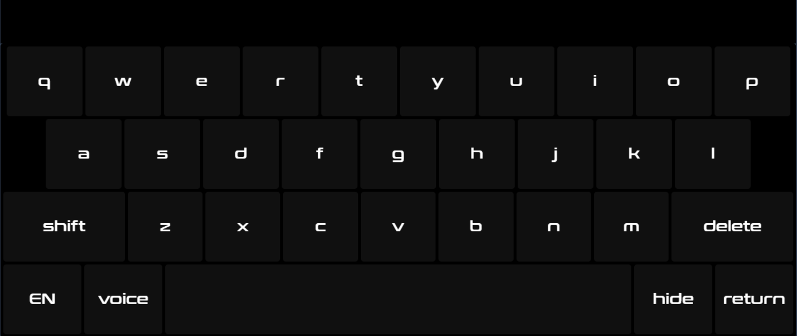
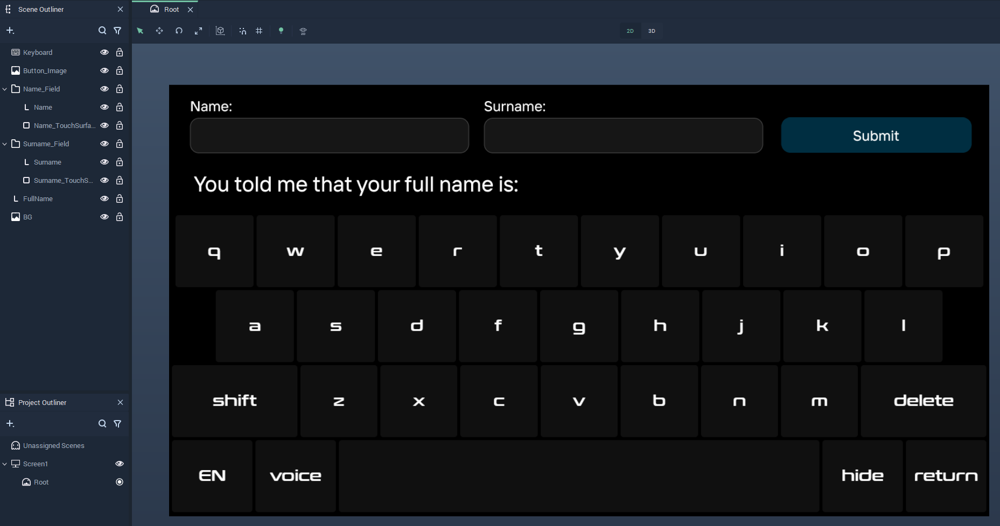
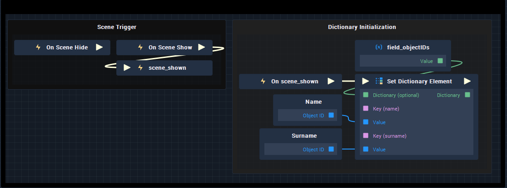
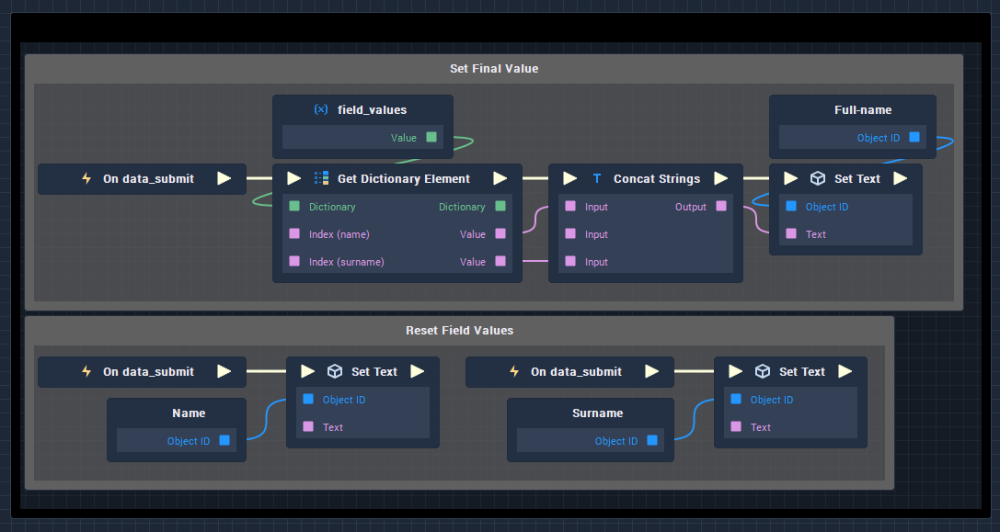

# Building a Custom Keyboard

## Overview 

In most applications that require user input, keyboards are a necessary component vital to the user. That is why, as a comprehensive *HMI* creation solution, **Incari Studio** comes pre-equipped with an [**On-Screen Keyboard**](../objects-and-types/scene-objects/3dobjects/onscreenkeyboard.md).

However, thanks to the advanced customization options in **Incari Studio**, it is now possible for one to configure their own keyboard. This takes things a step further and provides the opportunity for more personal and unique designs. 

This **Demo Project** aims to instruct on the following:

1. Providing more information on the **On-Screen Keyboard** in **Incari**.

2. Learning to modify a stock **On-Screen Keyboard** using the new **Layout** **Attribute**.

3. Clarifying how to alter its **Style** **Attribute** using *Cascading Style Sheets (CSS)*.


| :warning: | **Before you start** |
| --------- | -------------------- |

This **Demo Project** can be downloaded in the [**Hub**](../getting-started/first-steps/incari-hub.md#remote-projects)

## 1. Using the On-Screen Keyboard



Simply start by creating a new **On-Screen Keyboard Object** by following `Create > On-Screen Keyboard` in the **Scene Outliner**.

Click on this new **Object** and go to the **Attribute Editor**. Here one can see the **Object's** general **Attributes** as well as those which enable one to modify the `Layout`, `Style`, and `Text` properties of the **On-Screen Keyboard**.

To start with, set the size under `Size` to `x = 1366`, `y = 580` and `z = 1`. Also, for now, the `Layout` **Attribute** can be set to `English`.

## 2. Utilizing Custom Layouts

**Incari Studio** now supports custom layouts for **On-Screen Keyboard** **Objects**. First, create a `Keyboard Layout` **Asset** file called `english_custom` to utilize throughout the course of this project.



After creating the `layout`, a double-click will open up the **Code Editor** with the default layout. **Incari Studio** already handles the switch between *default*, *alt*, and *shift* layouts. So, if only a small change is required, one can utilize these predefined layouts.

To use these layouts with the **On-Screen Keyboard Object** that has just been created, they must be added to the **Project** in **Project** **Settings** under `Keyboard > Layout Manager`. After this step, simply select the newly added layout from the `Layout > Layout Family` selector under **Attribute Editor**.


### 1) Creating Custom Keys

To add Custom keys to your keyboard or change the way that stock buttons like `alt`, `backspace`, or `capslock` are rendered, you can simply do so by adding a definition under the `display` dictionary within the **Code Editor**.

For instance, in order to have the `Caps Lock` key rendered as `caps`,one would need to input the following code:

```
"display": {
  ...
  "{lock}": "caps",
  ...
}

```

Of course, this feature can be used to avoid duplicating hard-to-use symbols or *codepoints* throughout the layout. For instance, to use the symbol ⇪ for the `Caps Lock` key, you could simply add `{lock}` to your layouts and define it with a codepoint under the `display` dictionary as follows:

```
"{lock}": "&#xF223"
```

### 2) Creating Custom Sub-Layouts

Using the `custom_layouts` dictionary, one can add new sub-layouts and switch to them using custom keys. For any sub-layout “X”, adding a key named “showX” initiates the switch to the new sub-layout. Of course, this key can be rendered in any way seen fit by the designer.

For example, one might want to add a key to the default sub-layout that would make it switch to a German QWERTZ keyboard. This German keyboard would, in turn, have a key to show the abbreviation for the current English layout. Our code would look like this:

```
{   
    "default": [
        "[q w e r t y u i o p]",
        "[a s d f g h j k l]",
        "{shift} [z x c v b n m] {bksp}",
        "{showgerman} {voice} {space} {hide} {enter}"
    ],
    
    "shift": [
        "[Q W E R T Y U I O P]",
        "[A S D F G H J K L]",
        "{shift} [Z X C V B N M] {bksp}",
        "{showgerman} {voice} {space} {hide} {enter}"
    ],

    "display": {
    "{enter}": "return",
    "{bksp}": "delete",
    "{default}": "DE",
    "{showgerman}": "EN",
    "{voice}": "voice",
    "{shift}": "shift",
    "{showgerman_shift}": "shift",
    "{showgerman_fromshift}": "shift",
    "{hide}": "hide"
    },

    "custom_layouts": {

      "german": [
        "[q w e r t z u i o p ü]",
        "[a s d f g h j k l ö ä]",
        "{showgerman_shift} [y x c v b n m ß {bksp}",
        "{default} {voice} {space} {hide} {enter}"
      ],
      "german_fromshift": [
        "[q w e r t z u i o p ü]",
        "[a s d f g h j k l ö ä]",
        "{showgerman_shift} [y x c v b n m ß] {bksp}",
        "{default} {voice} {space} {hide} {enter}"
      ],
      "german_shift": [
        "[Q W E R T Z U I O P Ü]",
        "[A S D F G H J K L Ö Ä]",
        "{showgerman_fromshift} [Y X C V B N M ß] {bksp}",
        "{default} {voice} {space} {hide} {enter}"
      ]
    }
}

```

## 3. Styling the Keyboard

As the last step in making the **On-Screen Keyboard** a unique design, **Incari Studio** enables the user to use *CSS* files to customize the look and feel. To start, simply create a *CSS* file in the **Asset Manager** and drag it to the `Style` **Attribute** of the **On-Screen Keyboard Object** in the **Attribute Editor**.

To make styling as easy as possible, **Incari Studio** uses the same class-naming convention as the widely used open-source project [Simple-Keyboard](https://virtual-keyboard.js.org/). Some of the fundamental class names are:

* `.simple-keyboard`: Keyboard container.

* `.hg-row`: Keyboard rows.

* `.hg-button-container`: Groups the buttons between the brackets.

* `.hg-button`: Keyboard buttons.

* `.hg-standardBtn`: Non-function buttons (e.g. letters, numbers).

* `.hg-functionBtn`: Function buttons, wrapped in curly braces in layouts.

* `.hg-button-X`: The custom class for a button represented as `{X}` within the layout file.

For all these classes, standard *CSS state selectors* are applicable. So, after adding a few simple classes we can create ourselves a good-looking custom keyboard! Here’s a sample style:


```
.simple-keyboard{
    background: black !important;
}

input{
    background: black !important;
    color: white !important;
    height: 75px;
    font-size: 36px
}

.hg-row{
    height: 120px;
    display: flex;
    flex-direction: row;
    justify-content: space-between;
}

.hg-button-container{
    width: 100%;
    display: flex;
    justify-content: center;
}

.hg-button{
    height: 100% !important;
    background: #161616BB !important;
}

.hg-button:hover{
    background: #303030 !important;
}

.hg-button:active{
    transform: scale(0.99);
}

.hg-button>span{
    color: white;
    font-size: 25px
}

.hg-standardBtn {
    width: 100%;
    max-width: 130px;
}

.hg-functionBtn{
    width: 300px;
}

.hg-button-space{
    max-width: 800px;
    min-width: 800px;
    width: 800px !important;
}

```



## 4. Adding Logic to Our Keyboard

After having created a styled *On-Screen Keyboard* with its custom `layout` settings, it can now be used to dynamically alter the content on our screen. To demonstrate, one can start with a simple form. First, to make room for the extra content that will be added, resize our **Screen** in **Project Outliner** by changing the attribute `Size` to `x= 1366, y=720` from within the **Attribute Editor**. 

Then, add the file `background.png` from the **Asset Manager**. After that, set the `Sort Index` for the **On-Screen Keyboard** to `1`, and the `Position` attribute to `x=0, y=-105, z=1`.

In order to get rid of the input field that is no longer needed, update the type `input` of the *CSS* file as follows:

```
input{
  display: none
}
```

Next, add `button.png` from the **Assets** and set its `Position` **Attribute** to `x=495, y=276, z=1`. Finally, to finish up on the front-end, add three **Label** elements from the **Scene Outliner** using `Label` with the following **Attributes**:

1. `Size: x=400, y=42, z=1`, `Position: x=-430, y=275, z=2`,

2. `Size: x=400, y=42, z=1`, `Position: x=60, y=275, z=2`,

3. `Size: x=500, y=42, z=1`, `Position: x=170, y=194, z=2`.

Additionally, for all three of them, `Sort Index` should be set to `2`, `Font Color` to `#FFFFFFFF`, and `Font size (px)` to `36`. 

Also, in order to register the clicks to their respective text fields, it is necessary to add two touch surfaces. This can be done by grouping **Vector** elements with each of the previously created **Labels** and setting their properties as:

1. `Size: x=460, y=60, z=1`, `Position: x=-415, y=275, z=3`, `Opacity=0.0`, `Sort Index=3`

2. `Size: x=460, y=60, z=1`, `Position: x=75, y=275, z=3`, `Opacity=0.0, Sort Index=3`

The end result should look like this:



We can now start adding **Logic**! The **Logic** for this **Project** will be composed of three parts:

1. Initialization

2. Field Selection

3. Form Submission

4. Data Manipulation

| :information\_source: | **Logic Tip** |
| --------------------- | --------------------- |

It is always a good idea to divide **Logic** into smaller chunks using **Groups**. To toggle them, simply select a few **Nodes** and click `Ctrl + G`. To quickly understand the function of a **Group**, you can also assign specific colors to specific functions like initialization, value setters, and so on.

### 1) Initialization

In **Incari Studio**, the recommended way for working with *async* events is to use custom **Events** as they make for a neater **Logic** that is easier to debug. Start by setting the trigger for `Scene Show` and put the `Object ID` values for the **Text** **Objects** into a **Dictionary** **Object** for easier access later on.



### 2) Field Selection

In this stage, in order to know which **Text** **Object** to edit, there needs to be a way of knowing the field selected. By using a **Variable** called `selected_field`, it is possible to keep track of this. Also, to have a way of knowing the value of the fields at any time, simply create another **Dictionary** called `field_values`.


### 3) Form Submission

In order to know when the form is submitted, use another custom **Event** called `data_submit` that will eventually trigger the fourth stage of this guide. Triggering this will come from listening to either a mouse click or a press on the `Enter` key.


### 4) Data Manipulation

Finally, to reflect the gathered data on our screens, we are *concatenating* our two *strings* and setting the corresponding value to our **Text** **Object** called `Full-name`. Also, to get the form ready for next use, we are resetting the values of the `Name` and `Surname` **Text** **Objects**.




| :heavy_check_mark: | In Summary |
| --------- | -------------------- |

Using an **On-Screen Keyboard Object**, you created a custom input method quickly using **Incari Studio**! As the user's needs change, `layouts` can be added or removed while also adapting the **Logic** to fit each unique situation.
