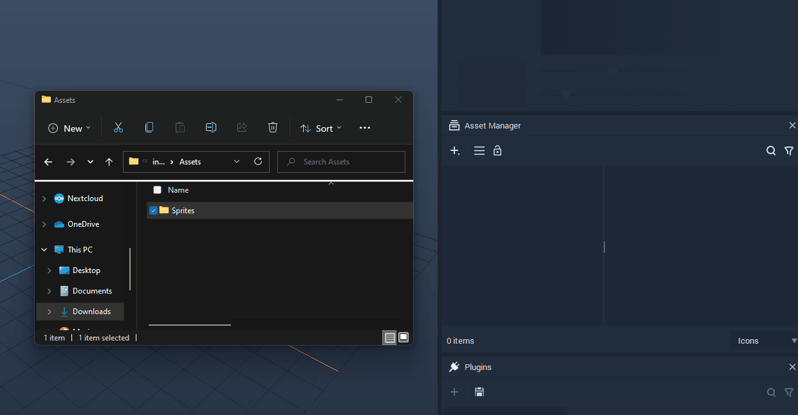
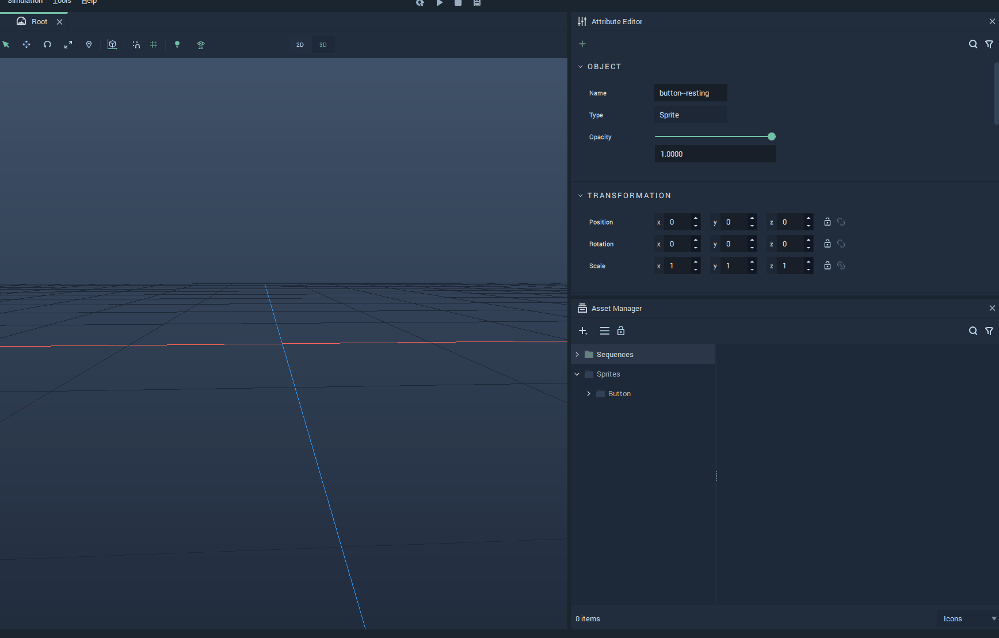
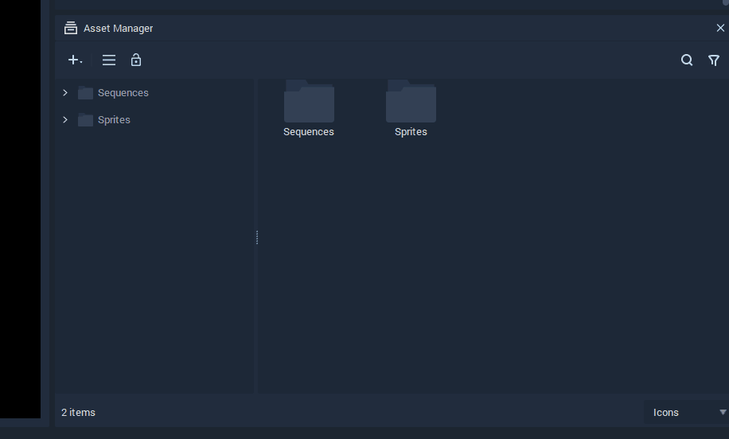
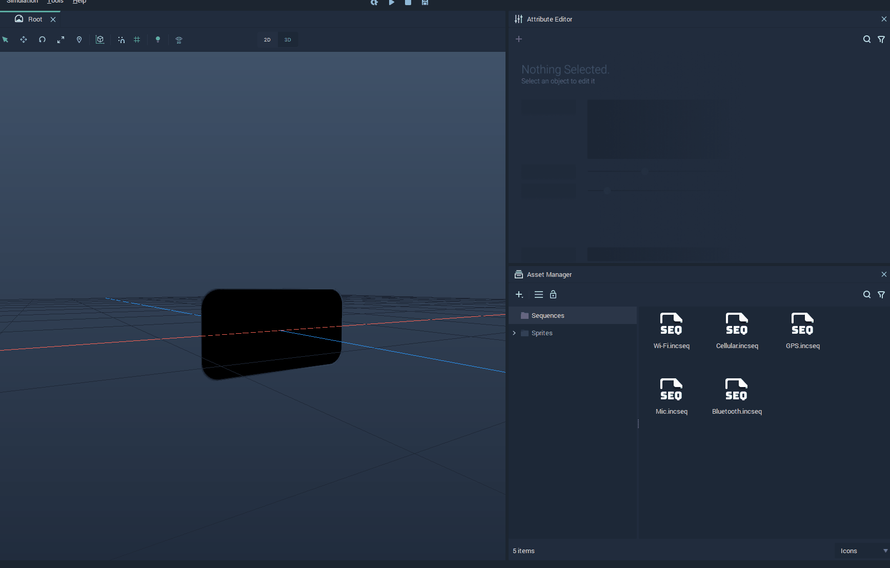
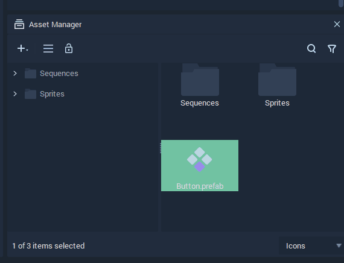
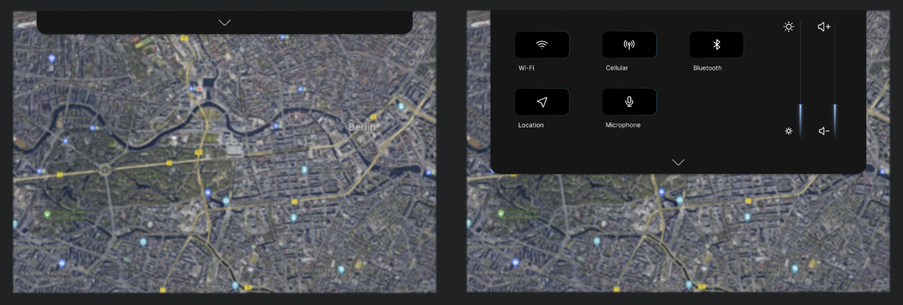
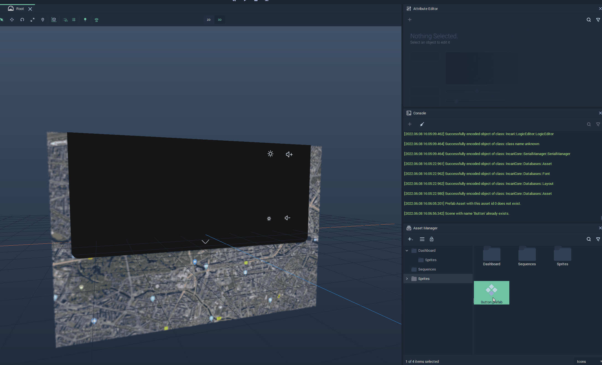
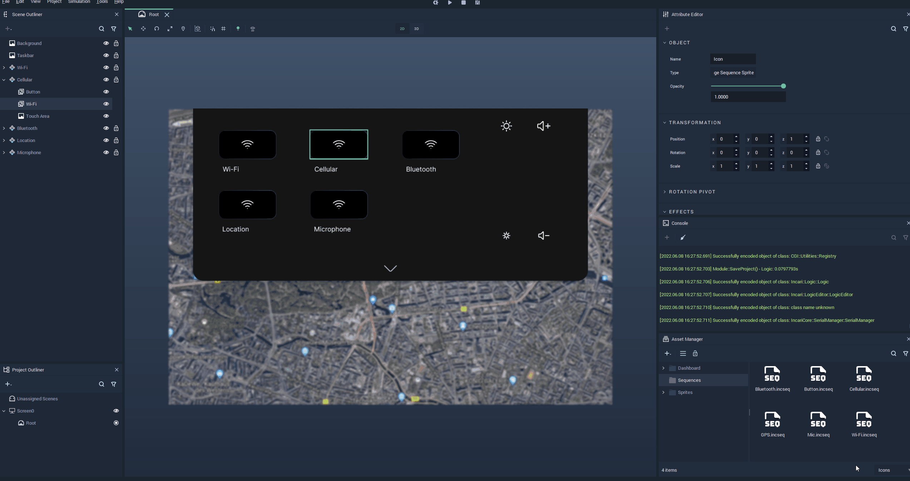
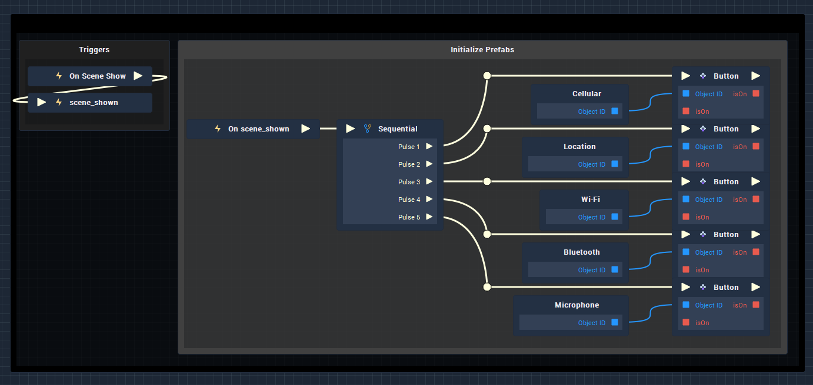

# Prefabs

In most *HMI* **Projects** you will create, the likelihood of having different variants of a component is quite high. Although this component can be anything from list items to search boxes, in this **Demo** we will be focusing on arguably the most prominent one: buttons.

## Overview

As part of this **Project** you will:

1. [Create a simple button in **Incari Studio**.](#1-creating-a-simple-button)

2. [Turn your basic button into a customizable **Prefab** with **Logic**.](#2-building-your-prefab)

3. [Use **Prefabs** to build a complex **Project** with just a few clicks.](#3-using-prefabs-to-build-complex-projects)

| :information_source: | **What is a Prefab?** |
| -- |:---|

 A **Prefab** in **Incari Studio** is a reusable component that encompasses its own **Logic**, design, and behavior independently from the rest of the **Project**. This means they can be transferred between **Projects** and take many shapes. For more information, see [**Prefabs**](../objects-and-types/prefabs/README.md).

<!--**Before you Start**-->

| :warning: | **Before you start** |
| -- |:---|

In order to follow along with this guide, you will need to be running **Incari** **Studio** version 2022.1 or higher. [Download now](https://www.incari.com/incari-studio/). Also, to follow along, you can download the **Assets** folder for this project using this [link](https://repo.incari.com/incari/prefabs/-/archive/master/prefabs-master.zip?path=Assets).

The fully functional **Project** is available in **Incari Hub** under *Remote Projects*. To start from scratch, keep following from here. 
## 1. Creating a Simple Button

Imagine a generic, rounded rectangle button that can have multiple different icons in the middle—something you would see in a lot of *HMI* systems. This can even be used to build a custom keyboard—although there is already a customizable [**On-Screen-Keyboard** **Object**](..) in **Incari**, so there is no need.

Our button will have three states: **'Resting'**, **'Hover'**, and **'Pressed'**.

For this **Demo**, we need 5 different buttons: *Wi-Fi*, *Bluetooth*, *Cellular*, *GPS*, and *Mic*. This is a common layout that you might see everywhere from your phone to your car. These are the final buttons we want to have:

### 1) Creating the Project

Open **Incari Hub** and [create a **Project**](../getting-started/first-steps/creating-a-project.md) using the default parameters. After all is complete, you should be presented with the **Incari Studio** start screen.

### 2) Importing the Assets

After exporting the files you downloaded, go to the **Asset Manager** to import them into your **Project**.

### 3) Creating Image Sequences

One of the simplest ways of creating different states for an image is using [**Image Sequences**](../toolbox/events/imagesequence/README.md). In your **Project's** **Assets** folder, you will find them pre-created —and should you wish, you can skip this step. But just to demonstrate how easy it is to create them, let’s make one for the Wi-Fi icon.

### 4) Creating a Prefab
To create a new **Prefab**, in this case one called **'Button'**, simply right-click on the **Asset Manager** and select `Create Asset > Prefab`.

### 5) Creating our Button

After creating your **Prefab**, double-click on it to open the editor. To add **Assets** to the **Scene**, simply drag them from the **Asset Manager** to the **Scene**. First, we will add the button backgrounds **Image Sequence** ('Button.incseq'). This way, we can later modify its state on hover.

Lastly, add an icon (let’s use Wi-Fi for the first one) and set its `sort index` to 3, so that it’s on top of everything else. Changing its name to Icon from the **Scene Outliner** is also a good way to make sure it stays common.

## 2. Building Your Prefab

### 1) Animating the Prefab with Logic

Open the **Logic Editor** through `View > Logic Editor`.

Let’s start by creating the **Logic** for the **'Hover'** and **'Resting'** states.

When the button is pressed, it will automatically scale down and up:

And lastly, when we click our button it will change the state of the icon, negate the corresponding variable, and output the new value.

Which leaves us with this as the end result:

### 2) Export Your Prefab

Now, in order to use it in different **Projects** and to collaborate with others, let’s export our **Prefab**. This can be done by right-clicking the **Prefab** in the **Asset Manager** and selecting `Export Prefab`.

## 3. Using Prefabs to Build Complex Projects

The real power of **Prefabs** lies in that you can use them again and again in different contexts. Using the **Prefab** we have just created, let’s build a simple control panel. It should take only a few drag and drops to build this fairly generic dashboard:

This **Project** uses the **Assets** from the *Dashboard* folder of the provided files. After adding our map and taskbar backgrounds, we can drag our **Prefabs** from the **Asset Manager** to the **Scene**.

After adding all **Prefabs** to the **Scene** and placing them in their respective locations, add the appropriate icons for each of them from the **'Sequences'** folder.

| :warning:| After all is done, do not forget to initialize your **Prefabs**!|
|---------|:------------------------------------------------------------------|

Finally, let’s add a slide-in animation for the taskbar —and we’re done!

Let’s see it in action!

| :grey_exclamation:| |
|------------------|:---------------------------------|

Using our Prefabs, we managed to create a dashboard in mere minutes using **Incari Studio**. As your **Prefab** library grows, building complex projects for any need will only get quicker!

