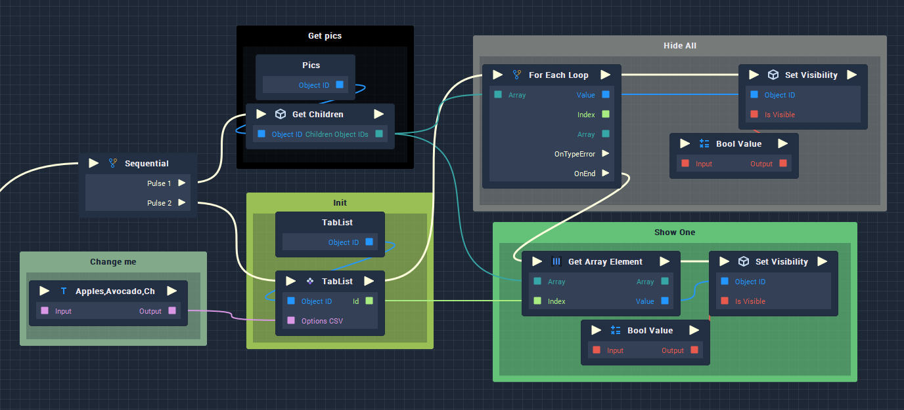
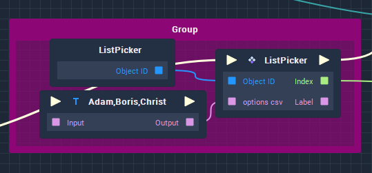
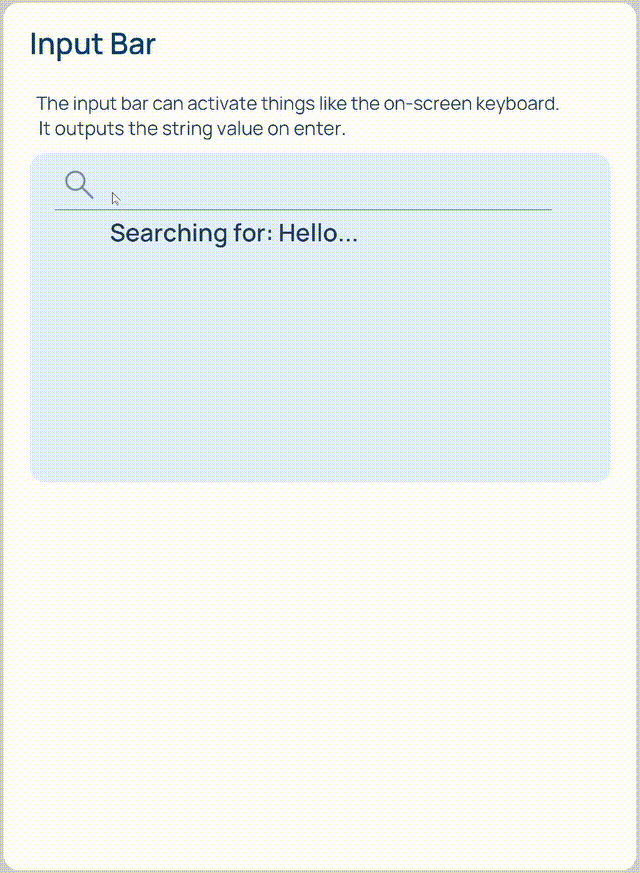
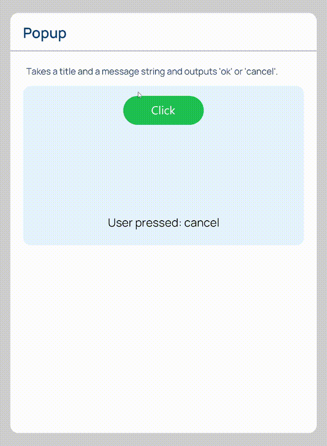

# Widgets

*Graphical widgets* are a cornerstone in building *User Interfaces*. One approach for building *widgets* in **Incari** is to use **Prefabs**, which are reusable components that can be adjusted accordingly for particular cases. See [**Prefabs**](../objects-and-types/prefabs/README.md) for a detailed description of **Prefabs** and their use.

This **Demo Project** is a showcase of several common *widget* types and how they can be connected to sources of data. It is composed of ten [**Scenes**](../objects-and-types/project-objects/scene.md), each of them showing one major *widget* type. 

To choose which **Scene** to show, use the numerical keys $$1-10$$ on the keyboard.

For each **Scene**, the resulting *Interface* is shown and the **Logic** used is explained.

The included **Scenes** are:

<!-- no toc -->
1. [**Buttons**](#1.-buttons)
2. [**Slider**](#2.-slider)
3. [**Tabs**](#3.-tabs) 
4. [**Progress Bar**](#4.-progress-bar)
5. [**List Picker**](#5.-list-picker)
6. [**Dropdown**](#6.-dropdown)
7. [**Input Bar**](#7.-input-bar)
8. [**Media**](#8.-media)
9. [**Sidebar**](#9.-sidebar)
10. [**Popup**](#10.-popup)

## **1. Buttons**

This **Scene** has two buttons implemented through **Prefabs**: 

* `TextButton`: A button that receives as input the text that it will show. When pressed, it changes its shade of green for an instant and activates a **Pulse** in the **Logic**. In this case, it is implemented as a counter.

* `RadioButton`: A button with two states: *on* and *off*. It outputs a **Boolean** indicating the current state and changes color accordingly. Here, it activates the *rotation* of a dot.

### Logic

#### **`TextButton` initialization**

This part of the **Scene** **Logic** initializes the `TextButton` button: 

* The event `buttons_init` is triggered when the **Scene** starts showing.
* The **Prefab Node** `TextButton` is triggered. In it, the text given is set on the button and the **Event Nodes** in the **Prefab Logic** are subscribed to.

#### **`RadioButton` initialization**

Here, `RadioButton` is initialized with the `buttons_init` **Event**. Remember that this **Event** is triggered when the **Scene** starts showing. It is also shown that the **Prefab Node** `RadioButton` outputs a **Boolean** indicating the current state of the button.

## **2. Slider**

This **Scene** shows a *slider* that can be set by clicking and dragging its indicator and a number between $$0$$ and $$1$$ representing the indicator's position.

### Logic

The *slider* is initialized when the **Scene** starts showing. For it, it needs as input the **Screen's** `Size` as a **Vector2**. 

Once initialized, the **Prefab Node** `SliderControl` outputs a **Pulse** and a **Float** between $$0$$ and $$1$$ each time the *slider* indicator is moved.

## **3. Tabs**

This **Scene** shows four *tabs*, each with a different *label* and an image. It allows the user to switch between *tabs* by clicking on their *label*. When this occurs, it changes the image and highlights the selected *tab*.

### Logic

The **Logic** for the `TabList` **Prefab** receives the list as a **String** with the options separated by commas and creates the *labels* for the *tabs*. It also includes the **Logic** for switching between *tabs* and it outputs the index of the selected *tab*, which is then used to display the corresponding image.

Each of the **Logic Groups** shown above has the following function:

* `Change me`: Includes the **String Value** **Node** with the list of *labels* that will be used for the *tabs*. They have to be given as *CSV* (*comma-separated values*). The default example is: `Apples,Avocado,Cheese,Coffee`.
* `Init`: Initialization of the `TabList` **Prefab Node**. This occurs automatically when the **Scene** starts showing. Moreover, the `TabList` **Prefab Node** is triggered each time a *tab* is clicked and outputs the `id` of the selected *tab*, which is then used to modify the **Scene's** interface.
* `Get pics`: This part of the **Logic** obtains the references to the pictures from the **Scene** and outputs them as an **Array**. The pictures must be included in the **Scene** in the `Pics` **Group**.
* `Hide All`: This part of the **Logic** sets the `visibility` of all the pictures to *false*. For this, it uses the **For Each Loop** **Node** to go through the **Array** and the **Set Visibility** **Node**. This is triggered from the **Prefab Node** each time a *tab* is selected.
* `Show One`: This part of the **Logic** gets triggered when the `Hide All` section finishes, obtains the `id` of the selected *tab* from the `TabList` **Prefab Node** and uses it to set the `visibility` of the corresponding image to *true*.
  

## **4. Progress Bar**

This **Scene** displays two **Instances** of the `ProgressBar` **Prefab**: one of them with its functionality implemented and the other one with its functionality waiting to be implemented

The `ProgressBar` displays the evolution of a value and it can take values only in the range $$[0,1]$$. It does this according to some data source that has to be provided as input. Its size is set with an input parameter.

### Logic

The `ProgressBar` **Prefab Node** requires the following parameters to be initialized:

* `Size` (**Vector2**): Size of the bar in pixels. 
* `Start value` (**Float**): The initial value, between $$0$$ and $$1$$.
* `Update value` (**Float**): This value must be negative in order to initialize.
* `Jump duration` (**Float**): The time it takes to animate between two values.

After initialization, the **Prefab Node** can be triggered with just one of the parameters and it will update it.

To animate between distant values, *true* should be given to the `jump` **Input Socket**. This will create a *tweening animation*.

When updated, the `ProgressBar` **Prefab Node** will output the new value.

## **5. List Picker**

This **Scene** displays a list of up to $$6$$ options, which have to be given to the **Prefab Node**. The list's functionality consists of allowing the user to choose an item of the list and it then highlights the chosen option and shows an image linked to this option. 

### Logic

The `ListPicker` **Prefab Node** receives a **String** with the options and generates the list with them. They can be up to $$6$$ and are given through a **String Value** **Node** and must be formatted as *CSV* (*comma-separated values*). Any time an option in the list is selected, it outputs the selected index (`Index`) and its corresponding label (`Label`).

## **6. Dropdown**

This **Scene** shows a *dropdown menu* where the options to show must be provided by the user. It takes up to $$6$$ options and they should be given in a **String** as *CSV* (*comma-separated values*).

### Logic

The `Dropdown` **Prefab Node** receives a **String** with the list of options and generates the *dropdown menu* with them. They can be up to $$6$$ and are given through a **String Value** **Node** and must be formatted as *CSV* (*comma-separated values*). Later on, these options can be updated by triggering again this **Node**. Any time an option in the *dropdown* is selected, it outputs the selected index (`idx`) and its corresponding label (`Label`).

## **7. Input Bar**

This **Scene** displays a bar in which the user can input text. The **Prefab Node** then outputs the inputted text, allowing for it to be used to search among data.

### Logic

The `SearchBar` **Prefab** is designed to work together with the **On-Screen Keyboard**, from which the characters inputted by the user will be obtained.

To initialize the `SearchBar` **Prefab Node**, the **String** has to be passed to it in the `Input Char` **Input Socket**. This will set the node to its `Active` state, trigger the **Output Pulse** once, and output *true* from the `Active` **Output Socket**.

Once the `SearchBar` **Prefab Node** has been initialized, subsequent inputs of *characters* through the `Input Char` **Input Socket** will update the text field that is displayed on the **Scene**. The **Prefab Node** has not output at this stage.

Then, when pressing `Enter` on the **On-Screen Keyboard** will cause the **Prefab Node** to trigger its **Output Pulse** and give two outputs:

* *False* from the `Active` **Ouput Socket**. The intention of this **Boolean** is for it to be used to trigger changes in the interface such as the `visibility` of the **On-Screen Keyboard**.
* A **String** that concatenates all the inputted *characters* from the `Value` **Output Socket**. This can then be used in subsequent **Logic**.

## **8. Media**

This **Scene** includes two widgets implemented as **Prefabs**: `MediaPlayer` and `MediaControls`. They are designed to work together and they are designed to control a group of **Media Objects**.

### Logic

To initialize the `MediaControls` **Prefab Node**, the **String** `init` should be given to the `StateUpdate` **Input Socket**. Then, the `MediaControls` will be ready to use.

A click on one of the buttons will make the **Prefab Node** to output a **Pulse** together with a label of which button was clicked: `play`, `pause`, `next`, or `prev`. This is then used on `MediaPlayer`.

To update the state of the play button (for it to show either play or pause), `playing` or `paused` is passed to the `StateUpdate` **Input Socket**.

Before initializing the player, a list of **Media Objects** references has to be given. The `MediaPlayer` **Prefab Node** accepts this data as a stringified JSON **Array**.

An example workflow for achieving this:

1. Create **Video Objects** in the **Scene** and put them all in a **Group**.
2. Drag and drop this **Group** into the **Logic Editor**. A **Node** will be created.
3. Connect the newly created **Node** to a **Get Children** **Node**.
4. Create a **JSON Stringify** **Node** and connect to it the output **Array** from the **Get Children** **Node**.
5. Connect the **Conversion** **Node** that was automatically created.
   
This **Logic** configuration is shown in the image below under `init video array`.

The **String** that is obtained from this **Logic** configuration should then be connected to the `MediaPlayer` **Prefab Node** in the `vidList` **Input Socket**.

Now, to initialize the player, an `init` **String** has to be given to the `command` **Input Socket** of the **Node**. Once this has been done, the following commands can be given: `play`, `pause`, `next`, `prev`.

Finally, the two **Prefab Nodes** are connected via **Events**:

1. Clicking one of the buttons makes `MediaControls` to output a command. This triggers an **Event**, which carries the command and gives as **Input** to the `MediaPlayer` **Prefab Node**.
2. The `MediaPlayer` **Prefab Node** receives this command, carries out the desired action and outputs the current state (`playing` or `paused`), which triggers another **Event** that then carries this command back to the `MediaControls` **Prefab Node**, which on receiving it updates the button displayed.

## **9. Sidebar**

This **Scene** displays a sidebar menu with four options, each with its own icon. It allows the user to switch between these options and highlights the current one.

### Logic

The sidebar works identically to the tab selector, except there is no list of labels to give as input.

To change the icons, change `Diffuse Texture` **Attribute** of the **Sprite Objects** in the **Scene** to the desired image, which has to be chosen from the **Assets** in the **Project**.

## **10. Popup**

This **Scene** displays a button, implemented through the **Prefab** explained in [**Buttons**](#1.-buttons), that opens a *popup* window when clicked on. This *popup* window is implemented through a **Prefab**, whose **Logic** takes the title and message that will be displayed on it and gives out the option clicked by the user on it, which can be either `cancel` or `ok`.

### Logic

The `Popup` **Prefab Node** receives two **Strings**: one for the title and another one for the message that will be displayed. It then outputs either `ok` or `cancel`, according to which button is pressed in the *popup*.

To start using it, the `Popup` **Prefab Node** has to be initialized with the command `init` in the `cmd` **Input Socket**.

## Exporting a Prefab

A **Prefab** can be exported as a single file to then be used in a different **Incari Project**. An exported **Prefab** is saved as a `.prefabpackage` file. This section shows the steps to follow for exporting a **Prefab**.

To export a **Prefab**:

1. Find the **Prefab** to export in the **Asset Manager**. In the case of this **Demo Project**, all **Prefabs** are in the `Prefabs` folder.
2. Right-click the **Prefab** to export and choose `Export Prefab` from the popup menu, as shown in the image below.

3. Choose the folder in which to export the **Prefab** in the *File Explorer* window that will open.
4. The exported **Prefab** will be saved as a `.prefabpackage` file in the chosen folder.

