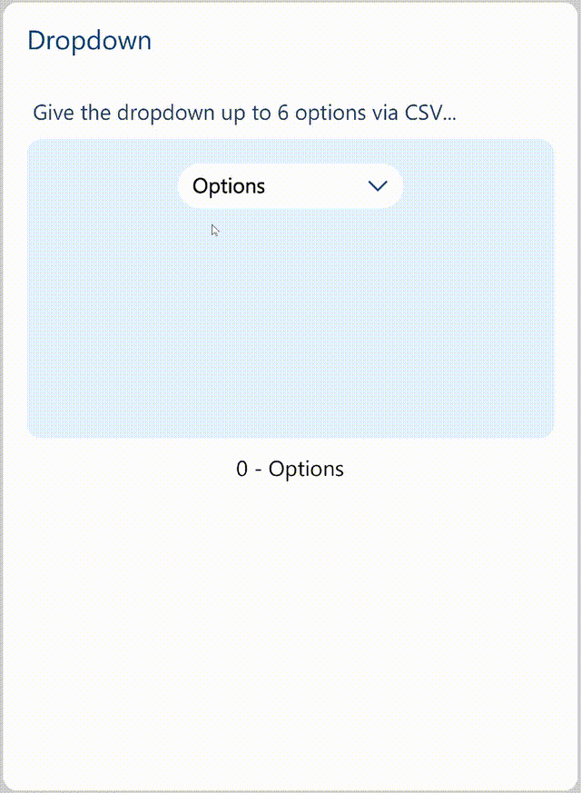
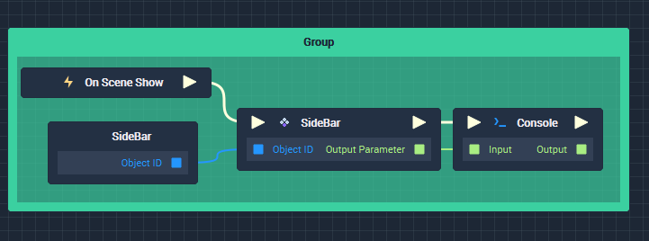

# Widgets

*Graphical widgets* are a cornerstone in building *User Interfaces*. One approach for building *widgets* in **Incari** is to use **Prefabs**, which are reusable components that can be adjusted accordingly for particular cases. See [**Prefabs**](../objects-and-types/prefabs/README.md) for a detailed description of **Prefabs** and their use.

This **Demo Project** is a showcase of several common *widget* types and how they can be connected to sources of data. It is composed of nine [**Scenes**](../objects-and-types/project-objects/scene.md), each of them showing one major *widget* type. 

To choose which **Scene** to show, use the numerical keys 1-9 on the keyboard.

For each **Scene**, the resulting *Interface* is shown and the **Logic** used is explained.

The included **Scenes** are:

<!-- no toc -->
1. [**Buttons**](#1-buttons)
2. [**Slider**](#2-slider)
3. [**Tabs**](#3-tabs) 
4. [**Dropdown**](#4-dropdown)
5. [**List Picker**](#5-list-picker)
6. [**Progress Bar**](#6-progress-bar)
7. [**Media**](#7-media)
8. [**Input Bar**](#8-input-bar)
9. [**Sidebar**](#9-sidebar)

## **1. Buttons**

This **Scene** has two buttons implemented through **Prefabs**: 

* `TextButton`: A button that receives as input the text that it will show. When pressed, it changes its shade of green for an instant and activates a **Pulse** in the **Logic**. In this case, it is implemented as a counter.

* `RadioButton`: A button with two states: *on* and *off*. It outputs a **Boolean** indicating the current state and changes color accordingly. Here, it activates the *rotation* of a dot.

### Logic

* **`TextButton` initialization**

This part of the **Scene** **Logic** initializes the `TextButton` button: 

* The event `buttons_init` is triggered when the **Scene** starts showing.
* The **Prefab Node** `TextButton` is triggered. In it, the text given is set on the button and the **Event Nodes** in the **Prefab Logic** are subscribed to.

* **`RadioButton`**

Here, `RadioButton` is initialized with the `buttons_init` **Event**. Remember that this **Event** is triggered when the **Scene** starts showing. It is also shown that the **Prefab Node** `RadioButton` outputs a **Boolean** indicating the current state of the button.

## **2. Slider**

This **Scene** shows a *slider* that can be set by clicking and dragging its indicator and a number between $$0$$ and $$1$$ representing the indicator's position.

### Logic

The *slider* is initialized when the **Scene** starts showing. For it, it needs as input the **Screen's** `Size` as a **Vector2**. 

Once initialized, the **Prefab Node** `SliderControl` outputs a **Pulse** and a **Float** between $$0$$ and $$1$$ each time the *slider* indicator is moved.

## **3. Tabs**

## **4. Dropdown**

## **5. List Picker**

## **6. Progress Bar**

## **7. Media**

## **8. Input Bar**

## **9. Sidebar**

