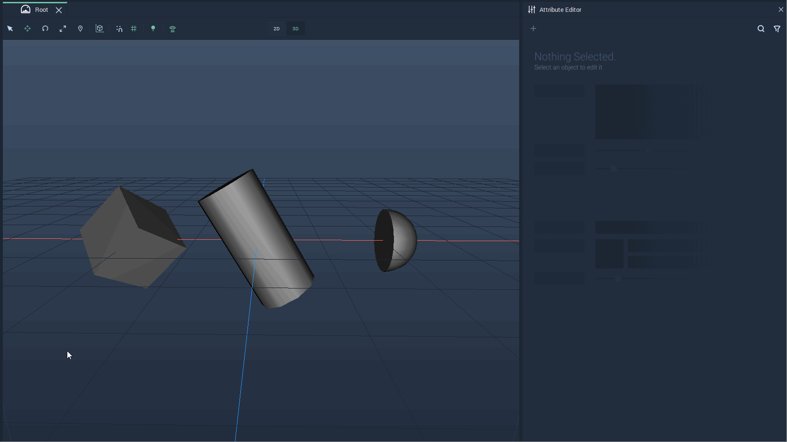
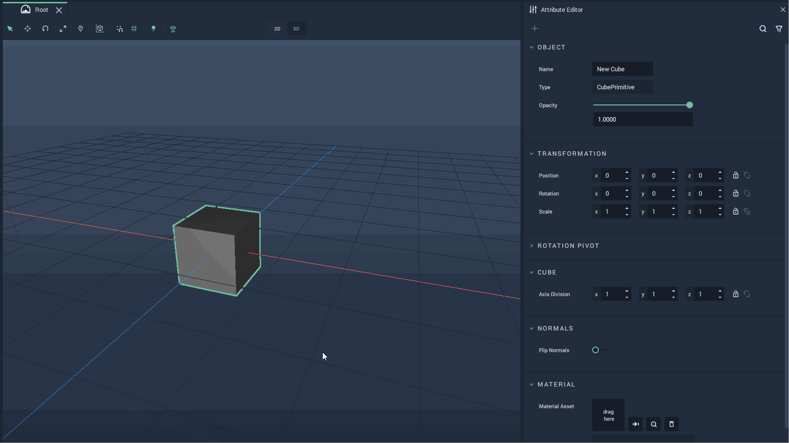

# Global Transformations

## Overview

**Global** **Transformations** are performed along the **Scene** axes, regardless of the **Object's** `Position` and `Rotation` **Attributes**.

The following example shows the **Global** axes for several **Objects**:

**Global** **Transformations** can be done either directly in the **Scene Viewport** in **Global** mode or in the [**Attribute Editor**](../../../../modules/attribute-editor.md). 

To switch to **Global** view simply click on the `Local Global` icon on the top Menu of the **Viewport**. This is only necessary if **Local** mode is currently selected, as **Global** mode is the default on start. 

To be able to modify the **Attributes** of an **Object**, select it and its **Attributes** will appear in the **Attribute Editor**, where they can be modified.

The **Global** mode allows one to change the [`Position`](#position) and [`Rotation`](#rotation) of an **Object**. It can also be used for [**Groups**](#groups).

## Position

Translating an **Object** can be done either in the **Scene Viewport** or in the **Object's** **Attributes**.

To modify an **Object's** **Position** in the **Viewport**, click on the `Translate` icon, second from the left on the top Menu. This will make a *gizmo* appear, showing the axes along which the **Object's** **Position** can be modified. In **Global** mode, the **Scene** axes are shown.

To move an **Object** along an axis, click on the preferred axis and drag the **Object**. It can also be moved in any direction by dragging the center of the *gizmo* or in a plane by dragging the square between two axes.

The example below shows an **Object** being moved along its **Global** axes.

It is also possible to change an **Object's** **Position** from its **Attributes**. For this, modify the `Position` values under `Transformation` in the **Attribute Editor**.

The following example shows the modification of the `Position` values for a cube.

## Rotation

Rotating an **Object** can be done either in the **Scene Viewport** or in the **Object's** **Attributes**.

To be able to rotate an **Object** in the **Viewport**, click on the `Rotate` icon, third from the left on the top Menu. This will make the *rotation gizmo* appear for the **Object**. Each circle represents an axis along which a rotation can be performed. For rotating the **Object**, click on a circle of the *gizmo* and drag towards the direction in which to perform the rotation. In **Global** mode, the **Object** is rotated with respect to the **Scene** axes.

The example below shows an **Object** being rotated with respect to the **Scene** axes.

It is also possible to rotate an **Object** from its **Attributes**. For this, modify the `Rotation` values under `Transformation` in the **Attribute Editor**.

The following example shows the modification of the `Rotation` values for a cube.

## Groups

It is possible to perform **Transformations** over several **Objects** as if they were parts of one **Object** by putting them into a **Group**. This can be done directly on the **Viewport** or in the **Attribute Editor**.

The example below shows a **Global** rotation and translation of a **Group** composed of two cylinders and a cube.

The following example shows the same **Group** being translated and rotated by modifying its **Attributes** in the **Attribute Editor**.

