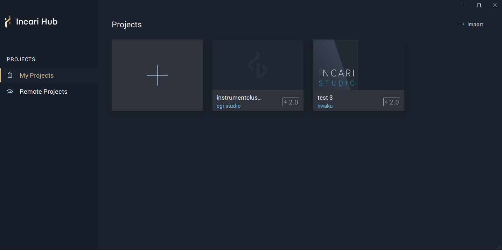
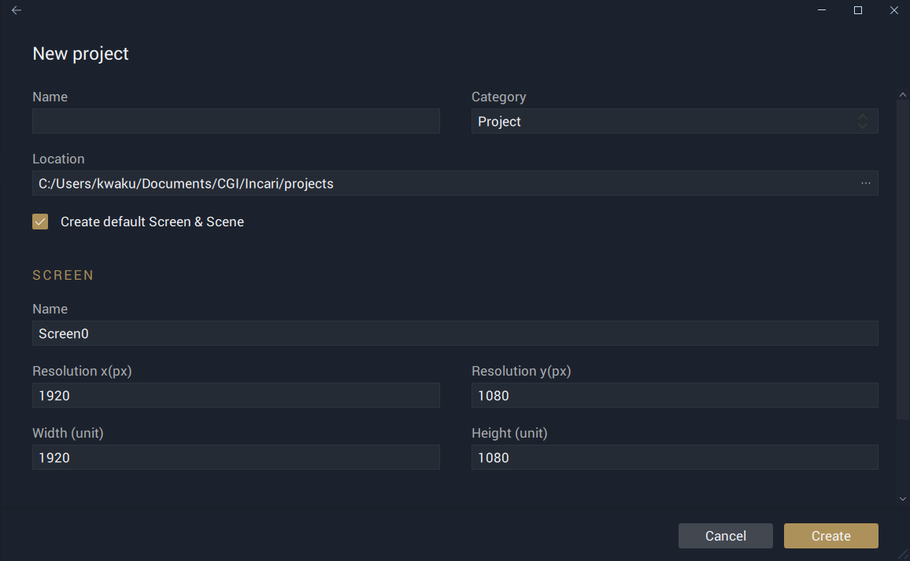
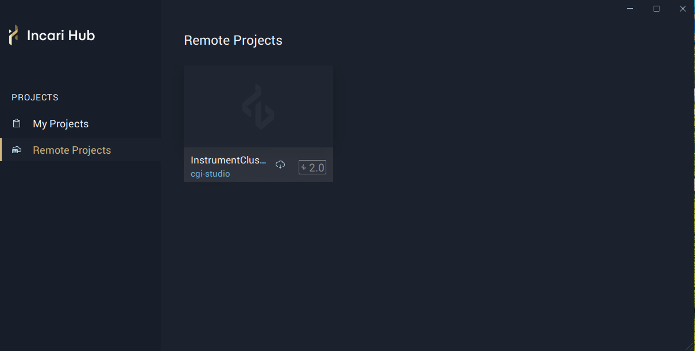

# Creating a Project

## Incari Hub
**Objects**, **Assets**, **Settings**, etc used in building **Simulations** are housed in projects. Therefore in order to use Incari Studio, you need to have access to an Incari **Project**.

The Incari Hub is the central point where all Projects are managed. It can be opened by doubling clicking on the Incari Hub 2.0.0 icon on your desktop. The Hub is divided into two sections, they are `My Projects` and `Remote Projects`. These sections are described in the following:





Under `My Projects`, a user can create new projects or import already created projects located on their PC. 

### Creating new projects
To create a new project, click on the plus icon seen below.

 

This will take you to a new project creation page.
 

**New Project**

* `Name` - Name of your project. The name will also be used for the project's folder structure.
* `Project location` - The location where your project will be saved. By default, this will be the project path defined in **Preferences**.
* `Category` - Here you can choose from one of four categories; **Project**, **Template**, **Scene** or **Widget**. These help differentiate between full-blown projects and smaller-scale components. 

**Screen**

* `Name` - This is the identifying name given to the target **Screen**.
* `Resolution (px)` - This defines the _pixel_ resolution of the targeted display in the *x* and *y* axis respectively.
* `Width & Height (unit)` - Width and height dimensions of the **Screen**.

**Scene**

* `Name` - The name given to the initial scene, when the project is created. This will most likely be your root scene.

### Managing Projects
* Import  icon allows you to import a previously unopened Project from another location. This is useful for exchanging files between team members and opening templates.

* Right-clicking on a **Project** shows a dropdown with options that allows you to do the following:

    `Reveal` - Opens a file explorer containing the contents of the project folder structure.

    `Remove` - Removes the specified project from `My Projects`. However, it is not deleted from the PC and can be imported back into `My Projects` by using the  icon. 

    `Delete` - Completely removes the project from your PC. This action is not reversible and therefore projects deleted can not be recovered.

* The name, category and location where a project is saved can be changed by clicking on the settings icon seen below: 

     

* A **simulation** of a **Project** can be played in Incari **Player** by clicking on the  icon.

* To open a project in Incari Studio, double click on its thumbnail. Furthermore, in order to reveal the settings and play icons, a project must be highlighted with a mouse pointer. Also All previous projects will be available to access via Incari Hub so, you can quickly jump back to your recent projects.





Under `Remote Projects`, you will find already implemented projects you can download and use right away. In order to download a remote project, click on the download  icon and the project will be downloaded and added to `My Projects`.





\*\*\*\*

