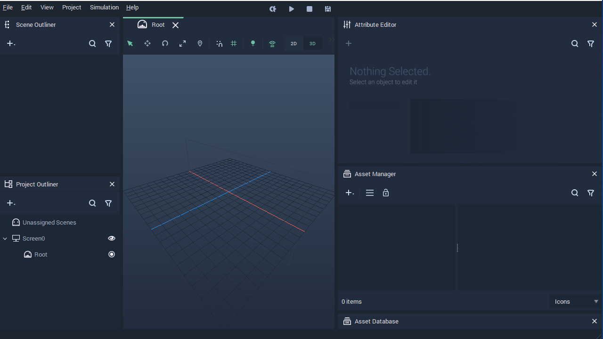

# Creating a Project

The first step to start using **Incari Studio** is to create a new **Project**. This is done from **Incari Hub**.

To create a new **Incari Studio** **Project**, go to *My Projects* and press on the large plus icon.

## New Project

Then, the *New Project* screen will appear. Here it is possible to choose the name and location of the new **Project** as well as the size of the default **Screen**.

 

**Project**

* Name: A relevant title for the **Project**. It will also be used for creating the **Project's** folder structure.
* Location: The location where the **Project** will be saved.
* Create with version: **Incari Studio** version with which the **Project** will be created. It offers a drop-down Menu of all the installed versions.
* Create default Screen & Scene: Whether the **Project** will be created with default **Screen** and **Scene** or not. When this is enabled, the following options appear.
  
**Screen**

* Name: Name of the default **Screen**.
* Resolution x (px): Width resolution of the targeted display device in pixels.
* Resolution y (px): Height resolution of the targeted display device in pixels.
* Width (unit): Width of the area in *3D* space that will be mapped to the targeted display device.
* Height (unit): Height of the area in *3D* space that will be mapped to the targeted display device.

**Scene**

* Name: Name of the default **Scene**.

After clicking on `Create`, **Incari Studio** starts with a new empty **Project**.

