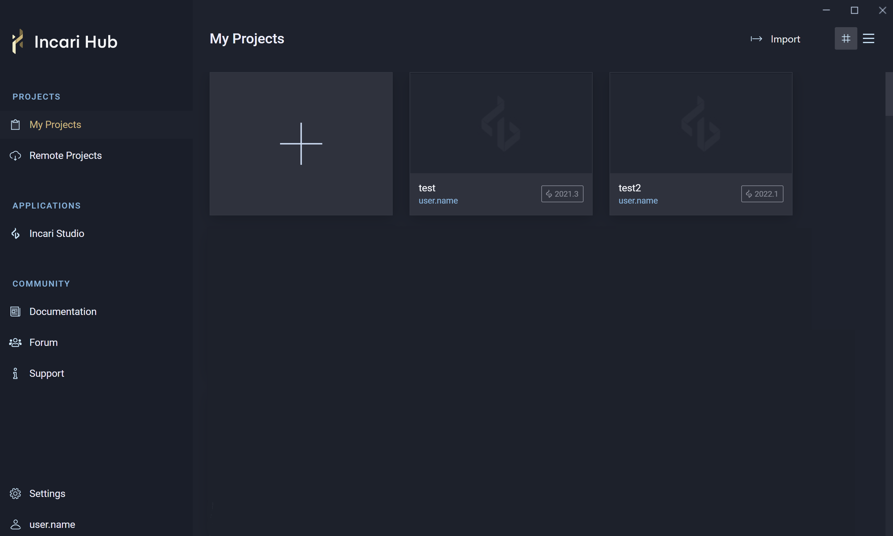
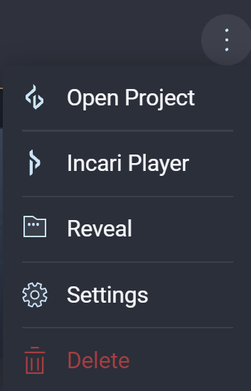

# Incari Hub

**Incari Hub** serves as a central access point to all **Incari** products. It allows one to install the latest version of **Incari**, manage existing **Projects**, and obtain **Demo Projects**.

On the left-side Menu, there are several sections. We will go through each, one by one: 

## Projects

### My Projects

*My Projects* allows the user to access, create, and manage their local **Projects**. Here there are two existing **Projects** called *test* and *test2*. 

Each **Project** displays the username and **Incari Studio** version at the bottom. Clicking on the three dots that appear when hovering over a **Project** allow the user to open the **Project**, open just the **Incari Player**, show **Project** in the user's local file library, and the **Project's** settings. It is also to delete the **Project** from here.  

### Remote Projects

 The tab *Remote Projects* gives access to **Demo Projects** that have been created by our very own **Incari** team :) These can be downloaded with the small cloud icon, and then opened locally. **Demo Projects** allow one to see how certain functionalities can be implemented in **Incari**. These range from a simple button to examples of the several methods of **Animation** available to the user.

 

 ## Applications

 ### Incari Studio

Under *Incari Studio*, one can install different version of **Incari Studio**. This can be done by locating a folder on your local machine or using the built-in installer. If there are no installations, a message will appear prompting the user to either `Locate` or `Install` a version of **Incari Studio**. Otherwise, the user can use the icon on the top right to do the same.

Please note that if an existing **Project** was made with a previous version of **Incari Studio**, and this version is not currently installed within **Incari Hub**, you will be prompted to upgrade the most recent version or locate the compatible version. Otherwise it will be impossible to open the **Project**. 

## Community

### Documentation

The **Documentation** takes you straight to the instructional texts that teach the user ins and out of **Incari**, which you are at right now! It gives a run down of the basics of getting started, explains each component of **Incari Studio**, and provides more information on a few **Demo Projects**. There's a lot to discover in the **Documentation.

### Forum

The **Forum** is where the **Incari** community can come together to discuss issues and ideas, feedback and features.

### Support

Clicking on *Support* takes you to the **Support** channel. It may ask you to log in at first, so don't forget your **Incari Account** password! Here the user can create *tickets* to report bugs or suggest new features and improvement. We are always aiming to improve **Incari**, so we are excited to receive *tickets* from you. 
