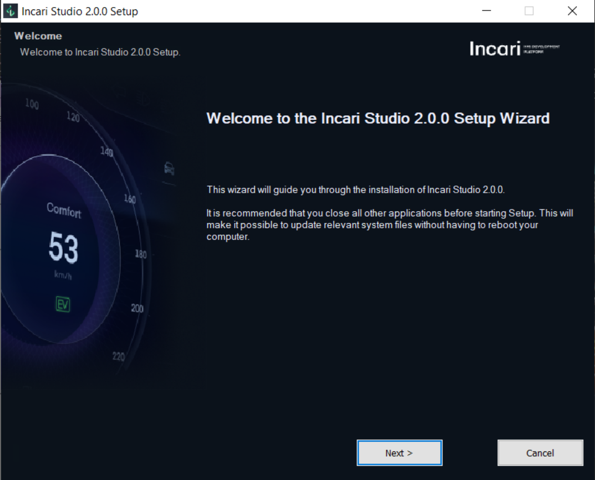
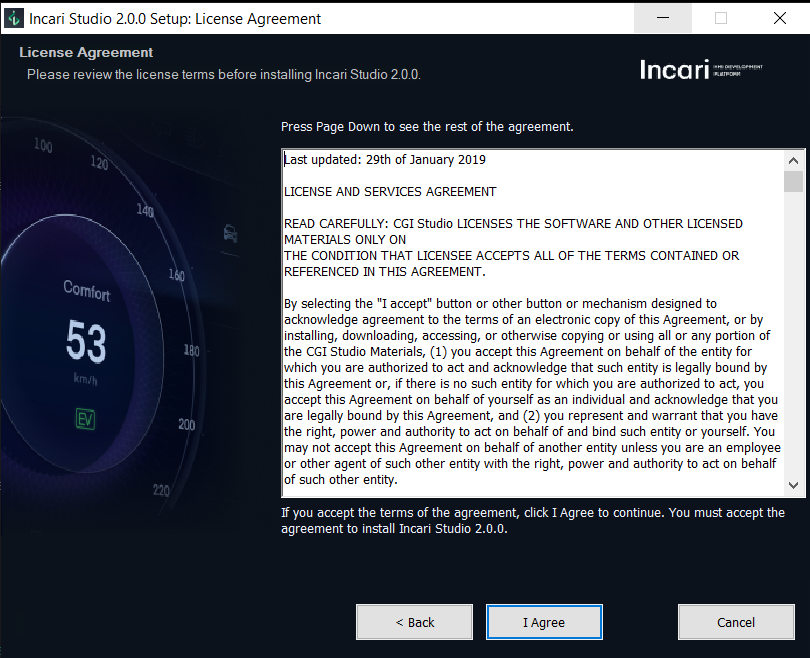
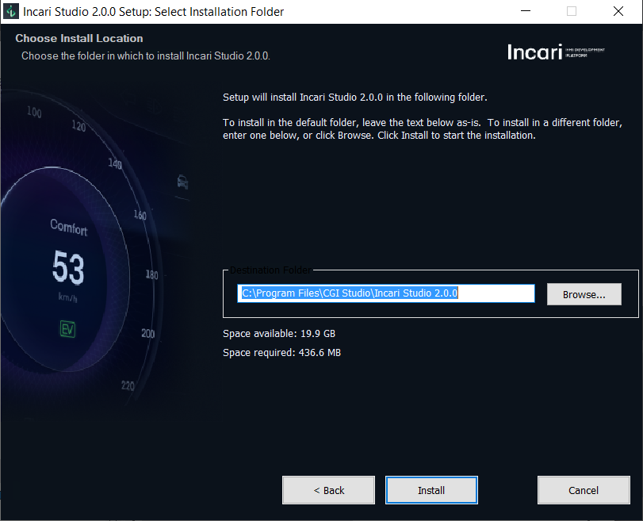
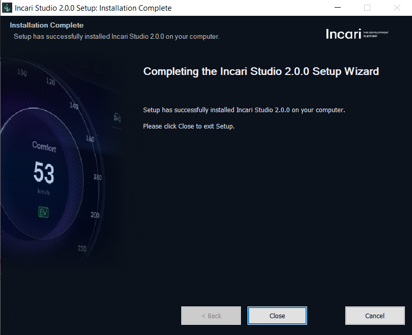

# Installation and License \*

To install Incari, follow the steps below:

1. Visit the [Incari website]() and download the [Incari Studio-2.0.0-installer.exe](www.cgi-studio.com). You will need to register for an Incari Studio account in order to download the installer.
   
2. Execute the Incari Studio-2.0.0-installer.exe and follow the instructions.

3. Click "Next" to proceed or "Cancel" to stop the current installation. 

4. You will need to agree to the license agreement in order to proceed.

5. Choose a folder in which you would like to save the installation files and click install.

6. After a successful installation, you can start Incari by double-clicking on the Incari Hub 2.0.0 shortcut icon on your desktop. 

7. On the first startup, Incari license check dialog appears which contains *your license key*. Use the *license key* to apply for a 30-day free trial license using the following email address contact@cgi-studio.com. 

    
8. **Install License**:
After receiving the license file, please copy the provided **incaristudio.lic** file into the installation folder of Incari Studio. The default installation path is `C**:\Program Files\CGI Studio\Incari Studio 2.0.0**`.
After copying the license file to the installation folder you can start using Incari.

