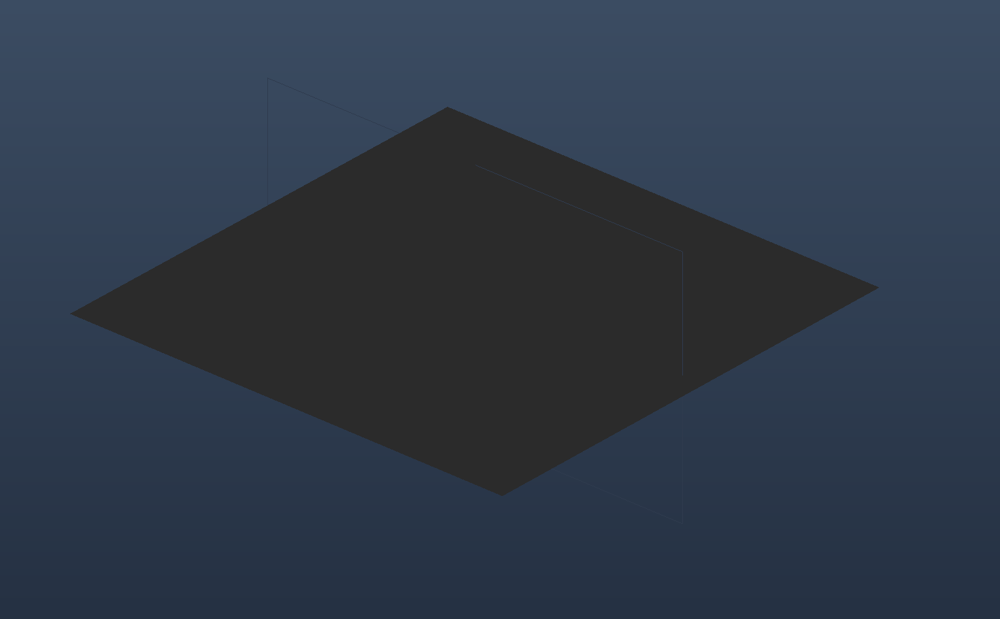

*Incari* has several types of **Primitives**, which are three-dimensional **Objects** that can add a realistic, immersive experience to a **User Interface**. They are found in the **Scene Outliner** and show up after the `+` button is *clicked*.

# Primitives
## Cube

 The **Cube**, a simple 3D geometric shape, has several **Attributes**. 

| Attribute | Description |
| :--- | :--- |
|`Object`|This section shows the name and type of the **Object**, in this case a **Cube**, as well as its `Opacity`, which determines how transparent or opaque the **Object** is.| 
|`Transformation`|The features under this **Attribute** are `Position`, `Rotation` and `Scale`. Together, they can alter the size, location, and rotation of the **Cube Object** within 3D space.|
|`Rotation Pivot`|XX|
|`Cube`|This section covers `Axis Division` which....|
|`Material`|The user can choose a **Material** file to customize the look of the **Cube**.|

## Cylinder

The **Cylinder**, a simple 3D geometric shape, has several **Attributes**.

| Attribute | Description |
| :--- | :--- |
|`Object`|This section shows the name and type of the **Object**, in this case a **Cylinder**, as well as its `Opacity`, which determines how transparent or opaque the **Object** is.| 
|`Transformation`|The features under this **Attribute** are `Position`, `Rotation` and `Scale`. Together, they can alter the size, location, and rotation of the **Cylinder Object** within 3D space.|
|`Rotation Pivot`|XX|
|`Cylinder`|This section covers several editable aspects of a **Cylinder's** appearance. `Rows` essentially allows the user to choose how many edges/vertices there will be. For example, `Rows` = 3 would give a base shape of a triangle. The sample image has `Rows` = 10. At a certain point, around 22, the vertices are indeterminate and the base shape appears as a circle. `Columns` bla bla. `Radius` changes the radius of the bottom face, while `Top Radius` changes the radius of the top face. These essentially expand and retract the faces, respectively. `Height` changes the **Object's** length, elongating or shortening the **Cylinder**.|
|`Material`|The user can choose a **Material** file to customize the look of the **Cylinder**.|

## Dome 

The **Dome**, a piece of a sphere with a flat bottom face, has several **Attributes**.

| Attribute | Description |
| :--- | :--- |
|`Object`|This section shows the name and type of the **Object**, in this case a **Dome**, as well as its `Opacity`, which determines how transparent or opaque the **Object** is.| 
|`Transformation`|The features under this **Attribute** are `Position`, `Rotation` and `Scale`. Together, they can alter the size, location, and rotation of the **Dome Object** within 3D space.|
|`Rotation Pivot`|XX|
|`Dome`|`Rows` sets how many 'rows' there are. In the sample image there are 10 and if 1 were chosen, the dome would come to a point like a pyramid. It is easier to see with `Rows` = 1-4, but any higher numbers and the **Dome** shapes become indistinguishable. `Columns` defines the number of vertices of the bottom face, so `Columns` = 4 would set the bottom face as a square and so on. `Radius` changes the radius of the bottom face !!!!!!!!!!!!!|
|`Material`|The user can choose a **Material** file to customize the look of the **Cube**.|

## Plane 

## Sphere

 The **Sphere**, a simple 3D geometric shape, has several **Attributes**. 

| Attribute | Description |
| :--- | :--- |
|`Object`|This section shows the name and type of the **Object**, in this case a **Sphere**, as well as its `Opacity`, which determines how transparent or opaque the **Object** is.| 
|`Transformation`|The features under this **Attribute** are `Position`, `Rotation` and `Scale`. Together, they can alter the size, location, and rotation of the **Sphere Object** within 3D space.|
|`Rotation Pivot`|XX|
|`Sphere`|`Rows` sets the number of 'rows', like segments of a colored beach ball. The sample image has `Rows` = 10. `Columns` sets the number of 'columns', essentially segments oriented lengthwise. The sample image has `Columns` = 10. The higher the numbers for each, the smoother the **Sphere** appears. `Radius` increases the radius of the **Sphere**, thus scaling it up or down.|
|`Material`|The user can choose a **Material** file to customize the look of the **Sphere**.|

# See also

* [**Material Editor**](../../modules/material-editor.md)

# External Links

* [*Cube*](https://en.wikipedia.org/wiki/Cube) on Wikipedia.
* [*Cylinder*](https://en.wikipedia.org/wiki/Cylinder) on Wikipedia.
* [*Dome*](https://en.wikipedia.org/wiki/Spherical_cap), or Spherical Cap, on Wikipedia
* [*Plane*](https://en.wikipedia.org/wiki/Plane_%28(geometry%29)) on Wikipedia.