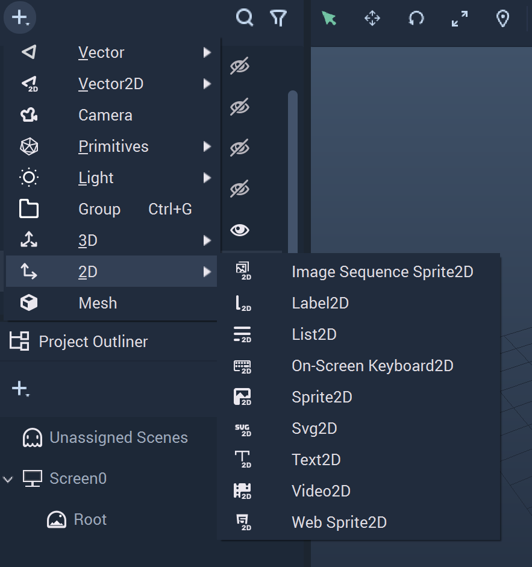

# Screen Space Elements

As **Incari** can use both **2D** and **3D** **Assets**, it is necessary that the coordinate system is *3D*. The downside of this is that most designers work with a layer-based, *2D* coordinate system which presents the need to convert each **Asset’s** position in *2D* space to the same relative position in *3D*. This can be a slow and tedious process.

With the introduction of **Screen** **Space** **Elements**, though, it is much easier for UI/UX designers using *2D*-based tools to transfer their designs into **Incari** without the extra step of performing individual conversions. Designers can now import **Assets** from third-party content creation software, such as _Photoshop_ or _Figma_, directly into **Incari**.

Additionally, the **Screen Space Elements** encompass new **Objects** and new [**Nodes**](#2d-nodes).

The **2D** **Objects** available in **Incari** fall under two groups in the **Scene Outliner**. These are **2D** and **Vector2D**. These provide *2D* counterparts to those under **3D** and **Vector3D** and are only editable within two-dimensional space, meaning that their position is only contained within the X and Y axes. Additionally, these utilize the _pixel positioning feature_, which means that the origin \(0,0\) is set at the top-left corner of the **Screen** and the X and Y values under `Position` reflect the exact pixel position when the **Object** is rendered on the **Screen**.

## 2D

The **2D Objects** cover different functional items used to provide engaging graphics and visuals in **Incari**.

* **Image Sequence Sprite2D** 

**Image Sequences** are used for one type of animation in **Incari**. More information can be found [_here_](../../demo-projects/4-methods-of-animation.md#3-image-sequence) and [_here_](../../modules/image-sequence-editor.md).

* **Label2D**

**Labels** are useful for displaying textual information and titles. More information can be found [_here_](../../toolbox/incari/vector/label/README.md).

* **List2D**

**Lists** require several different files to display data in the desired manner and are interwoven with **Incari Models**. More information can be found [_here_](list-widget.md).

* **On-Screen Keyboard2D**

As the name suggests, the **On-Screen Keyboard** is simply a keyboard shown on the screen in two-dimensional format. Certain style aspects can be changed with a `.css file` and `Tint`, the latter providing the color for the highlighted key.

* **Sprite2D**

More information on **Sprite** **Objects** and further links can be found [_here_](sprite.md).

* **Svg2D**

This **Object** allows the user to upload their own **SVG**, or _Scalable Vector Graphic_, file. Learn more about **Scalable Vector Graphics** on [_Wikipedia_](https://en.wikipedia.org/wiki/Scalable_Vector_Graphics).

* **Text2D**

A **Text Object** is used for writing texts in the *User Interface*. More information can be found [_here_](text.md).

* **Video2D**

**Videos** are self-explanatory. This **Object** allows the user to upload their own video and move it around within two-dimensional space.

* **Web Sprite2D**

**Web Sprites** are important for embedding different types of web technologies into an **Incari** **Project**. This is explained in greater detail [_here_](web-sprite.md).

## Vector2D

The **Vector2D Objects** provide alternatives to their **Vector** counterparts and encompass several two-dimensional shapes that help build up the visual aspects of a _User Interface_. Unlike **Vector**, **Vector2D Objects** do not have Z axis components.

* **Arc2D**

A **2D Object** that is a piece of a circle defined by a starting and ending degree disregarding the center and running straight through between the two selected degree points. It is restricted to the X and Y axes. More information on **Arcs** can be found [_here_](../../toolbox/incari/vector/arc/README.md).

* **Ellipse2D**

A circular **2D** **Object** that is restricted to the X and Y axes.

* **Line2D**

A linear **2D** **Object** that is restricted to the X and Y axes. More information on **Lines** can be found [_here_](../../toolbox/incari/vector/line/README.md).

* **Pie2D**

A **2D** **Object** that is a piece of a circle defined by a starting and ending degree and a connected point at the center of the circle. It is restricted to the X and Y axes. More information on **Pies** can be found [_here_](../../toolbox/incari/vector/pie/README.md).

* **Rectangle2D**

A rectangular **2D** **Object** that is restricted to the X and Y axes. More information on **Rectangles** can be found [_here_](../../toolbox/incari/vector/rectangle/README.md).

## 2D Nodes

These **Nodes** work for **2D Objects**. The **Vector Nodes** are still usable for **Vector Objects** and now can be used for **Vector2D Objects** as well. More information on **Vector Nodes** can be found [_here_](../../toolbox/incari/vector/README.md).

The **2D Nodes** fall under three groups and include the following:

* Position
  * [**Set Position Pixel**](../../toolbox/incari/object/set-position-pixel.md)
  * [**Get Position Pixel**](../../toolbox/incari/object/get-position-pixel.md)
* Rotation
  * [**Set Rotation 2D**](../../toolbox/incari/object/set-rotation-pixel.md)
  * [**Get Rotation 2D**](../../toolbox/incari/object/get-rotation-pixel.md)
* Size
  * [**Set Size Pixel**](../../toolbox/incari/object/set-size-pixel.md)
  * [**Get Size Pixel**](../../toolbox/incari/object/get-size-pixel.md)

