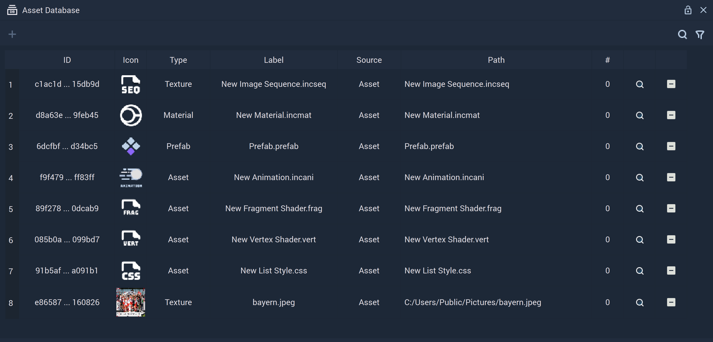

# What's New

Many new features have been added to the release of **Incari Studio** 2023.1. Here is a list of the features you need to know.

## 2D Workflow Update

The previously introduced split of *2D* and *3D* components in **Incari** has been widely expanded in this current release. 

### 2D Objects

New specific *2D* **Objects** have been added along with their respective **Nodes**:

* [**Button**](../objects-and-types/scene2d-objects/gui/button.md)
* [**Dropdown**](../objects-and-types/scene2d-objects/gui/dropdown.md)
  * [**Get Active Dropdown Value**]()
  * [**Get Dropdown Options**]()
  * [**Set Active Dropdown Index**]()
  * [**Set Active Dropdown Value**]()
  * [**Set Dropdown Options**]()
  * [**On Dropdown Active Value Change**]()
* [**List**](../objects-and-types/scene2d-objects/gui/list.md)
* [**Slider**](../objects-and-types/scene2d-objects/gui/slider.md)
* [**Text**](../objects-and-types/scene2d-objects/gui/text.md)
* [**Text Area**](../objects-and-types/scene2d-objects/gui/textarea.md)
* [**Text Input**](../objects-and-types/scene2d-objects/gui/textinput.md)
* [**Toggle**](../objects-and-types/scene2d-objects/gui/toggle.md)

### 2D Prefabs

**Prefabs** in **Scenes** have already been an important facet of **Incari**. Now these extend into **Scene2Ds** where all **Objects** and combinations of **Objects** can be converted into **Prefabs**.

### Stylesheets

now in Scene2D, Project Settings, and Objects 2D. Particular Nodes for Scene2D and Objects 2D

## Custom Shading

The [**Material Editor**](../modules/material-editor/README.md) now includes a new shading model called the [**Custom Shading**](../modules/material-editor/customshadingmodel.md). It allows the user to create and customize their own shading model. This expands the possibilities for **Materials** in **Incari**. 

The customization is done via `Vertex Shader` or `Fragment Shader`. 

## Exporter Update

The [**Exporter**](../modules/exporter.md) now allows the user to export a **Project** onto a different platform than it was created. For example, it can now handle the case of exporting a **Project** from *Windows* to *Linux*. 

In addition, the **Exporter** offers the user the option to export only the used **Assets**, thus providing a way to export a **Project** using only the necessary resources. 

## Communication Update

**Incari** has extended the options for the different protocols supports:

* **Serial** now has the option to set delimiters for incoming messages. This can be configured in [**Project Settings**](../modules/project-settings/serial.md).
* *HTTPS* support has been added to the already implemented [**HTTP**](../toolbox/communication/http/README.md), for both client and server.
* For [**CAN**](../toolbox/communication/can/README.md) now multiple connections can be configured in [**Project Settings**](../modules/project-settings/CAN.md).
* [**MAVLink**](../toolbox/communication/mavlink/README.md) is now a [Plugin](../modules/plugins/communication/mavlinkmanager.md)

## [Asset Database](../modules/asset-database.md)

A new [**Module**](../modules/overview.md) has been introduced with this release: the [**Asset Database**](../modules/asset-database.md), which is a *database* of all the **Assets** that are either used in the **Project** or available to be used at runtime. It allows the user to keep track of all these **Assets** and have easy access to information about them, such as how many times they are used in the **Project** or their location.

Furthermore, two **Nodes** for managing **Assets** in the **Asset Database** have been introduced:

* [**Add to Asset Database**](../toolbox/incari/asset/add-to-asset-database.md)
* [**Remove from Asset Database**](../toolbox/incari/asset/remove-from-asset-database.md)

## **New Nodes and Node Updates**

Besides the **Nodes** related to new features that are specified above, several new **Nodes** have been introduced with this release while some existent ones have had major updates. The list is given below:
