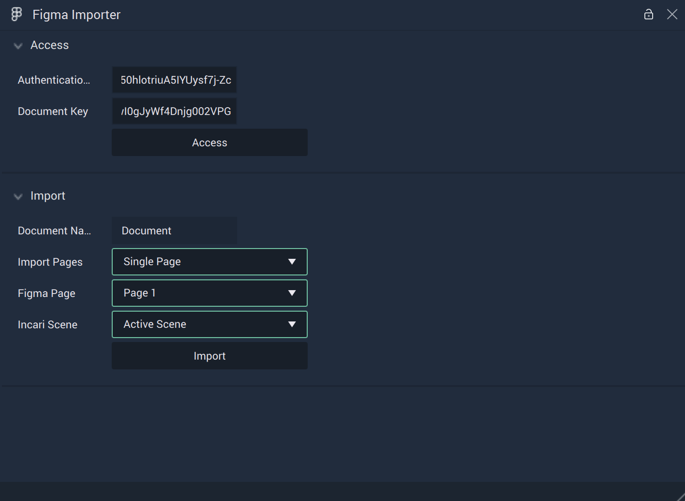
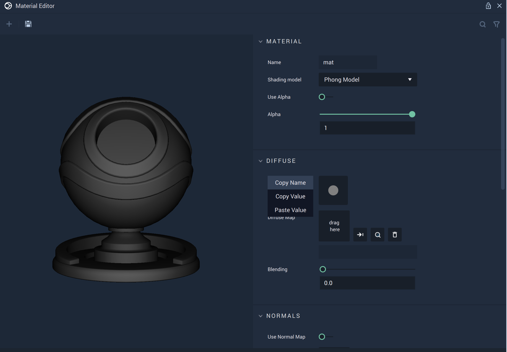
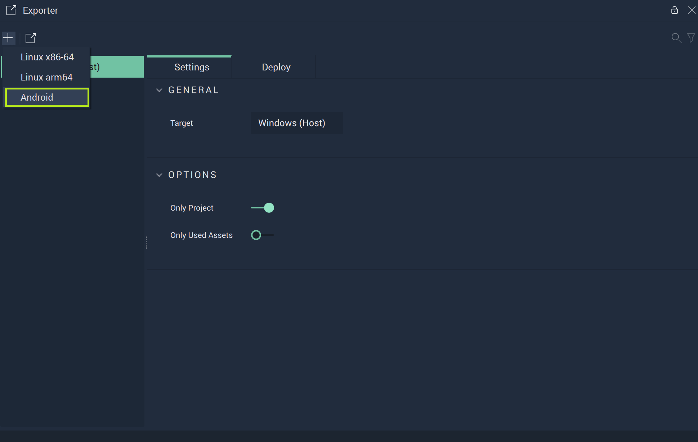

# What's New

Many new features have been added to the release of **Incari Studio** 2023.2. Here is a list of the features you need to know.

## Figma Importer and New Objects

Exciting news for *Figma* users! With the new [**Figma Importer**](../modules/figma-importer/README.md), **Incari Studio** maximizes its reach like never before, acting as a bridge that allows designers to combine the best of both platforms. 

By integrating *Figma* creations into **Incari**, users can enhance their *Figma* projects with the powerful tools and capabilities that **Incari Studio** offers, trading in previous limitations for a more fluid and dynamic creative process.

This comes with support of several aspects of *Figma*, like *stroke*, *fill*, *masking*, and *blending*. Several **Objects** also see an upgrade with this integration:

* [**Vector**](../objects-and-types/scene2d-objects/figma/README.md)
  * [**Boolean Operation**](../objects-and-types/scene2d-objects/figma/figmabooleanoperation.md)
  * [**Ellipse**](../objects-and-types/scene2d-objects/figma/figmaellipse.md)
  * [**Line**](../objects-and-types/scene2d-objects/figma/figmaline.md)
  * [**Rectangle**](../objects-and-types/scene2d-objects/figma/figmarectangle.md)
  * [**Text**](../objects-and-types/scene2d-objects/figma/figmatext.md)

In order to incoporate these new *Figma* features properly in the **Logic**, there are also several new **Nodes** which add functionality:

* [**Object 2D**](../toolbox/incari/object2d/README.md)
  * [**Get Paint**](../toolbox/incari/object2d/getpaint.md)
  * [**Get Paint Opacity**](../toolbox/incari/object2d/getpaintopacity.md)
  * [**Get Stroke Width**](../toolbox/incari/object2d/getstrokewidth.md)
  * [**Set Blend Mode**](../toolbox/incari/object2d/setblendmode.md)
  * [**Set Paint**](../toolbox/incari/object2d/setpaint.md)
  * [**Set Paint Opacity**](../toolbox/incari/object2d/setpaintopacity.md)
  * [**Set Stroke Width**](../toolbox/incari/object2d/setstrokewidth.md)

## Introducing Incari INNA - AI Generation

Breaking into a new field of *HMI* design, we at **Incari** are excited to introduce **Incari INNA**, an **AI Logic Generator** in its beta phase. It is masterfully crafted to elevate the efficiency and intuitiveness of **Logic** construction, keeping in mind the needs of both novices and experienced creators alike.

While an exciting new development, it is still in its beta phase and is expected to grow in the coming releases. Give your feedback to help us improve it! 

 

## Texture and 3D Object Importer

The [**Asset Manager**](../modules/asset-manager.md) sees a new update with the addition of the [**Texture Importer**](../modules/asset-manager.md#texture-importer) and [**3D Object Importer**](../modules/asset-manager.md#3d-object-importer). 

A new accompanying workflow acts as the base: when an **Asset** is imported and used somewhere in a **Project**, a `.ktx2` file (for **Images** and **Image Sequences**) or `.glb` file (for **Meshes**) is created in an internal folder. By converting **Assets** into their binary formats, the **Project's** loading time is significantly sped up.

The **Texture** and **3D Object Importers** allow the user to control certain properties of each file type. This gives more power to the user over their **Assets**. 

## Prefabs Update

**Prefabs** in **Scenes** remain an integral facet of **Incari Studio**. **Logic** in **Prefabs** has changed slightly with the introduction of two new **Nodes**:

* [**On Creation**](../objects-and-types/prefabs/logic-prefabs.md#nodes): Initializing a **Prefab** in **Incari Studio** is easier than ever with the **On Creation Node**. This intelligent feature automatically configures any **Prefabs** as they are added to a **Project**, taking care of all initial settings and technical groundwork. 
* [**On Destruction**](../objects-and-types/prefabs/logic-prefabs.md#nodes): Removing a **Prefab** is as smooth as introducing one, thanks to the **On Destruction Node**. It handles the disassembly of **Prefabs** from a **Project**, ensuring there's no leftover data to clutter a user's workspace. 

In addition, the [**Variable** of a **Prefab**](../objects-and-types/prefabs/logic-prefabs.md#variables) are now exposed in the **Attribute Editor**. Here, the user can change the default values of the local variable.  

## Material Editor Update 

Several small updates add up to a better user experience. The **Material Editor** now allows the user to [get the name](../modules/material-editor/README.md) of any **Shading Model's** property, copy it, and paste it. This is especially useful for the **Custom Shading Model**, as it allows the user to integrate any of its properties into corresponding **Logic** with no fuss. 

This requires the use of two new **Nodes**:

* [**Get Material Property**](../toolbox/incari/material/getmaterialproperty.md)
* [**Set Material Property**](../toolbox/incari/material/setmaterialproperty.md)

It is also now possible to use shaders from [*ShaderToy*](https://www.shadertoy.com/), expanding the capabilities of design within **Incari Studio**. The process to do so is described [here](../modules/material-editor/customshadingmodel.md#fragment-shader) towards the bottom of the section.

## Exporter Update

The [**Exporter**](../modules/exporter.md) now allows the user to export a **Project** to *Android*. This makes it easy to deploy an **Incari Project** onto *Android* devices, extending the ways an **Incari Studio** user can reach their audience. A step by step is available to make [exporting to *Android*](../modules/exporter.md#android) easy. 

## Communication Update

**Incari** has added to the different communication protocols it supports. These are:

* [**Bluetooth**](../toolbox/communication/bluetooth/README.md). *Bluetooth* allows for communication between wireless and fixed devices in the short range, like when a car connects to a mobile phone. Besides new **Nodes**, this includes an update to [**Plugins**](../modules/plugins/communication/bluetooth.md).
   * [**Events**](../toolbox/communication/bluetooth/events/README.md)
     * [**On Bluetooth Device Paired**](../toolbox/communication/bluetooth/events/onbluetoothdevicepaired.md)
     * [**On Bluetooth Device Unpaired**](../toolbox/communication/bluetooth/events/onbluetoothdeviceunpaired.md)
  * [**Is Bluetooth Device Paired**](../toolbox/communication/bluetooth/ispaired.md)
  * [**Pair Bluetooth Device**](../toolbox/communication/bluetooth/pairbluetoothdevices.md)
  * [**Retrieve Call History**](../toolbox/communication/bluetooth/retrievecallhistory.md)
  * [**Retrieve Phonebook**](../toolbox/communication/bluetooth/retrievephonebook.md)
  * [**Scan For Bluetooth Devices**](../toolbox/communication/bluetooth/scanforbluetoothdevices.md)
  * [**Unpair Bluetooth Device**](../toolbox/communication/bluetooth/unpairbluetoothdevices.md)
* [**WebSocket**](../toolbox/communication/websocket/README.md). *WebSocket* is a communication protocol that provides full-duplex, bidirectional communication channels over a single *TCP* connection. Besides new **Nodes**, this includes an update to both [**Plugins**](../modules/plugins/communication/bluetooth.md) and [**Project Settings**](../modules/project-settings/websocket.md).
  * [**Events**](../toolbox/communication/websocket/events/README.md)
    * [**On WebSocket Error**](../toolbox/communication/websocket/events/onwebsocketerror.md)
    * [**On WebSocket Receive**](../toolbox/communication/websocket/events/onwebsocketreceive.md)
    * [**On WebSocket Start**](../toolbox/communication/websocket/events/onwebsocketstart.md)
    * [**On WebSocket Stop**](../toolbox/communication/websocket/events/onwebsocketstop.md)
  * [**WebSocket Client Send**](../toolbox/communication/websocket/websocketsend.md)
  * [**WebSocket Client Start**](../toolbox/communication/websocket/websocketstart.md)
  * [**WebSocket Client Stop**](../toolbox/communication/websocket/websocketstop.md)

## Incari Hub Update 

A user's subscriptions now appear directly in the **Incari Hub** `Settings` and can be activated there, creating a smoother process for managing access to **Incari Studio**. 

## **New Nodes and Node Updates**

Besides the **Nodes** related to new features that are specified above, several new **Nodes** have been introduced with this release. The list is given below:

New **Nodes**:
  * [**Media**](../toolbox/incari/media/README.md): 
    * [**Get Media**](../toolbox/incari/media/getmedia.md)
    * [**Get Media Length**](../toolbox/incari/media/getmedialength.md)
    * [**Get Media Loop**](../toolbox/incari/media/getmedialoop.md)
    * [**Get Media Progress**](../toolbox/incari/media/getmediaprogress.md)
    * [**Set Media**](../toolbox/incari/media/setmedia.md)
    * [**Set Media Loop**](../toolbox/incari/media/setmedialoop.md)
    * [**Set Media Progress**](../toolbox/incari/media/setmediaprogress.md)
  * [**Screen**](../toolbox/incari/screen/README.md):
    * [**Load Scene**](../toolbox/incari/screen/loadscene.md)
    * [**Set Background**](../toolbox/incari/screen/setbackground.md)
    * [**Unload Scene**](../toolbox/incari/screen/unloadscene.md)
  * [**Scene**](../toolbox/events/scene/README.md)
      * [**On Scene Loaded**](../toolbox/events/scene/onsceneloaded.md)
  * [**Binary**](../toolbox/binary/README.md)
      * [**Binary To Byte Array**](../toolbox/binary/binarytobytearray.md)
      * [**Verify Checksum**](../toolbox/binary/verifychecksum.md)