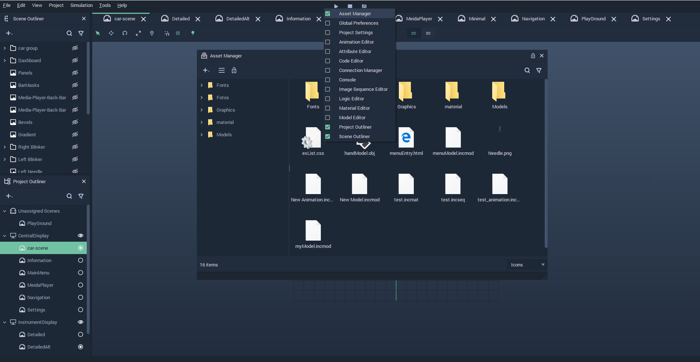
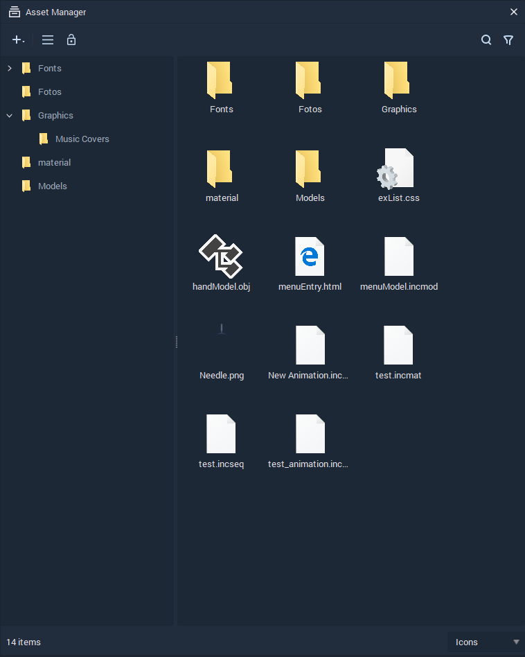

# Asset Manager

## Overview 
The **Asset Manager** is an organized collection of **Assets** that can be readily created, imported, deleted and updated. 

In order to open the **Asset Manager**,  *right-click* on the *file menu bar* in Incari and *click* on **Asset Manager** from the drop-down list. This can be seen in the illustration below:

 

 

## Views in the Asset Manager 
The **Asset Manager** can be *toggled* between a `flat` or `folder` `tree` `view` by clicking on the *stripe icon*  located in the toolbar of the **Asset Manager**.

The `flat tree` `view` shows **Assets** in a single-panel window while the `folder tree view` shows **Assets** in a dual-panel window. 

The left panel of the `folder tree view` contains folders created by a user in order to separate different categories of **Assets**. If a folder is selected in the left panel, its corresponding contents will be displayed in the right panel.

### Lock Current View
A folder selected in the left panel of the `folder tree view` can be locked by clicking on the  icon in the toolbar. Therefore, *clicking* on another folder in the left panel will have no effect in the right panel.

## Import Assets
New **Assets** can be imported in the following ways:

* *Clicking* on the *plus icon* button  in the toolbar and then the `Import Assets` button from the drop-down list.

* *Right-clicking* in the left panel of the `folder tree view` > `Import Assets`. 
  
* *Dragging and Dropping* **Assets** from a user's computer into the **Asset Manager**. This option also allows you to add **Asset** folders to the **Asset Manager**.

## Create Assets
New **Assets** can be created by *right-clicking* in the right panel of the `folder tree view` &gt; `Create Asset` &gt; *the type of **Asset** desired from the drop-down list*.

## Managing Assets
By *right-clicking* on an **Asset** in the **Asset Manager**, a drop-down appears, allowing us to select different options including `Delete`, `Rename`, `Duplicate`, and `Reveal`. Most of the listed options are self-explanatory in their usage except `Reveal` whose purpose is to open the location of an **Asset** in a user's computer. 

## New Folder
The purpose of `Folders` is to hold **Assets** created or imported into the **Asset Manager**. This is done by dragging and dropping **Assets** into desired `Folders`.

A `New Folder` can be created in the following ways:

* *Clicking* on the *plus icon* button  and then the `New Folder` button from the drop-down list in the toolbar. 

* Also, a `New Folder` can be created by right-clicking on either the left panel or right panel and selecting the `New Folder` button.