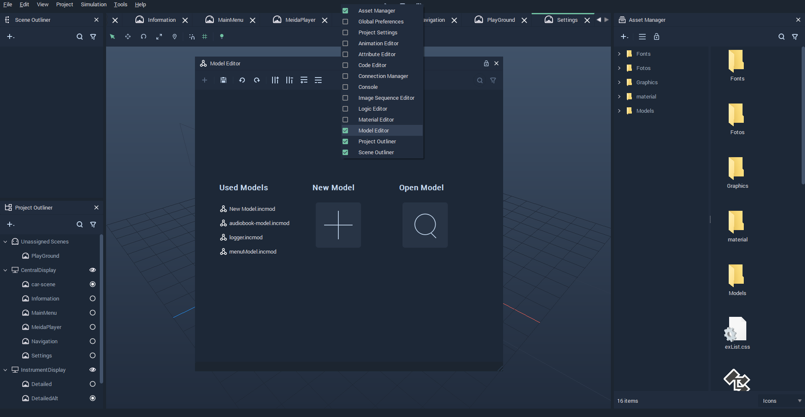
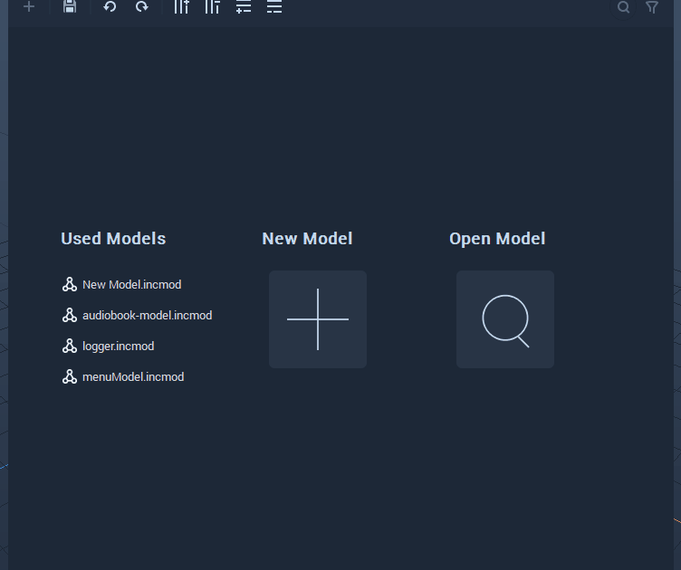
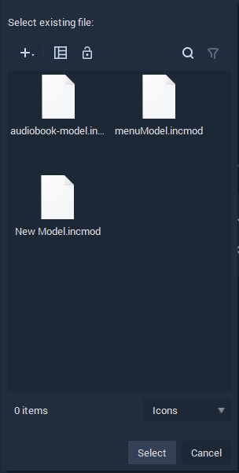

# Model Editor

**Data** **Models** used in **Scene** **Objects** such as **List** can be created using the **Model Editor**. These files have *.incmod* as their filename extension.

 In order to open the **Model Editor**, *right-click* on the *Menu bar* in Incari and *click* on **Model Editor** from the drop-down list. This can be seen in the illustration below:

`Used Models` seen from the illustration above are **Models** which have been previously used in the **Scene**. These **Models** can be opened by *clicking* on them.

`New Model` allows us to create new **Models** in the **Assert Manager**. The illustration below depicts its behavior when *clicked*.

`Open Model` opens a window that allows us to select an existing **Model** file. An example of the window is shown below:

