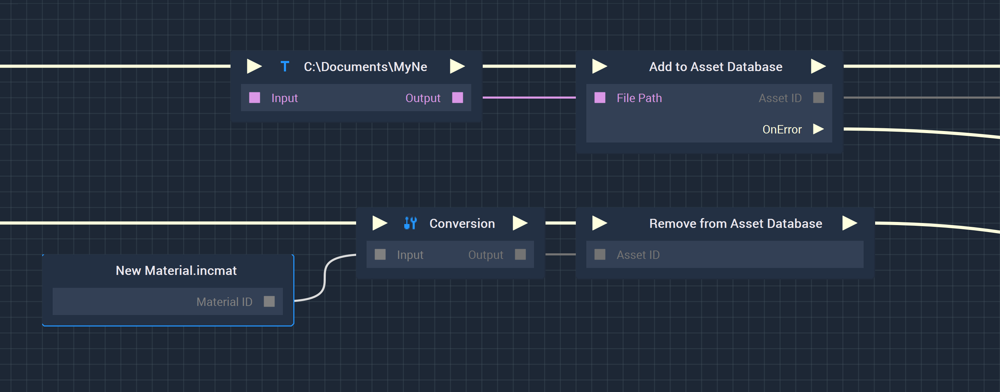

# Asset Database

## Overview

The **Asset Database** is a *database* of all the **Assets** that are either used in the **Project** or available to be used at runtime. It allows the user to keep track of all these **Assets** and have easy access to information about them, such as how many times they are used in the **Project** or their location.

In summary, the **Asset Database** shows two sets of **Assets**:

* **Assets** that are currently used in the **Project**. These are added automatically when used in the **Project**.
* **Assets** that are available to be used in the **Project** at runtime. These have to be added manually from the [**Asset Manager**](asset-manager.md).

For each **Asset**, the **Asset Database** displays the following information:

* `ID`: Unique identifier for the **Asset**.
* `Icon`: Icon that represents the `Type` of **Asset**.
* `Type`: Type of **Asset**.
* `Label`: *Label* for the **Asset**. By default, it is set to the filename and it can be edited directly on the **Asset Database**.
* `Source`:
* `Path`: *Path* to the file. For **Assets** located in the **Project Asset** folder, it shows the relative *path*, and for other **Assets**, it shows the full *path*.
* `#`: Number of times that the **Asset** is used in the **Project**.

And it offers two options:

* `Highlight asset in Asset Manager`: Press this option to highlight the **Asset** in the **Asset Manager**.
* `Remove asset from Asset Database`: Press this option to remove the **Asset** from the **Asset Database**.

## Adding Assets to the Asset Database

There are three ways in which **Assets** can be added to the **Asset Database**:

### Using Assets in the Project

Using an **Asset** automatically adds it to the **Asset Database**.

### Manually

An **Asset** can be added manually to the **Asset Database**. To do this, simply drag and drop a file in the **Asset Database**. This can be done from the **Asset Manager** or from the *File Explorer*, thus allowing to add files that are not in the **Asset** folder.

There are two special cases:

* **Keyboard Layouts** have to be added in [**Project Settings**](project-settings/keyboard.md) and then they will be automatically added to the **Asset Database**. 

* **Materials** are automatically added to the **Asset Database** when created in the [**Asset Manager**](asset-manager.md) 

### At runtime using Logic

**Assets** can be added to the **Asset Database** using **Logic**. For this purpose, use the [**Add to Asset Database** **Node**](../toolbox/incari/asset/add-to-asset-database.md), which receives the *path* of the file to be added to the **Asset Database**.

They can also be removed from the **Asset Database** using the [**Remove from Asset Database** **Node**](../toolbox/incari/asset/remove-from-asset-database.md). To obtain the **Node** corresponding to an **Asset** in the **Asset Database**, simply drag the **Asset** from the **Asset Database** into the **Logic Editor**.

See in the image below simple examples of how to use these **Nodes**:

## Features

### Search

how to search

### Filter

how to filter

### Highlight

### Remove

