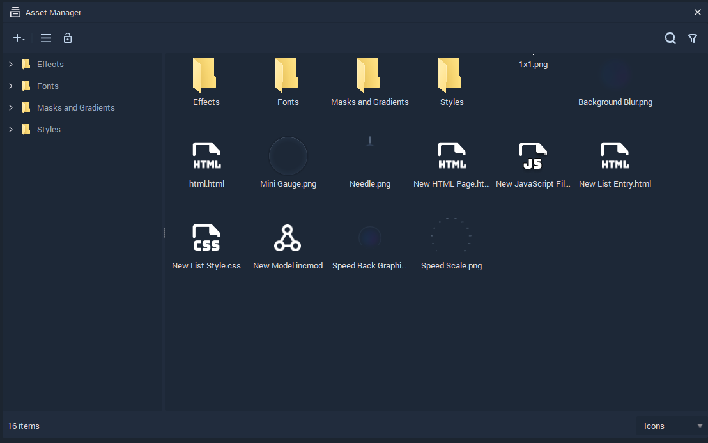

# Asset Manager

## Overview

**Assets** are the files in the **Project Asset** folder. They can be used for creating or modifying **Objects**. The **Asset Manager** shows all the available **Assets** and allows to organize, manage, and create them.

## Importing

**Assets** can be imported by clicking on the plus  icon at the top left of the **Asset Manager**, selecting `Import Assets`, and finding the files to import to the **Asset Manager**.

## Creating

For creating an **Asset**, right-click on the **Asset Manager**, select `Create Asset`, and choose which kind of **Asset** to create.

## Views

The **Asset Manager** offers different views of the files in the **Assets** folder. The general view can be switched on the top left between flat and folder tree view and the files can be seen as either icons or in a list, which is chosen in the bottom right corner.

## Deleting

**Assets** can be deleted in the following ways:

* Right-click the **Asset** and select the `Delete` button from the pop-up.
* Select an **Asset** and press `del`.

## Renaming

**Assets** can be renamed by right-clicking an item and selecting `Rename`. You can then type a new name and press **`⏎`**/`Return` to confirm the change.

