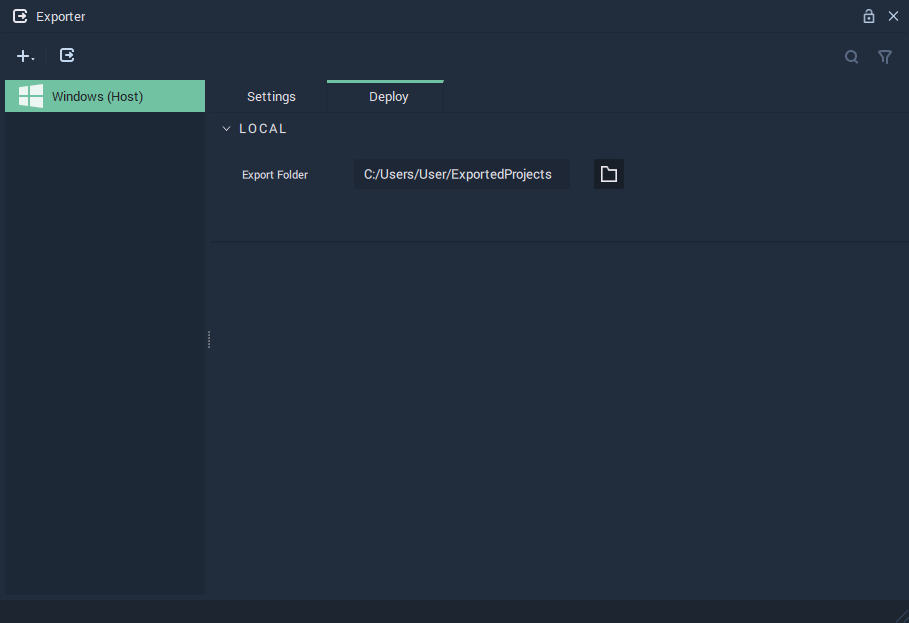

# Exporter

The **Exporter** **Module** allows the user to export a **Project** to a chosen location. In addition to exporting the **Project**, **Exporter** can create a copy of **Incari Player** in the same folder. This makes it possible to save and open a **Project** in **Player** format at another time.

There are two tabs in the **Exporter** **Module**: [**Settings**](#settings) and [**Deploy**](#deploy).

Furthermore, find below an easy guide on [**Exporting a Project**](#exporting-a-project) with the **Exporter** **Module**.

## Settings

### General

* `Target`: *Operating System* in whose **Incari Player** version the **Project** will be played.

### Options

* `Only Project`: Whether only the **Project** will be exported or the **Project** alongside a copy of **Incari Player**.

## Deploy

* `Export Folder`: The location in the local machine to which the **Project** will be exported.

<!--  -->

## Exporting a Project

To export a **Project**, simply click on the `Export` button on the top menu.

A pop-up message indicating that the export was successful will appear.

After exporting a **Project**, the export folder will have:

* A folder with the exported **Project**.
* A `run.bat` file.
* A folder with a copy of **Incari Player** (only if `Only Project` was set to *false*).

The **Project** can then be started by launching `run.bat`.

It is also possible to export a **Project** from the command line with the command `IncariCLI.exe /p="<project-path>" /export /output="<export-folder-path>"`.

