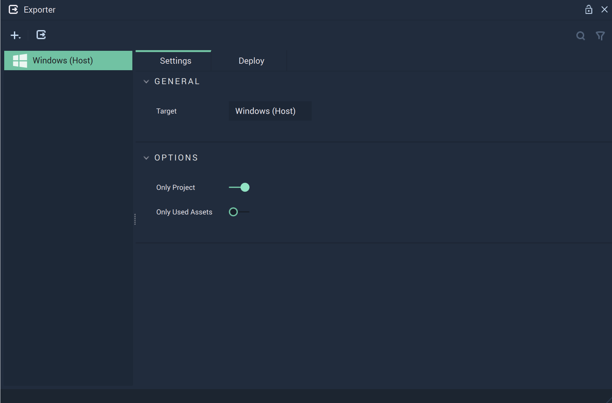
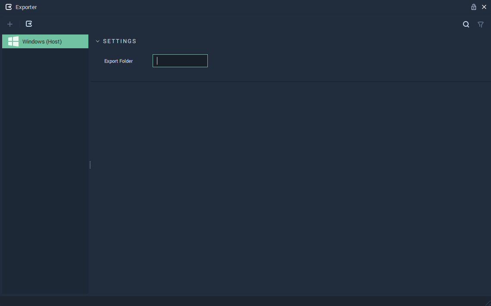
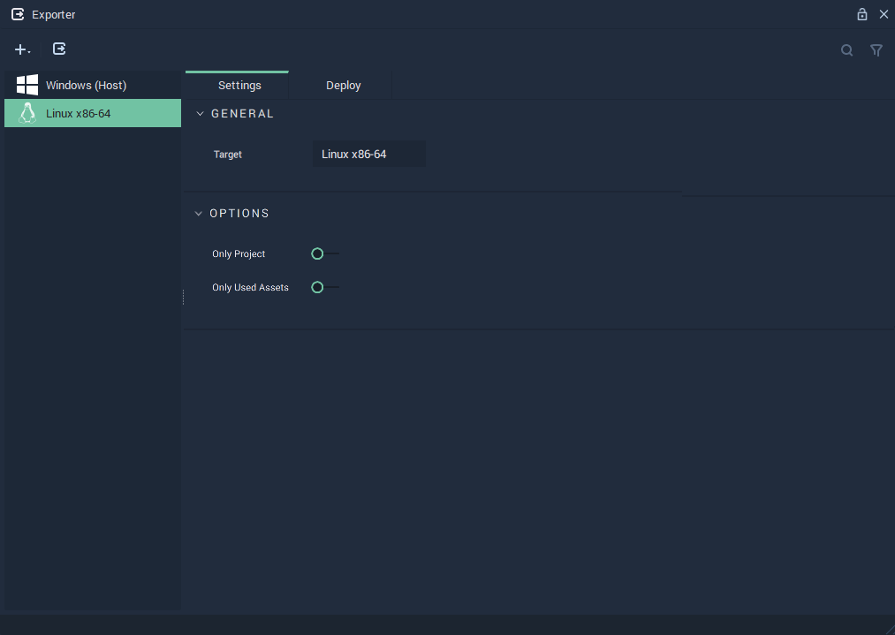
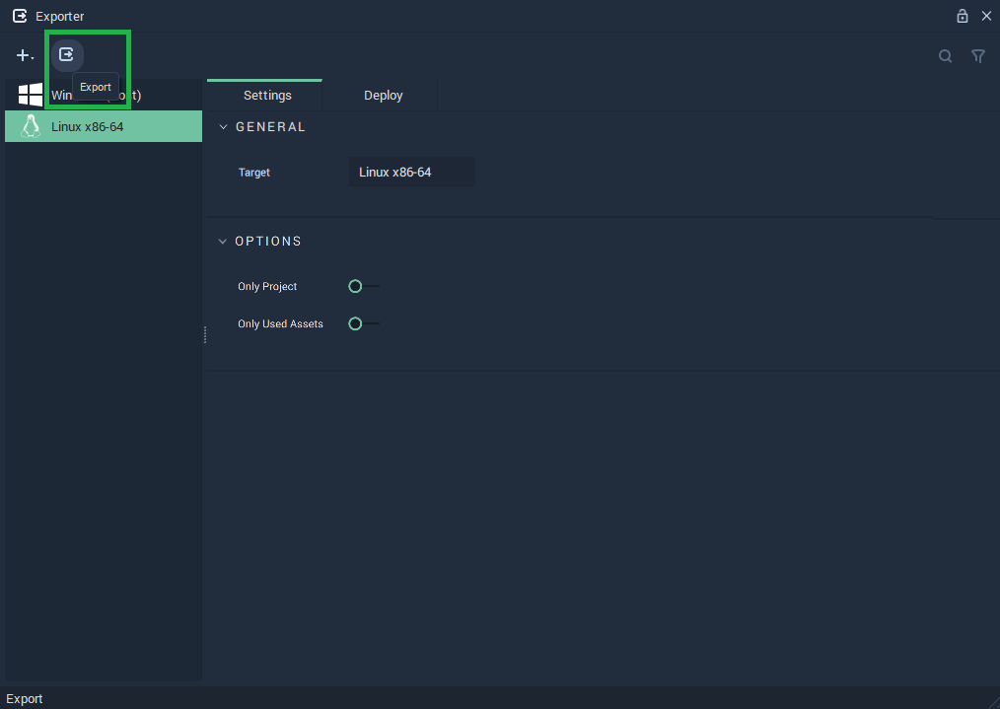
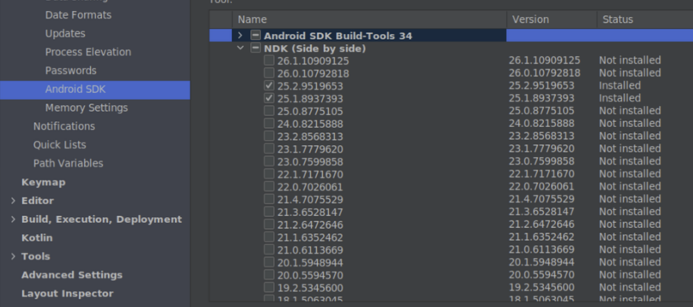

# Exporter

The **Exporter** **Module** allows the user to export a **Project** to a chosen location. In addition to exporting the **Project**, the **Exporter** can create a copy of **Incari Player** in the same folder. This makes it possible to save and run a **Project** without the need of **Incari Studio**.

There are two tabs in the **Exporter** **Module**: [**Settings**](#settings) and [**Deploy**](#deploy).

Furthermore, find below an easy guide on [**Exporting a Project**](#exporting-a-project) with the **Exporter** **Module**, divided between the two possible cases of *Target Platforms*:

* [**Host Target**](#host-target)
* [**Different Target**](#different-target)

## Settings

### General

* `Target`: *Operating System* where the exported **Project** will be played in the corresponding version of **Incari Player**. 
### Options

* `Only Project`: Whether only the **Project** will be exported or the **Project** alongside a copy of **Incari Player**.
* `Only Used Assets`: A user may import more **Assets** than they end up using. When toggled on, this **Attribute** makes sure only the essential **Assets**, which appear in the **Asset Database**, are packaged up for export. 
## Deploy

* `Export Folder`: The location in the local machine to which the **Project** will be exported.

<!--  -->

## Exporting a Project

There are two slightly different procedures for exporting a **Project** depending on the `Target` chosen:

* [**Host Target**](#host-target)
* [**Different Target**](#different-target)

### Host Target

Exporting a **Project** for the *Host* `Target` is very straightforward as this `Target` is already available and selected by default. To export the **Project**, simply click on the `Export` button on the top menu.

A pop-up message indicating that the export was successful will appear.

After exporting a **Project**, the export folder will have:

* A folder with the exported **Project**.
* A `run.bat` file.
* A folder with a copy of **Incari Player** (only if `Only Project` was set to *false*).

The **Project** can then be started by launching `run.bat`.

It is also possible to export a **Project** from the command line. There are two cases, which are equivalent to whether the `Only Project` option is set to *true* or *false* in [**Settings**](#settings), when exporting from **Incari Studio**.

For exporting the **Project** alongside a copy of **Incari Player**, run the command:

* `IncariCLI.exe /p="<project-path>" /export /output="<export-folder-path>"`.

For exporting just the **Project**, without a copy of **Incari Player**, run the command:

* `IncariCLI.exe /p="<project-path>" /export /output="<export-folder-path>" /no-player`.

<!-- with the command `IncariCLI.exe /p="<project-path>" /export /output="<export-folder-path>"`. 

Add `/no-player` to the command to export just the **Project** without a copy of **Incari Player**, this is equivalent to setting `Only Project` to *true* in the [**Settings tab**](#settings) when exporting from **Incari Studio**. Omitting `/no-player` from the command will result in exporting the **Project** alongside a copy of **Incari Player**, just as setting `Only Project` to *false* when exporting from **Incari Studio**. -->

### Different Target

#### Linux

Exporting a **Project** for a different *Target* than the *Host* requires a few preparatory steps that will be explained in detail:

**Setting up WSL**

*WSL* stands for *Windows Subsystem for Linux* and is a tool that allows users to run a *Linux* environment directly on *Windows*. It is needed for building the **Project** for the desired *Target Platform*. 

Find more information about *WSL* on the links provided in the **External Links** section below.

To set up *WSL*, follow these steps:

1. Either on *Windows PowerShell* or *Command Prompt*, run the following *command*: `wsl --install`. This will install *WSL* and the latest *Ubuntu* version.
2. Restart *Windows*.
3. Go to the *Microsoft Store* and install *Ubuntu 22.04* or run on the *PowerShell* or *Command Prompt* the following command: `wsl --install -d Ubuntu-22.04`.
4. Enter your credentials in the pop-up window that appears. If it does not appear, run the command `wsl` on the *PowerShell* or *Command Prompt* and enter your credentials.
5. Set-up *Ubuntu 22.04* as the default *distribution* by running the command `wsl --set-default Ubuntu-22.04` on the *PowerShell* or *Command Prompt*.

**Preparing Incari Studio**

For exporting to a different *Target Platform* than the *Host*, a *cross-compiled* version of **Incari Player** for the desired *Target* is necessary.

* Download **Incari Player** for the desired `Target` *platform* in the [*Applications*](../getting-started/first-steps/incari-hub.md#incari-player) section of [**Incari Hub**](../getting-started/first-steps/incari-hub.md).

<!-- 1. Acquire **Incari Player** for the desired `Target` *platform* in the *Applications* section of [**Incari Hub**](../getting-started/first-steps/incari-hub.md). For this, an **Enterprise Account** is needed.
1. Copy the *cross-compiled* version of **Incari Player** in the following location: `%AppData%\IncariStudio\CrossCompile\<target-triple>\Incari\IncariPlayer\<IncariStudio/Player-version>/`. 

The `<target-triple>` in the *path* where the *cross-compiled* version of **Incari Player** should be located is dependent on the desired *Target Platform*.

These are a few examples for `<target-triple>` to be used in the *path*:
* `x86_64-linux-gnu`, for *Linux x86-64*.
* `aarch64-linux-gnu`, for *Linux arm64*.
* `arm-linux-gnueabihf`, for *Linux arm32*.
 -->
**Exporting the Project**

After following all the previous steps, everything is ready for exporting a **Project** to the desired *Target* *Platform*. For this:

1. Open the **Project** to be exported in **Incari Studio** and go to the **Exporter Module**.
2. Add the desired `Target` by using the plus icon on the top left.

3. Choose the desired `Export Folder` on the [**Deploy**](#deploy) tab. 
4. Click on the `Export` button on the top menu.

A pop-up message indicating that the export was successful will appear.

After exporting a **Project**, the export folder will have:

* A folder with the exported **Project**.
* A `run.sh` file.
* A folder with a copy of **Incari Player** for the desired `Target` (only if `Only Project` was set to *false*).

The **Project** can then be started on the *Target Platform* by launching `run.sh`.

It is also possible to export a **Project** from the command line. There are two cases, which are equivalent to whether the `Only Project` option is set to *true* or *false* in [**Settings**](#settings), when exporting from **Incari Studio**.

For exporting the **Project** alongside a copy of **Incari Player**, run the command:

* `IncariCLI.exe /p="<project-path>" /export /output="<export-folder-path>" /target=<target-triple>`.

For exporting just the **Project**, without a copy of **Incari Player**, run the command:

* `IncariCLI.exe /p="<project-path>" /export /output="<export-folder-path>" /no-player /target=<target-triple>`.

Where `<target-triple>` specifies the *Target Platform*:

* Use `x86_64-linux-gnu` for *Linux x86-64*.
* Use `aarch64-linux-gnu` for *Linux arm64*.

#### Android

**Setting up Android SDK and NDK**

To deploy the application on an *Android* device, [*AndroidStudio*](https://developer.android.com/studio/install) must be installed. 

During the *AndroidStudio* installation, a prompt will appear requiring that *Android SDK* be installed as well. This will also install *platform-tools*, which will be required to use [*Android Debug Bridge*](https://developer.android.com/tools/adb) to build and run an app from **IncariStudio**. Please make sure `Android SDK` and `Android API 34` are selected. 

Next, *Android NDK* must be installed. This will allow one to compile **Incari Projects** for *Android* and compile *Android* projects later on. Simply open *Android Studio* and click `Tools->SDKManager->AndroidSDK->SDKTools` and in the *NDK* section, select `25.1.8937393`. 

*Android NDK* can also be downloaded [here](https://github.com/android/ndk/wiki/Unsupported-Downloads#r25c).

**Exporting Project**

When exporting a **Project** for *Android*, it is necessary to specify the *Android Toolchain Path*, besides the target platform and project. *Toolchain*
can be found in the installed or downloaded *NDK*.

For example:

`/home/user_name/Android/Sdk/ndk/25.1.8937393/toolchains/llvm/prebuilt/linux-x86_64`

or

`Downloads/android-ndk-r25c/toolchains/llvm/prebuilt/linux-x86_64/`

The toolchain path should be provided to the `IncariCLI` as an argument, alongside the project name and desired output directory. 

## External Links

* [*WSL Documentation*](https://learn.microsoft.com/en-gb/windows/wsl/).