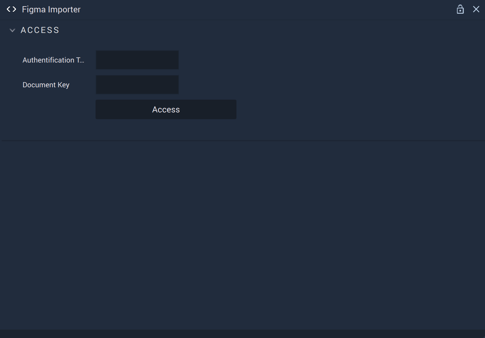
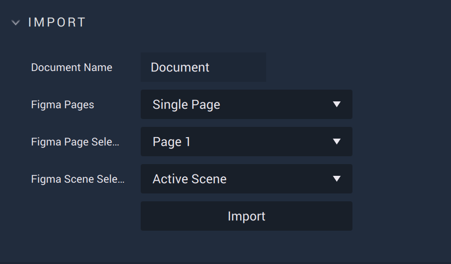
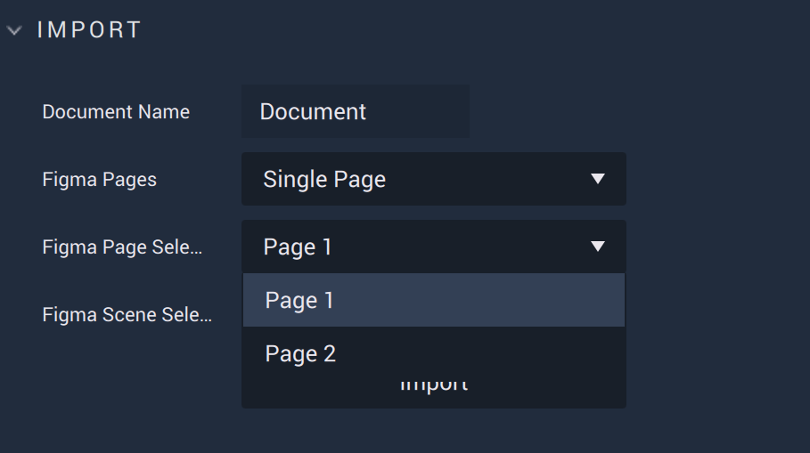
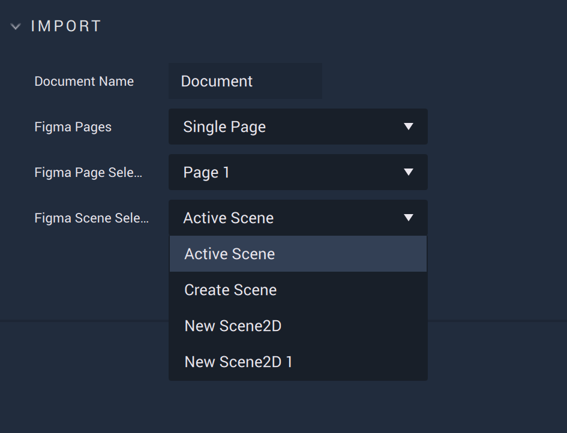

# Figma Importer 

The **Figma Importer** allows the user to import their projects (or parts of their projects) from *Figma* and render them in **Incari Studio** with comparable retention of designs using **Scene2Ds**. As of 2023.2, there are some exceptions to this which will be desribed in greater detail [below](figma-importer.md#exceptions).

All *Figma* componenets are imported as **Prefabs**. More specifically, a component will become a [**Frame**](../objects-and-types/scene2d-objects/frame.md) and its variants become **Prefabs** under that **Frame**. 

Even if only one page of a *Figma* project is imported, *all* components and their variants from the entire project will be imported into **Incari Studio**. If there are any images in the *Figma* project, the images are added like a normal **Asset** and appear in both the [**Asset Manager**](../modules/asset-manager.md) and [**Asset Database**](asset-database.md). 

NESTED PREFABS

*Figma* pages are different to **Scenes** in **Incari**. Large *Figma* pages take a long time to render, so its recommended to split these into multiple pages before importing. It's also highly suggested to flatten any objects used in *Figma* projects so that everything runs smoothly in **Incari**. 

## Access

Before any options for importing can become available, the user must locate the necessary information to access the *Figma* project. These are the `Authentication Token` and the `Document Key`.

The `Authentication Token` can be generated in a *Figma* user's account settings, the process of which is described [here](https://www.figma.com/developers/api#authentication). 

The `Document Key` is located in the *url* of the project, after `file` such as in:

`https://www.figma.com/file/jCFQWXBJWk6LtqsI4wLi4j/project_example_name`

Here, the `Document Key` is `jCFQWXBJWk6LtqsI4wLi4j`

Inputting these two into their respective text boxes will result in the user gaining access. 

In the event that this attempt is unsuccessful, a warning will be given. 

## Import 

There are initially two **Attributes**, `Document Name` and `Figma Pages`.  

### All Pages

Selecting `All Pages` will import each *Figma Page* into a new and separate Scene2D. For example, if a *Figma* project has two *Pages* called `Page 1` and `Page 2`, this will result in two new **Scene2Ds** in `Unassigned Scenes` in the **Project Outliner** labeled `Page 1` and `Page 2`. 

### Single Page

Selecting `Single Page` will make the `Figma Page Selection` and `Figma Scene Selection` **Attributes** visible. 

`Figma Page Selection` gives a dropdown of all the possible *Figma Pages* available in the accessed *Figma* project. 

`Figma Scene Selection` gives a dropdown of all the possible **Scene2Ds** to import into as well as the options `Active Scene` (the **Scene2D** that is currently open) and `Create Scene` (creates a new **Scene2D** on import). 

If there is not an `Active Scene`, one will be created. If one imports into a **Scene2D** where there is already a populated **Scene2D**, it will override what is currently there (this applies to **Objects** and not to **Logic**). Please note that all references in the **Logic** will break as they have likely been deleted! 

## Exceptions

There are a few small exceptions that should be noted in order to make sure everything runs smoothly and renders properly on import in **Incari Studio**.

* **General**

  * Any flattened *Figma* objects, or *Figma* vectors in general, must not consist of multiple different fills.

* **Objects**

  * Polygons and Stars in *Figma* are imported as **Vectors**.

* **Text**

  * In *Figma*, properties are on a letter basis, meaning that it is possible to change the colors of individual letters. In **Incari** they are on an object basis, meaning that setting the color of individual letters won't do anything.

  * **Fonts** have to be added [manually](../modules/project-settings/fonts.md). If a font unknown to **Incari** is imported from a *Figma* project, a so-called *dummy font* will be used in its place and a file will appear in the **Asset Manager** containing default dummy font. 

  * `Line Height` only works with %, not with pt.

* **Frame**

  * Only integers for layouting. This may change in the coming days though

  * If the user imports a **Frame** which has a fixed size and its content (i.e. padding, gap, size, etc.) exceeds the size of the **Frame**, it will appear differently to how it looks in *Figma*. *Figma* tries to center the content while applying gap and padding; however, in **Incari Studio**, We apply the left and top padding and then the gap, and only apply the bottom and right padding for the space that remains.

* **Prefabs**

  * Nested *Figma* variants must not change the type of variant they use. If there is a change, everything upwards in the hierarchy will imported as a **Frame**. 

  * Remote *Figma* components are imported as **Frames**, so there is no linking to the original component.

* **Vector**

  * Objects which cannot have a fill (open objects) have a static stroke width which cannot be changed. 

* **Paint**

  * Setting the outer handle of gradients is not supported.

  * Diamond Gradient paints are not supported, lending the whole layer to be nonexistant as nothing is imported.

