# Logic Editor

Logic in Incari is what allows us to take our 2D/3D assets and turn them into fully-interactive user interfaces. Traditionally, building this kind of complex system was only achievable by writing _a lot_ of code, however by utilizing Incari's powerful visual scripting tools, we can build these systems without writing a single line! This section introduces you to some of the core concepts and terminologies of Incari's **Logic Editor**.

## 1 - Logic Editor Window

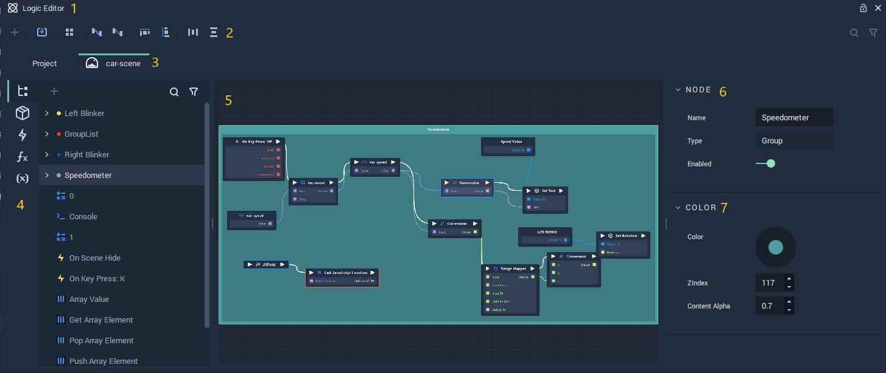

**Logic Editor** - The main window which contains all things logic-related. It is compartmentalized into several different sections discussed below.

## 2 - Toolbar

The toolbar shows a list of icons that are used to visualize certain features in the **Logic Graph**. Definitions of the icons are as follows:

 **Import blueprint** icon allows you to import a **Logic Graph** saved on your computer into the **Logic Editor**.

 **Group** icon clusters **Logic Graph**s into distinct groupings. See a usage example below:

 **Highlight** icon applies a distinct color to sections of a **Logic Graph** that are connected together. **Remove highlight** reverses the action performed by clicking the **Highlight** icon. See a usage example below:

 **Align horizontally** and **Align Vertically** icons will align a **Node Graph** horizontally and vertically respectively in the **Logic Editor**. See usage example below:

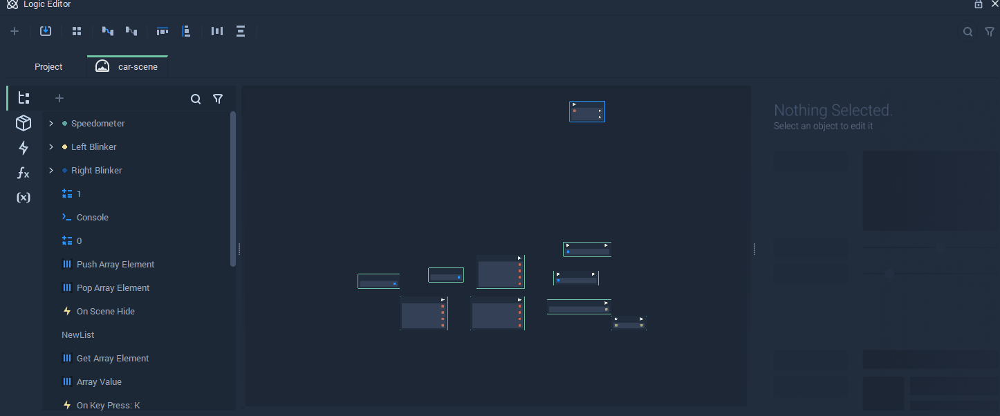

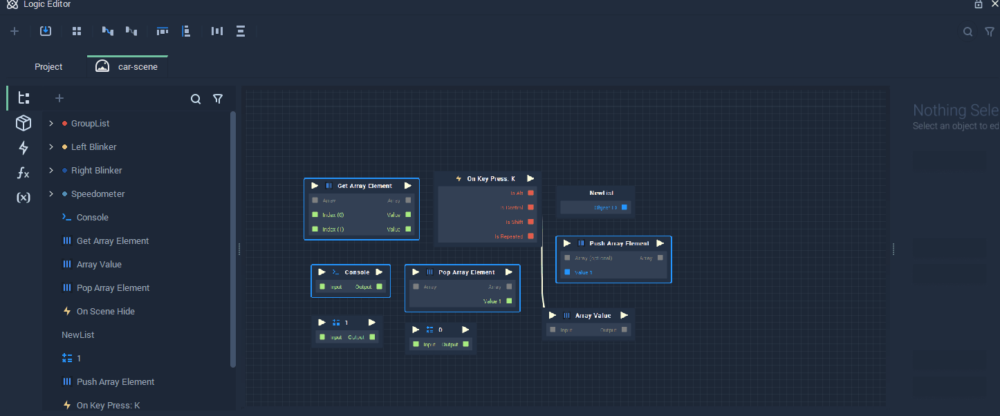

 **Arrange horizontally** and **Arrange vertically** icons will arrange a **Node Graph** horizontally and vertically respectively in the **Logic Editor**. See Usage example below:

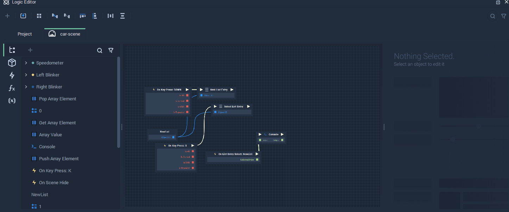

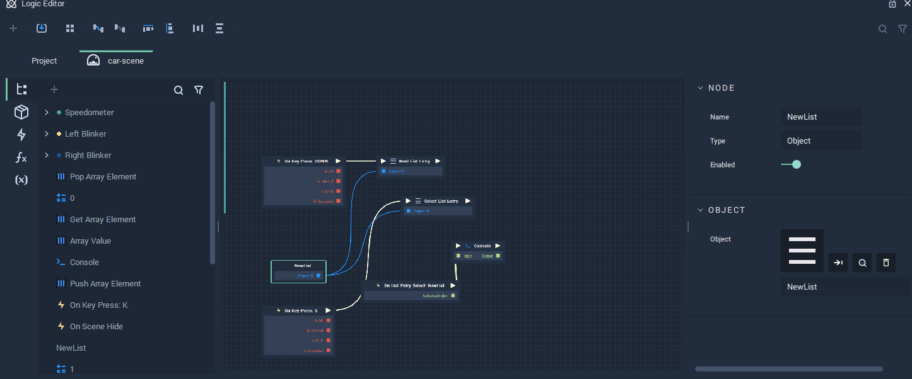

## 3 - Top Panel

The _top panel_ represents **Logic Graph**s that are implemented for different Incari items such as the current opened **Project**, the selected **Scene** in the **Project Outliner** and **Functions** added to the **Logic Editor**. Each **Logic Graph** can be accessed by using the tabs on the _top panel_.

## 4 - Left Panel

The _left panel_ contains **Nodes** that can be added to the **Logic Editor**. The panel is divided into five sections, and these are the **Explorer**, **Toolbox**, **Events**, **Functions** and **Variables**.

Each section is described below:



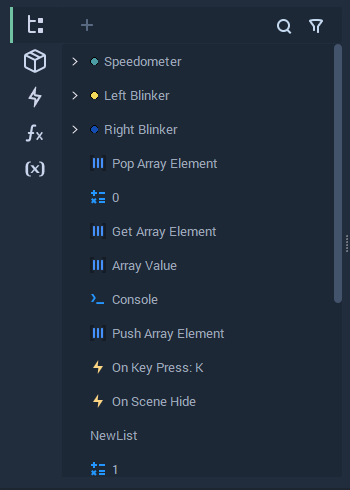

All **Nodes** and **Groups** that are added to the **Logic Graph** will be listed in this section. When an item is picked in this section, the corresponding node is selected in the **Logic Graph**.



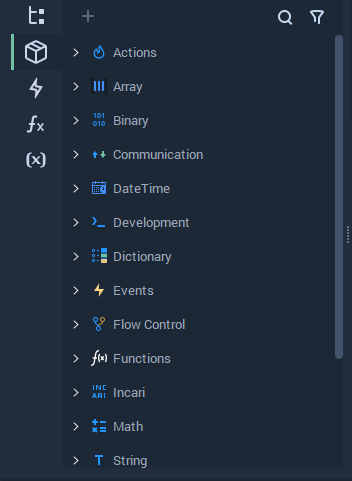

The **Toolbox** contains all of the individual tools you will need to create your logic. The function and purpose of all nodes are covered in depth in the **Toolbox** section and it is _highly_ recommended that you refer to it, to understand how each node functions. In short, the **Toolbox** contains a categorized list of all nodes available at your disposal, which can be added to your logic by double-clicking or dragging and dropping an item into your **Logic Graph**.




An **Event** **Node** can be added to the **Events** tab by clicking on the add icon  located at the top of the panel and then the desired name for the **Event Node** inserted. You can add the **Event Node** to your logic by dragging and dropping it into your **Logic Graph**. The illustrations below describes briefly how **Events** are created in the **Logic** **Editor**. For a detailed introduction to **Events**, please see [toolbox/events](../toolbox/events/).

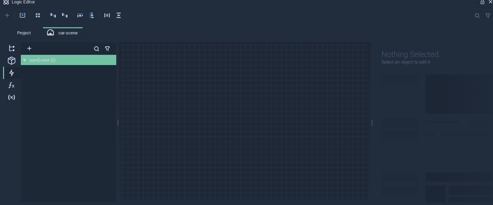



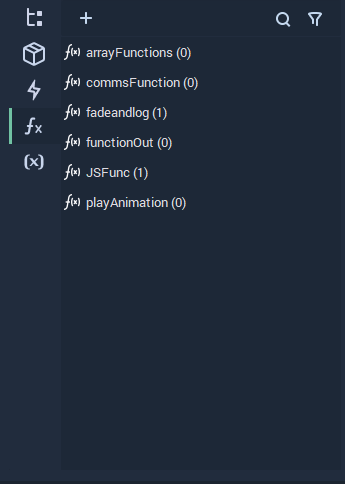

Custom-built **Node Graph**s can be packaged as a function and added to your **Scene** logic in a modular manner. To add a function to the **Functions** tab, click on the add icon  located at the top of the panel and type in the desired name of the function. The illustrations below describes briefly how **Functions** are created in the **Logic** **Editor**. For a detailed discussion of **Functions**, please see [toolbox/functions](https://github.com/cgi-studio-gmbh/incari-doc/tree/66656c2442958de634bc73f77b533a03f83df0fb/toolbox/functions/README.md).





The **Variables** tab allows us to add variables to the **Logic Editor**. To add a variable to your **Logic Graph**, click on the add icon  located at the top of the panel and type in the desired variable name. The illustrations below describes briefly how **Variables** are created in the **Logic** **Editor**. For a detailed discussion of **Variables**, please see [toolbox/variables](https://github.com/cgi-studio-gmbh/incari-doc/tree/66656c2442958de634bc73f77b533a03f83df0fb/toolbox/variables/README.md).

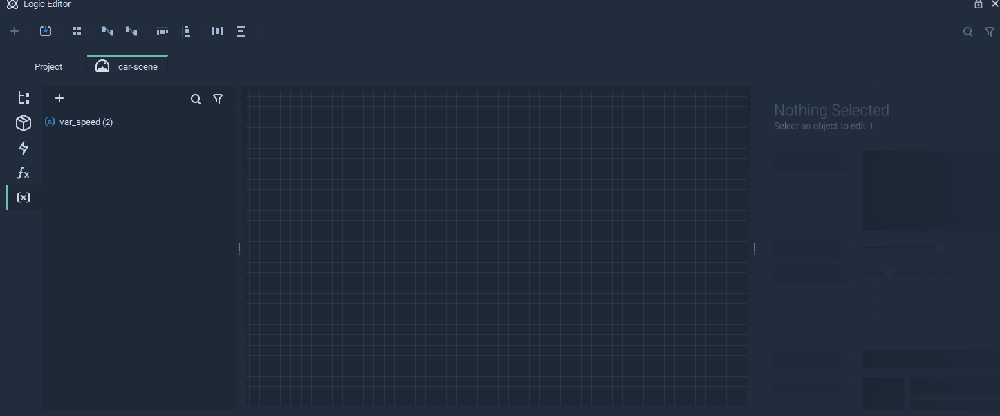



## 5 - The Logic Graph / Node Graph

The most important section of the **Logic Editor**. If the nodes and variables are the paints and materials at your disposal, then the **Logic Graph** is the canvas. This is where we build our systems from the ground up and where you will spend most of your time while using Incari.

Fundamentally, it is comprised of a combination of two entities: **Nodes** and **Connections**.

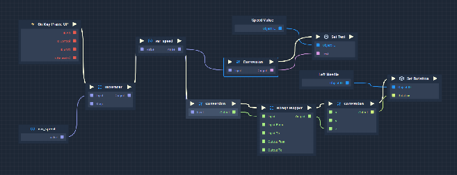

### **Nodes**

**Nodes** are components which each have a specific, singular function. The majority of Nodes evaluate data values based on input parameters, but they can also represent **Variables**, **Events** and **Objects**.

#### Sockets

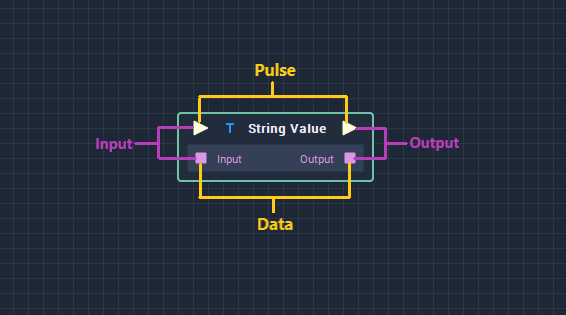

**Sockets** are like the ports on an electronic device. Along with **Connections**, they allow us to link **Nodes** to each other. In Incari, sockets are either:

* **Input** \(receiving an instruction or data value\). **Sockets** on the left-hand side of a **Node** are **Input Sockets.**
* **Output** \(sending an instruction or data value\). **Sockets** on the right-hand side of a **Node** are **Output Sockets**.

Beyond that, we have **Pulse** and **Data Sockets**, denoted by white triangles \(►\) and coloured squares \(■\) respectively. For example, when we refer to an "Input Pulse Socket", we are normally referring to the white triangle in the top-left-hand side of a node.

The concept of **Sockets**, makes much more sense in the context of **Connections**.

#### **Connections**

**Connections** are the "wires" that link our components together. This is how we pass data between nodes and how we determine the execution order of our logic. Connections come in two categories and are related to the type of **Socket** they are plugged into. The two categories are **Pulse** and **Data**.

#### Pulse

These connections do not carry any data between nodes. What they _do_ is tell nodes that it is time for them to do their thing. Once a node has finished its execution and its purpose has been fulfilled, the next node connected via the **Pulse** connection will then begin _its_ task. Pulse connections are represented by a white "wire", linking two **Pulse Sockets**, represented by white triangles \(►\). Multiple connections can be plugged into a single **Pulse Input Socket**, however only one connection can come out of a **Pulse Output Socket**. Pulse Connections are also referred to as Pulses.

#### Data

These connections pass data values between nodes. We do this by connecting the **Data Output Socket** of one node into a **Data Input Socket** of another node. Both the input and output sockets must be of the same data type. **Data Sockets** are represented by a coloured square \(⬛\), the colour of which, corresponds to the **Data Type**. Conversely to **Pulse** connections, **Data Input Sockets** can take only one input connection, whereas **Data Output Sockets** can have multiple output connections. Unlike **Pulse** connections, **Data** connections do not initiate the execution of a node.

## 6 & 7. **Node Attribute Editor**

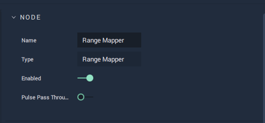

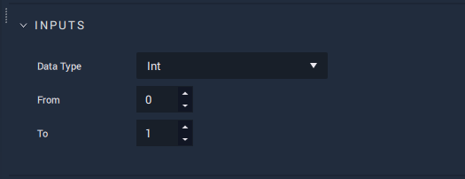

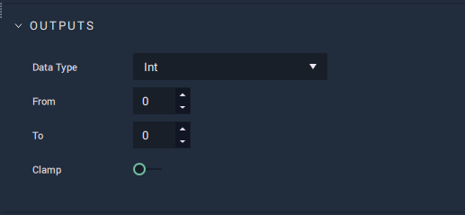

The **Node Attribute Editor** \(referred to simply as **Editor** hereinafter\) is similar to the **Attribute Editor**, except rather than adjusting the **Attributes** of **Objects**, we can adjust the **Attributes** of **Nodes**. **Node Attributes** are specific to that particular **Node** and are documented in their corresponding entry in the **Toolbox** section. Often, **Node** **Attributes** are simply an alternative to using **Input Connections** and can define a default value if there is no **Connection** attached to that particular **Input Socket**. There are exceptions however, where **Attributes** can be set only in the **Editor**, and there is no equivalent **Socket** available, which are discussed below, in the **Node-Specific Attributes** section.

### General Attributes

Coming under the "Node" heading of the **Editor**, these **Attributes** are available on nearly all **Nodes**. and can only be set in the **Editor**.

All Nodes have the following Attributes:

* **Name** - The name of the **Node**. This isn't editable unless it is a **Function**.
* **Type** - The type of **Node**. This isn't editable and will often be the same as the name, unless the **Node** represents something which the user defines, like **Functions**, **Variables** and **Objects**.
* **Enabled** - Allows the entire **Node** to be ignored by enabling/disabling it. This is useful when you want to test and debug a specific part of your logic, as you can disable entire node trees temporarily. All subsequent nodes linked via **Pulse Connections** _will not_ be executed.

Most **Nodes** also have an additional attribute:

* **Pulse Pass Through** - Similar to the **Enabled** attribute above, it disables the evaluation of a **Node**. The difference with this option however, is that subsequent **Nodes** linked via **Pulse Connections** _will_ be executed. This is useful when you only want to disable part of a **Node Tree**, rather than the entire thing.

### Node-Specific Attributes

As stated above, most **Node Attributes** are an alternative to **Data Input Connections** and allow us to set default values, in the absence of such a **Connection**. There are cases, though, where **Attributes** can only be set in the **Editor**, which modifies the way that the **Node** functions.

#### Data Types

Some **Nodes** work with different **Data Types**, however these need to be explicitly defined in the **Editor**, so that the **Node** knows which type it will receive \(**Input**\), and/or the type of data it will return \(**Output**\). Where multiple **Data Types** are available, there will be a drop-down menu in the **Editor**. Changing the **Type** will also change the colour of the corresponding **Socket**.

#### Linked Objects

Some **Node Attributes** correspond to something outside of the **Logic Editor**, such as a **Scene**, **Screen**, **Object**, **Text Object** or **File**. In this case, you will see a small square, which will either have a thumbnail, related to that type of **File** or **Object**, or the text "drag here". To assign something to the **Attribute**, simply drag and drop it onto the square.

#### Adding Removing Sockets

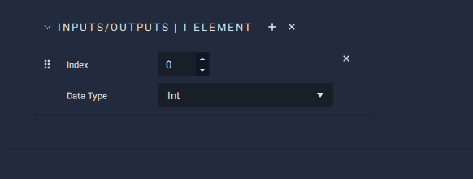

There are a few **Nodes** in Incari that allow you to customise the number of **Input**/**Output Sockets**. The purpose for this is very specific to that particular **Node**, but the process of adding/removing parameters is the same.

By clicking the plus button \(**+**\) you can add additional elements, which will be added to the _bottom_ of the list.

By clicking the cross button \(**x**\) you can remove elements. If you click the cross on the list _header_, it will remove _all_ of the elements, whereas if you click the cross on a list _item_, you only remove that _single_ element.

You can also rearrange the order of the elements by clicking and dragging elements using the rearrange button \(**⠿**\).

