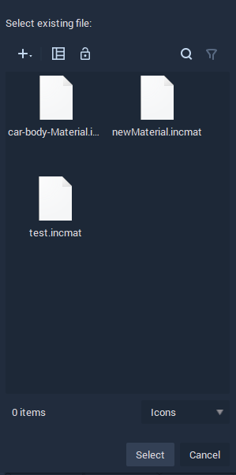
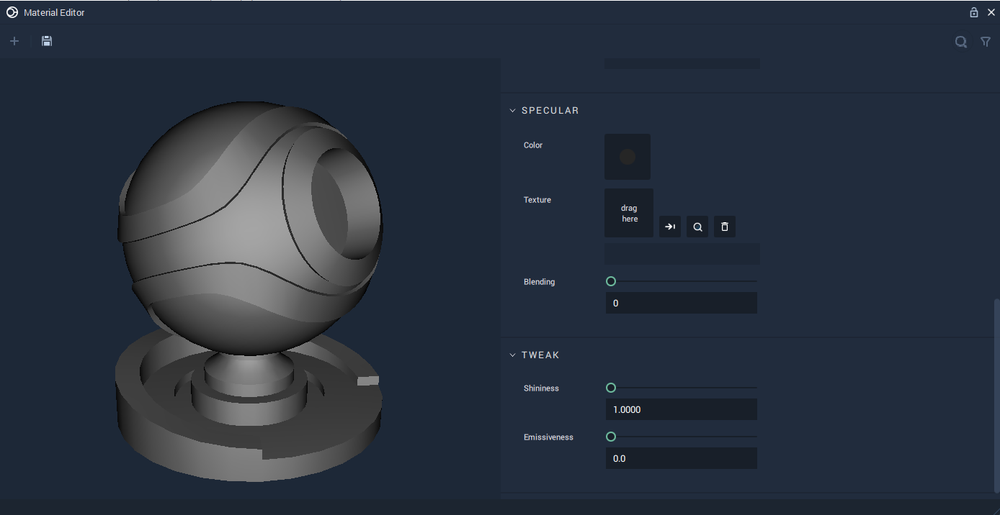
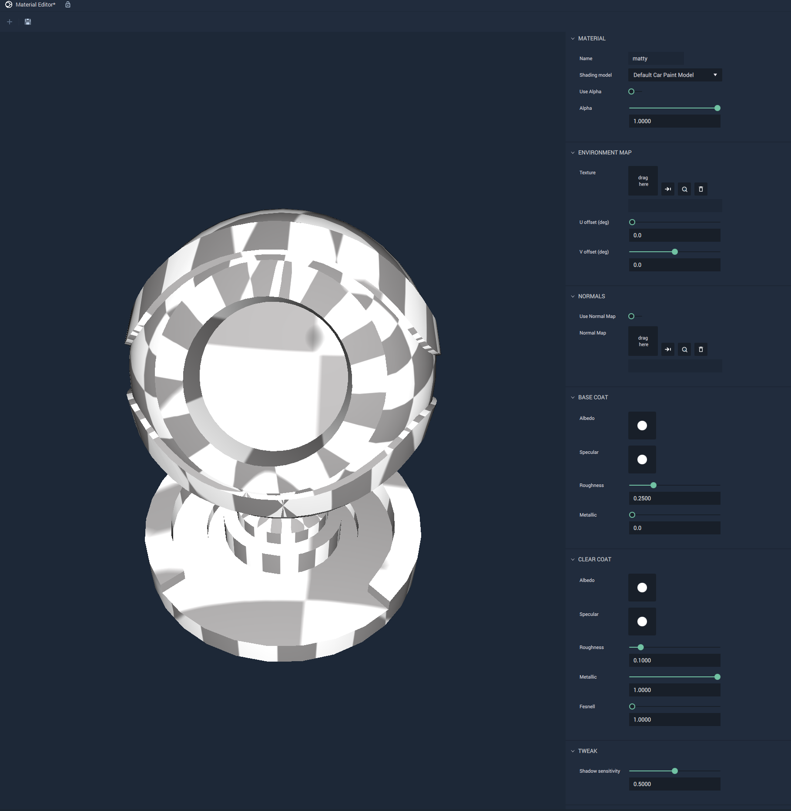
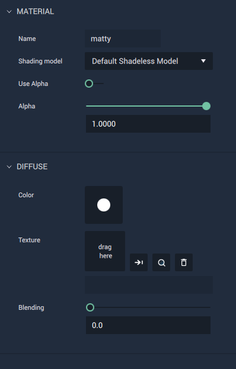

# Material Editor

The **Material Editor** allows us to create a **Material** that gives a **Mesh** a specific visual appearance when it comes into contact with **Light** in a **Scene**. The **Material** files have `.incmat` as their filename extension.

To open the **Material Editor**, double-click on a **Material** file in the **Asset Manager** or right-click on the Menu bar and click on **Material Editor** from the drop-down list. The latter option can be seen in the illustration below:

The sections defined in the **Material Editor** are discussed below. They will not be displayed in the **Material Editor** if a **Material** file has already been opened. 

The `Used Materials` section has **Materials** that have been previously applied to a **Mesh** in a **Scene**. These **Materials** can be edited by clicking on them.

`New Material`, as its name suggests, allows us to create new **Materials**. The illustration below depicts its behavior when clicked.

`Open Material` opens a window that allows us to select an existing **Material** file. An example of the window is shown below:

Once a **Material** has been opened, the **Material** **Editor** allows the user to edit the **Material's** **Attributes**. 

There are several **Shading** **Models** available to choose from when creating a new **Material**. The following sections gives a brief description of each and list their available attributes.<!-- Along with ways to edit **Shadow** and **Texture**, **Incari** now supports the use of _normal mapping_ with the `Normal Maps` **Attribute**. This allows the user to upload a **Normal Map** file that, when applied, can improve the detail and complexity of a **Mesh** which is made up of a low number of polygons \(simply put, less complex\). This also helps streamline the rendering process. With this type of texture mapping, **Meshes** in **Incari** will seem as detailed as complicated ones, while being more efficient. !-->

<!--

 !-->

## Default Car Paint Model 

This model represents a material that provides the visual qualities to a car's paint job. It allows for selecting and editing `Environment` and `Normal` `Mapping`, `Base` `Coat` `Color` and `Roughness`, `Clear` `Coat` `Color` and `Roughness`, as well as `Metallicness` and `Shadow` `Sensitivity`.

## Default Phong Model 

This model represents the standard Phong model, characterized by a shiny surface marked by pinpointed highlights. It allows for selecting and editing `Diffuse` or `Specular` `Color`, `Texture`, and `Blending`; `Normal` `Mapping`; as well as tweaking `Shininess` and `Emissiveness`.

## Default Glass Model

This model represents materials with a glass-like quality. It allows for selecting and editing `Environment` and `Normal` `Mapping`; `Base` `Texture`, `Color`, and `Blending`; `Reflection` `Color`, `Roughness`, and `Fresnel`; as well as tweaking `Shadow` `Sensitivity`. 

## Default ExtendendedPBR Model

This model offers more attributes than the **Default PBR Model**. It allows for selecting and editing `Environment` and `Normal` `Mapping`; `Albedo` `Texture`, `Color`, and `Blending`; `Specular` `Color`; as well as several aspects of `Occlusion` `Metallic` `Roughness`.

## Default PBR Model

This model represents a material that provides a more realistic quality to objects, using physically based rendering. It allows for selecting and editing `Environment` and `Normal` `Mapping`; `Albedo` `Texture`, `Color`, and `Blending`; `Specular` `Color`; as well as tweaking `Metalicness`, `Shadow` `Senstivity`, and `Roughness`. 

## Default Shadeless Model 

This model represents a material which displays a solid color and offers no response to light placement. It is rather simple, only allowing for selecting and editing `Diffuse` `Color`, `Texture`, and `Blending`. 

### See Also

* [**Mesh**](../getting-started/scene-objects/mesh.md)

## External Links

* More on [_normal mapping_](https://en.wikipedia.org/wiki/Normal_mapping) on Wikipedia.
* More on [*environment mapping*](https://en.wikipedia.org/wiki/Reflection_mapping) on Wikipedia. 
* More on [*specular reflection*](https://en.wikipedia.org/wiki/Specular_reflection) on Wikipedia.
* More on [*diffuse reflection*](https://en.wikipedia.org/wiki/Diffuse_reflection) on Wikipedia. 
* More on [*fresnel shading*](http://kylehalladay.com/blog/tutorial/2014/02/18/Fresnel-Shaders-From-The-Ground-Up.html) on Kyle Halladay's blog. 
* More on [*albedo shading*](https://www.scratchapixel.com/lessons/3d-basic-rendering/introduction-to-shading/diffuse-lambertian-shading#:~:text=albedo%20%3D%20reflect%20light%20incident%20light.%20In%20computer,often%20denoted%20with%20the%20Greek%20letter%20%CF%81%20%28rho%29.) on Scratchapixel. 

