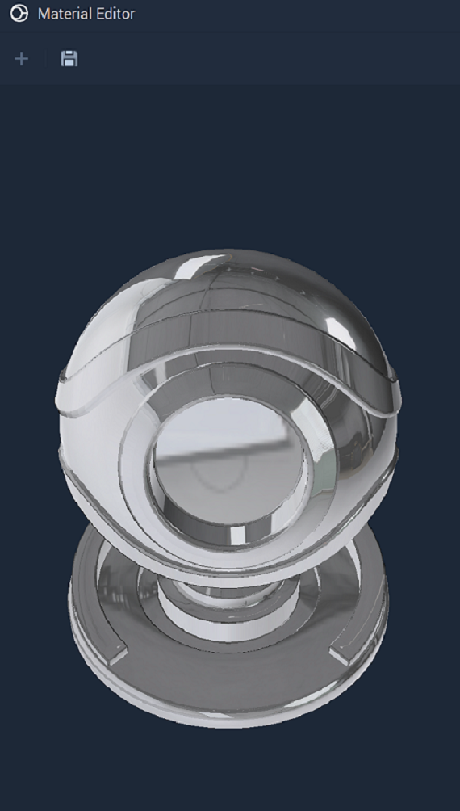
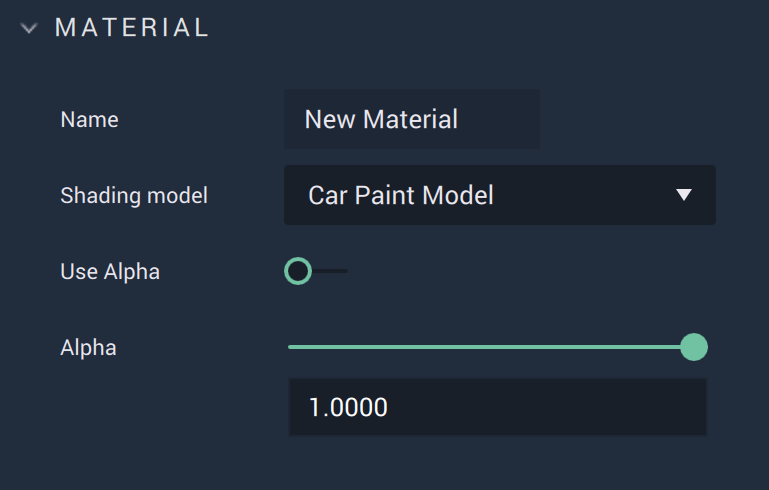
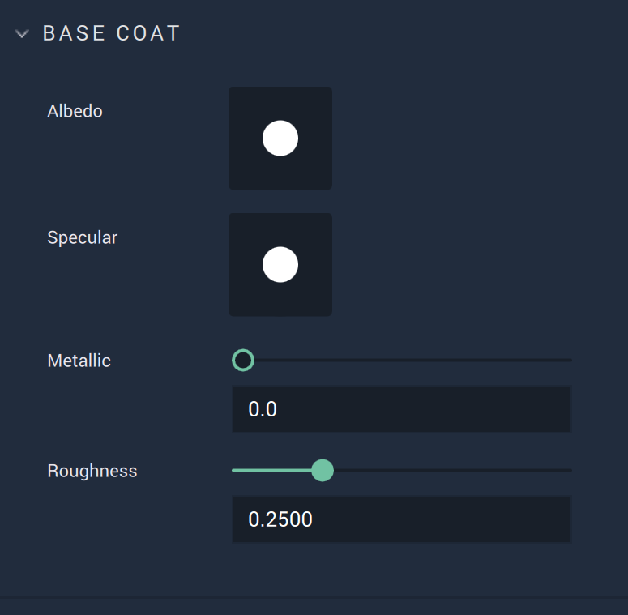
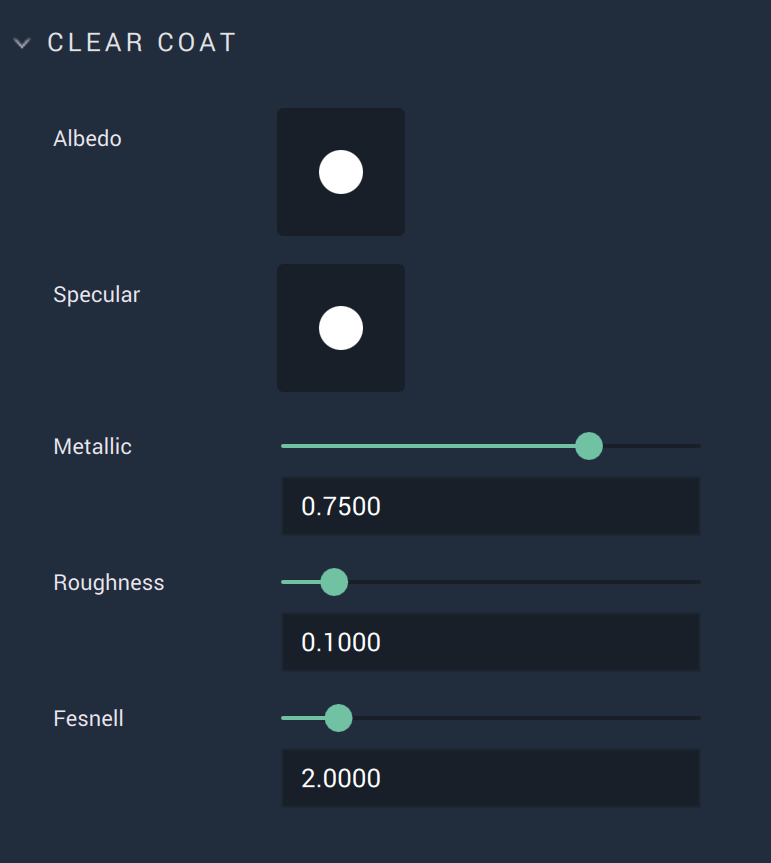

# Car Paint Model

This model represents a material that provides the visual qualities to a car's paint features. It allows for selecting and editing: 

* `Environment Mapping`
* `Normal Mapping`
* `Base Coat Color` and `Roughness`
* `Clear Coat Color` and `Roughness` 
* `Metallicness` 
* and `Shadow` `Sensitivity`.

All these **Attributes** are described in greater detail below. 

## Attributes

### Material

This **Attribute** provides the `Name` of the **Material** as well as the `Shading model` type. It also sets the `Alpha` value if it is toggled on. 

The `Alpha` channel is additional to the RGB channels and adds a kind of transparency to the object by mixing the background and foreground colors. For example, if the `Alpha` value is set to 0.5, then this would result in a 50% mix of the object and its background, providing a semi-translucent quality. 

### Environment Map

This enables the user to set a **Texture** which reflects the environment around an **Object**, meaning that the **Object** reflects the surface surrounding it (whether that be the background, another **Object**, or both combined.). 

Initially, there is only the **Attribute** `Overwrite Env.` which is toggled off by default. If it is toggled on, all of the other **Attributes** are revealed. 

`Environment Map` is the desired **Texture** to be used (a *equirectangular* or *cubemap* **Texture** of type *PNG*, *JPG*, *EXR*, or *HDR*). 

`Tint` provides the color of the tint. The **Texture’s** RGB channels (not alpha) are then multiplied by the chosen tint.

`Exposure` determines how bright the **Texture** should be with a value from 0 to infinity.  

`Rotation` sets the beginning of the image of the provided `Texture` to be "delayed" in the x or direction, moving it from left to right. The resulting "cut off" piece wraps around to the start of the image. Its range is from 0 degrees to 360 degrees. 

`Tilt` sets the beginning of the image of the provided `Texture` to be "delayed" in the y or direction, moving it from bottom to top. The resulting "cut off" piece wraps around to the start of the image. Its range is from -90 degrees to 90 degrees. 

`Projection Height` is where the ‘point of visualization’ starts. If set to 50%, this would be halfway from the bottom of the image and it would display upwards from there. To see a visual example of this, please refer to the video linked [here](https://www.youtube.com/watch?v=7axPpWTcFrw). 

### Normals

A normal is a line perpendicular to the surface of some object. *Normal mapping* distorts these normals and simulates a surface with light and shadow, even if the object surface itself is flat. This is only possible with a light source. The `Normal Map` sets this surface and `Use Normal Map` toggles it on and off. 

### Base Coat

`Albedo` is the base diffuse color of the car. 

`Specular` is the point of reflection of the light source. 

`Roughness` determines how rough an object is, limiting or strengthening reflectivity. 

`Metallic` determines how much the surface simulates a metal-like quality, appearing shinier and harder or rougher and duller.   

### Clear Coat

The `Albedo` here is the color of the glossy finish of a car, which sits at the top layer as a color that one can see through. 

`Specular` is the point of reflection of the light source. 

`Roughness` determines how rough an object is, limiting or strengthening reflectivity. 

`Metallic` determines how much the surface simulates a metal-like quality, appearing shinier and harder or rougher and duller. 

`Fesnel` encompasses the idea of the angle of incidence (the angle between the line of sight of the observer and the object being observed) influencing the perceived reflectivity of a surface. A wider angle creates less reflection and a smaller angle creates greater reflection.

### Tweak

`Shadow sensitivity` decides the percentage of the shadow's influence. So if set to 0, the surface will not be influenced by the shadow at all. At 100% the surface would be totally black and at 50%, even if the **Object's** surface stands in a shadow, it will still retain 50% of its own color.

### Property Names

It is possible to hover over each **Attribute** and access their property names to be used in code or **Nodes**. A complete list of these names is as follows:

* `Use Alpha`: use_alpha
* `Alpha`: alpha
* `Overwrite Env.`: env_overwrite
* `Environment Map`: environment_map
* `Tint`: env_tint
* `Exposure`: env_exposure
* `Rotation`: env_rotate
* `Tilt`: env_tilt
* `Projection Height`: env_projection_height
* `Use Normal Map`: use_normal_map
* `Normal Map`: normal_map
* `Albedo` (Base Coat): base_coat_albedo
* `Specular` (Base Coat): base_coat_specular
* `Metallic` (Base Coat): base_coat_metallic
* `Roughness` (Base Coat): base_coat_roughness
* `Albedo` (Clear Coat) clear_coat_albedo
* `Specular` (Clear Coat): clear_coat_specular
* `Metallic` (Clear Coat): clear_coat_metallic
* `Roughness` (Clear Coat): clear_coat_roughness
* `Fesnel`: clear_coat_fresnel
* `Shadow Senstivity`: shadow_sensitivity
