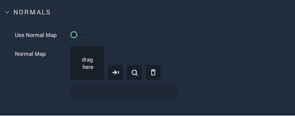

# Default Car Paint Model

This model represents a material that provides the visual qualities to a car's paint job. It allows for selecting and editing: 

* `Environment Mapping`
* `Normal Mapping`
* `Base Coat Color` and `Roughness`
* `Clear Coat Color` and `Roughness` 
* `Metallicness` 
* and `Shadow` `Sensitivity`.

All these **Attributes** are described in greater detail below. 

## Attributes

### Material

This **Attribute** provides the `Name` of the **Material** as well as the `Shading model` type. It also sets the `Alpha` value if it is toggled on. 

The `Alpha` channel is additional to the RGB channels and adds a kind of transparency to the object by mixing the background and foreground colors. For example, if the `Alpha` value is set to 0.5, then this would result in a 50% mix of the object and its background, providing a semi-translucent quality. 

### Environment Map

This enables the user to set a `Texture` which reflects the environment around an **Object**, meaning that the **Object** reflects the surface surrounding it (whether that be the background, another **Object**, or both combined.). 

The two types of offset allow the beginning of the image on the provided `Texture` to be "delayed" in either the x or y direction. The resulting "cut off" piece wraps around to the start of the image. 

`U offset (deg)` moves the image from left to right (X-axis) and `V offset (deg)` moves the image from bottom to top (Y-axis). 

### Normals

A normal is a line perpendicular to the surface of some object. *Normal mapping* distorts these normals and simulates a surface with light and shadow, even if the object surface itself is flat. This is only possible with a light source. The `Normal Map` sets this surface and `Use Normal Map` toggles it on and off. 

### Base Coat

`Albedo` is the base diffuse color of the car. 

`Specular` is the point of reflection of the light source. 

`Roughness` determines how rough an object is, limiting or strengthening reflectivity. 

`Metallic` determines how much the surface simulates a metal-like quality, appearing shinier and harder or rougher and duller.   

### Clear Coat

The `Albedo` here is the color of the glossy finish of a car, which sits at the top layer as a color that one can see through. 

`Specular` is the point of reflection of the light source. 

`Roughness` determines how rough an object is, limiting or strengthening reflectivity. 

`Metallic` determines how much the surface simulates a metal-like quality, appearing shinier and harder or rougher and duller. 

`Fesnell` encompasses the idea of the angle of incidence (the angle between the line of sight of the observer and the object being observed) influencing the perceived reflectivity of a surface. A wider angle creates less reflection and a smaller angle creates greater reflection.

### Tweak

`Shadow sensitivity` decides the percentage of influence of the shadow. So if set to 0, the surface will not be influenced by the shadow at all. At 100% the surface would be totally black and at 50%, even if the **Object's** surface stands in a shadow, it will still retain 50% of its own color.
