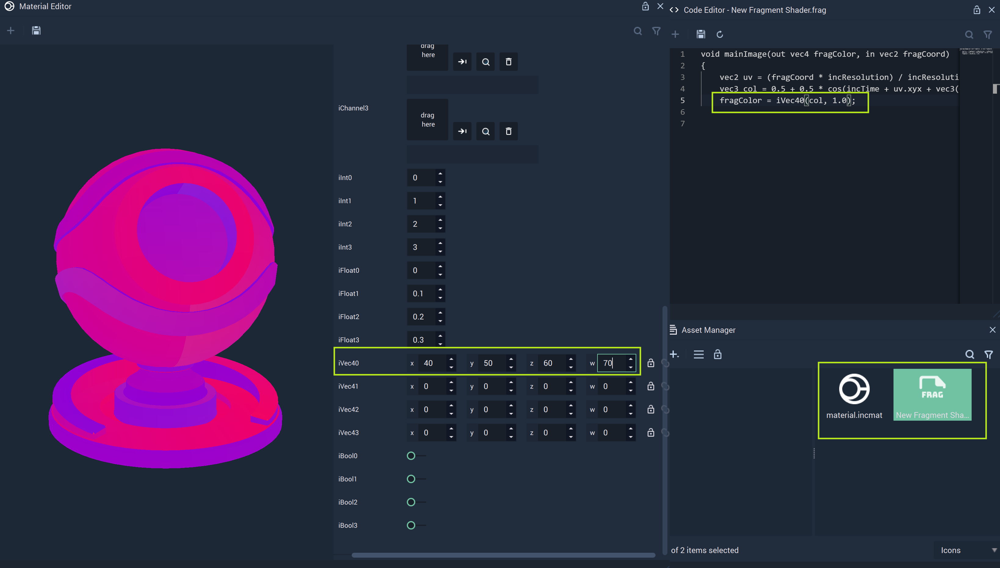
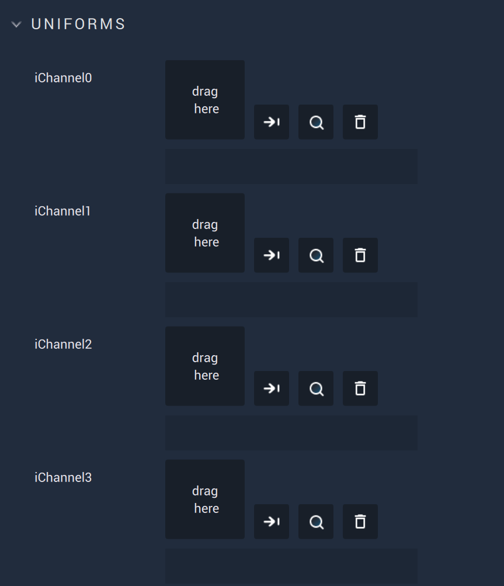
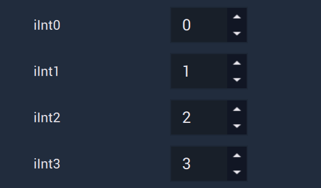
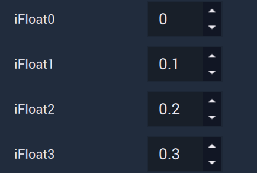
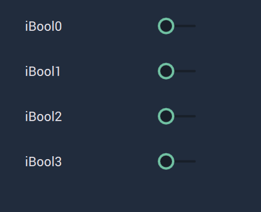

# Custom Shading Model

This model allows the user to create and customize their own **Shading Model**. The specifications are given via configuration files in the **Attributes**:

* [`Vertex Shader`](#vertex-shader)
* [`Fragment Shader`](#fragment-shader)
* [`Uniforms`](#uniforms)

All these **Attributes** are described in greater detail below.


## Attributes

### Material


This **Attribute** provides the `Name` of the **Custom Material** as well as the `Shading model` type. It also sets the `Alpha` value if it is toggled on.

The `Alpha` channel is additional to the RGB channels and adds a kind of transparency to the object by mixing the background and foreground colors. For example, if the `Alpha` value is set to 0.5, then this would result in a 50% mix of the object and its background, providing a semi-translucent quality.

### Shaders

There are two types of *shaders* that can be used for this model: [`Vertex Shader`](#vertex-shader) and [`Fragment Shader`](#fragment-shader).

Find below a detailed explanation of how to configure these *shaders*.

#### Shaders Configuration

Across the configuration of both, two uniform variables can be used:

* `incTime`: **Float** that keeps the time from the start of the application.
* `incResolution`: **Vector2** containing the **Screen** resolution.


#### Vertex Shader

*Vertex Shaders* influence the rendering of the vertices of **Objects**.


The `Vertex Shader` is configured via an **Asset** with `.vert` extension. This **Asset** consists of code and can be edited in **Incari** with the [**Code Editor**](../code-editor.md).

This is the code that is generated by default when creating a `.vert` **Asset** in the [**Asset Manager**](../asset-manager.md):


```
void mainPosition(in mat4 projectionMatrix, in mat4 modelMatrix, in vec3 viewPosition, in vec4 worldPosition)
{
    gl_Position = projectionMatrix * vec4(viewPosition, 1.0);
}
```


A *vertex shader* requires a main function named `mainPosition`, which is called once per vertex each time the **Scene** is rendered. This function receives as inputs:

* `projectionMatrix`: $$4x4$$ matrix that represents the perspective of the **Camera**.
* `modelMatrix`: $$4x4$$ matrix that represents where the vertex is.
* `viewPosition`: **Vector3** that contains the relative position of the vertex.
* `worldPosition`: **Vector4** that contains the absolute position of the vertex.

It is always necessary to calculate:

* `gl_Position`: **Vector4** that contains the position of the vertex in *clip space*.


#### Fragment Shader

*Fragment Shaders* influence the rendering of each *pixel* of **Objects**.


The `Fragment Shader` is configured via an **Asset** with `.frag` extension. This **Asset** consists of code and can be edited in **Incari** with the [**Code Editor**](../code-editor.md).

This is the code that is generated by default when creating a `.frag` **Asset** in the [**Asset Manager**](../asset-manager.md):


```
‌void mainImage(out vec4 fragColor, in vec2 fragCoord)
{
 vec2 uv = (fragCoord * incResolution) / incResolution.xy;
 vec3 col = 0.5 + 0.5 * cos(incTime + uv.xyx + vec3(0, 2, 4));
 fragColor = vec4(col, 1.0);
}
```



A *fragment shader* requires a main function named `mainImage`, which is called once per pixel each time the **Scene** is rendered. The argument for this function is:

* `fragCoord`: **Vector2** that contains the 2-dimensional coordinates of the pixel.

And the output is:

* `fragColor`: **Vector4** that stores the color that the pixel will be set to.


The *uv coordinates* can be obtained by using:

`vec2 uv = (fragCoord * incResolution) / incResolution.xy;`

### Uniforms

**Incari** makes it possible for the user to set values in **Fragment** and **Vertex Shader** files. This can also be done on runtime by using the [**Set Custom Uniform Node**](../../toolbox/incari/material/setcustomuniforms.md).

Here, the user can set the values for several variables. These variables correspond to those present in the files given in the *shaders*. Please note that *shaders* should be conform to the [*GLSL_ES*](https://www.khronos.org/files/opengles_shading_language.pdf) standards.

There are five types of variables:

* [Channels](#channels)
* [Integers](#integers)
* [Floats](#floats)
* [Vectors](#vectors)
* [Booleans](#booleans)

Please note that for the `Uniforms` to have any effect, the names in the files must match the **Attribute** names seen here in the `Custom Shading Model`. 



#### Channels



These **Attributes** can take any file that is an image or *texture map*. With these, it is possible to add other textures and/or visual components to the already existing **Custom Material**. It is possible to set up to four of these currently in **Incari**. 

For example, the user could switch between two *texture* *maps*. After setting *textures* for `iChannel1` and `iChannel2`, the code for the `Fragment Shader` could use these in an *if/else* statement:

```
if( iBool0 ) {
fragColor = texture( iChannel1 , uv );
}
else
{
fragColor = texture( iChannel2 , uv );
}
```


#### Integers



These **Attributes** set the values for **Ints**. This can be used to set the `x`, `y`, `z` , and/or `w` values for a **Vector4** in the code for the `Fragment Shader`, for example. It is possible to set up to four of these currently in **Incari**. 

#### Floats



These **Attributes** set the values for **Floats**. This can be used to multiply the time variable present in the code for the `Fragment Shader` by some **Float** during runtime, for example. It is possible to set up to four of these currently in **Incari**. 

#### Vectors


These **Attributes** set the values for **Vector4s**. This can be used to set certain RGB values, for example. The first value corresponds to the red value, the second for green, the third for blue, and the fourth for the alpha overchannel. It is possible to set up to four of these currently in **Incari**.

#### Booleans



These **Attributes** set the *true* or *false* values for **Bools**. This can be used to execute a certain condition in the code for the `Fragment Shader`, for example. It is possible to set up to four of these currently in **Incari**.


## External Links

*  [*Vertex Shader*](https://www.khronos.org/opengl/wiki/Vertex_Shader) on OpenGL Wiki.
*  [*Vertex Shader*](https://shader-tutorial.dev/basics/vertex-shader/) on GPU Shader Tutorial.
*  [*Fragment Shader*](https://www.khronos.org/opengl/wiki/Fragment_Shader) on OpenGL Wiki.
*  [*Fragment Shader*](https://shader-tutorial.dev/basics/fragment-shader/) on GPU Shader Tutorial.
*  [*Shaders*](https://learnopengl.com/Getting-started/Shaders) in Learn OpenGL.