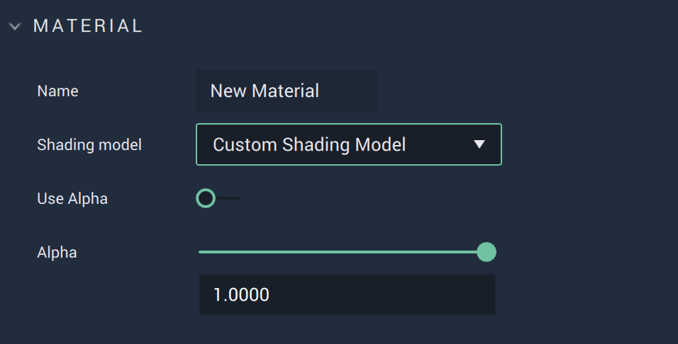
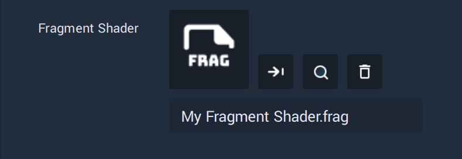
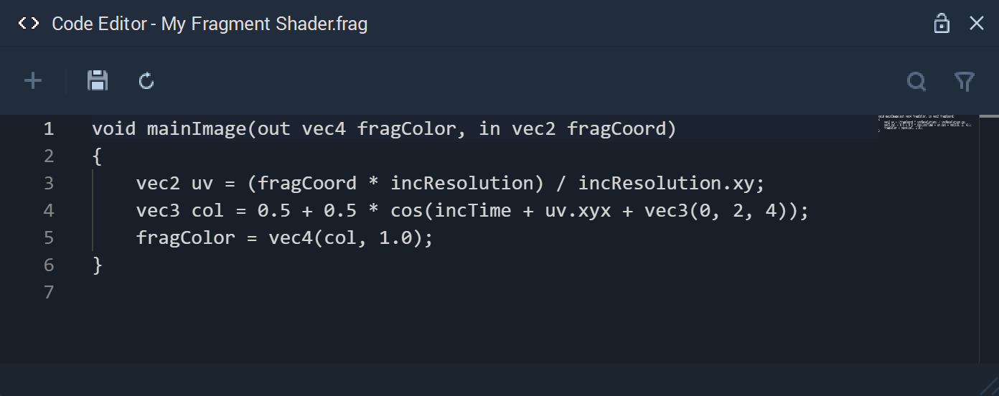

# Custom Shading Model

This model allows the user to create and customize their own **Shading Model**. The specifications are given via configuration files in the **Attributes**:

* `Vertex Shader`
* `Fragment Shader`

All these **Attributes** are described in greater detail below. 

## Attributes

### Material

This **Attribute** provides the `Name` of the **Material** as well as the `Shading model` type. It also sets the `Alpha` value if it is toggled on. 

The `Alpha` channel is additional to the RGB channels and adds a kind of transparency to the object by mixing the background and foreground colors. For example, if the `Alpha` value is set to 0.5, then this would result in a 50% mix of the object and its background, providing a semi-translucent quality. 

### Shaders

<!--  -->

#### Vertex Shader

The `Vertex Shader` receives a `.vert` **Asset**
 
<!--   -->

    void mainPosition(in mat4 projectionMatrix, in mat4 modelMatrix, in vec3 viewPosition, in vec4 worldPosition)  
    {
        gl_Position = projectionMatrix * vec4(viewPosition, 1.0);
    }

#### Fragment Shader

The `Fragment Shader` takes a `.frag` **Asset**

<!--  -->

    ‌void mainImage(out vec4 fragColor, in vec2 fragCoord)
    {
     vec2 uv = (fragCoord * incResolution) / incResolution.xy;
     vec3 col = 0.5 + 0.5 * cos(incTime + uv.xyx + vec3(0, 2, 4));
     fragColor = vec4(col, 1.0);
    }