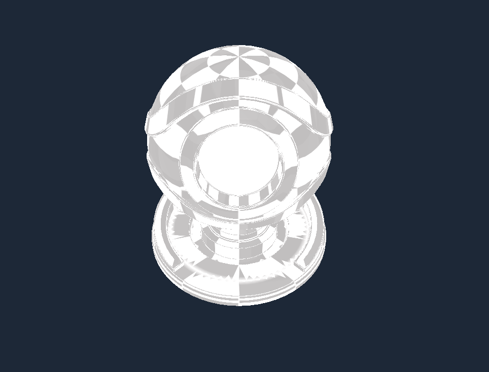
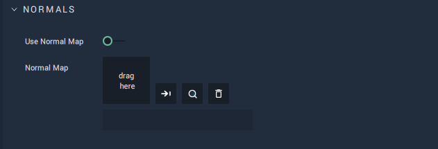
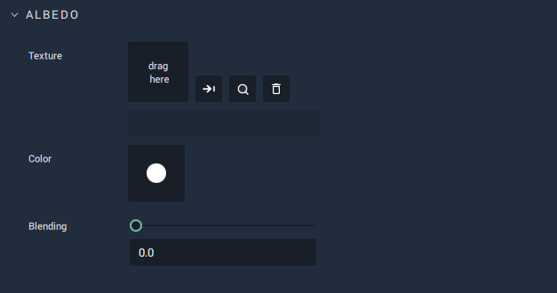
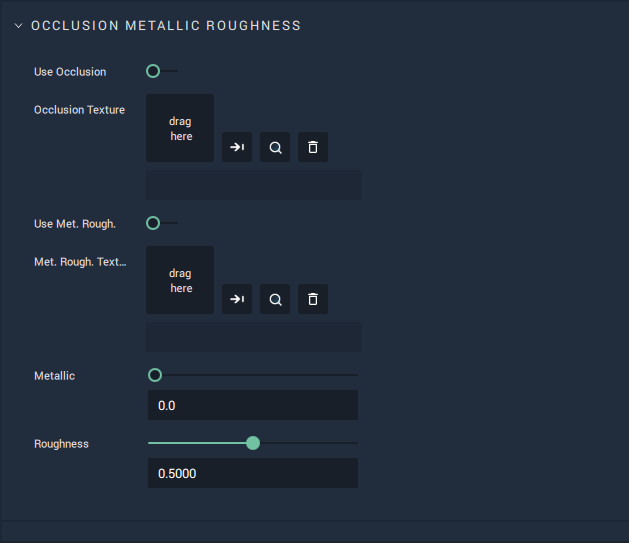

## Default ExtendendedPBR Model

This model offers more attributes than the **Default PBR Model**. It allows for selecting and editing `Environment` and `Normal Mapping`; `Albedo Texture`, `Color`, and `Blending`; `Specular Color`; as well as several aspects of `Occlusion Metallic Roughness`.

This **Attribute** provides the `Name` of the **Material** as well as the `Shading model` type. It also sets the `Alpha` value if it is toggled on. The `Alpha` channel is additional to the RGB channels and adds a kind of transparency to the object by mixing the background a nd foreground colors. For example, if the `Alpha` value is set to 0.5, then this would result in a 50% mix of the object and its background, providing a somewhat see-through quality. 

This enables the user to set a `Texture` which reflects the environment around an object, meaning that the object reflects the surface surrounding it (whether that be the background, another object, or both combined.). 

The two types of offset allow the beginning of the image on the provided `Texture` to be "delayed" in either the x or y direction. The resulting "cut off" piece wraps around to the start of the image. `U offset (deg)` moves the image from left to right (X-axis) and `V offset (deg)` moves the image from bottom to top (Y-axis).

A normal is a line perpendicular to the surface of some object. Normal mapping distorts these normals and simulates a surface with light and shadow, even if the object surface itself is flat. This is only possible with a light source.

`Color` of `Albedo` sets the base diffuse color of the model. `Texture` takes any image to add any desired visual information. Using `Blending`, the `Texture` and `Color` are combined. If `Blending` is set to 1 then 100% of the `Texture` is displayed on the **Object**. If 0.5, then it displays a 50/50 ratio of `Texture` and `Color`. 

`Specular` is the point of reflection of the light source. `Color` sets the color of it. 

`Use Occlusion` toggles occlusion on and off. `Occlusion Texture` sets an image for occlusion. Occlusion itself delivers shadow proprties. Considering the RGB channels, occlusion only uses the red channel (keep this in mind when making `Texture` files). Even without a light source, the `Texture` will show up as a shadow and light on the **Object**, simulating a bright side and dark side. Occlusion makes it possible for one to make a texture for an **Object** that simulates another **Object** throwing a shadow on the first **Object**.
