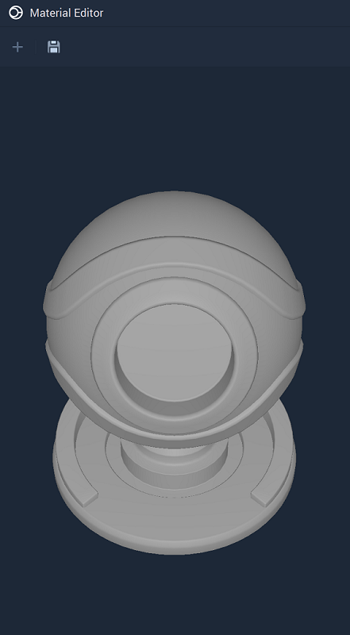
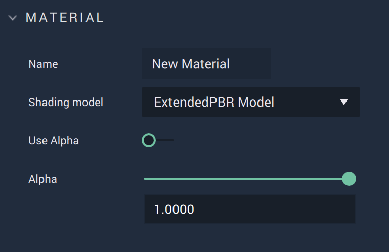
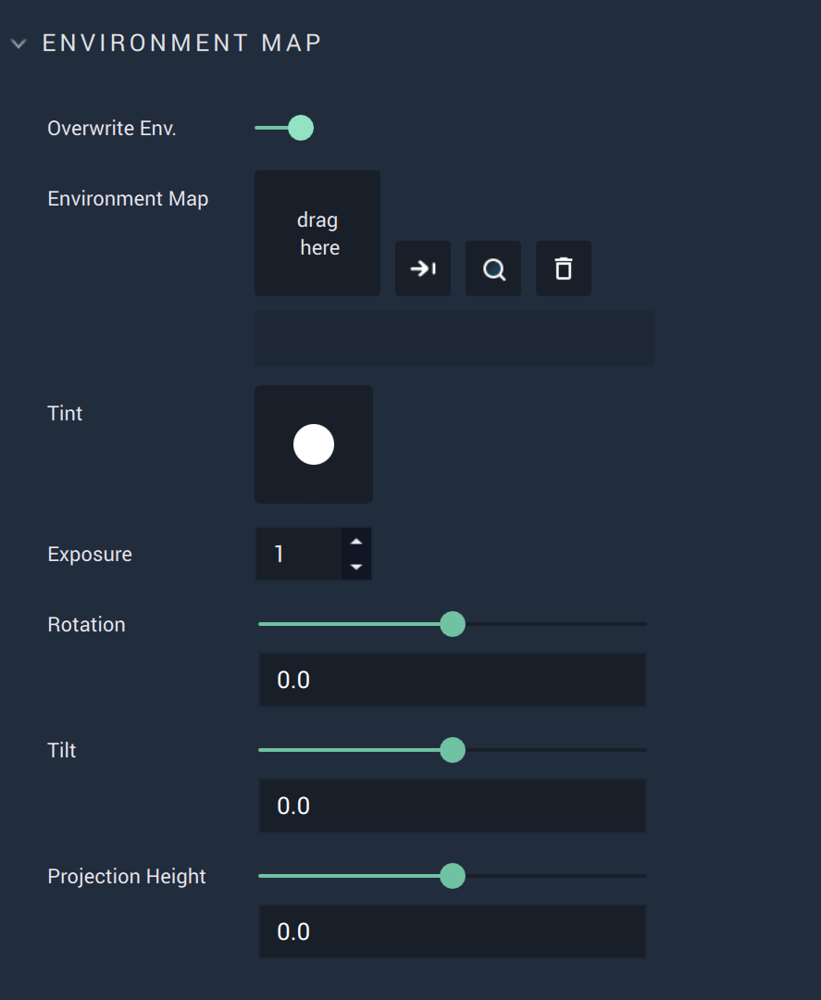
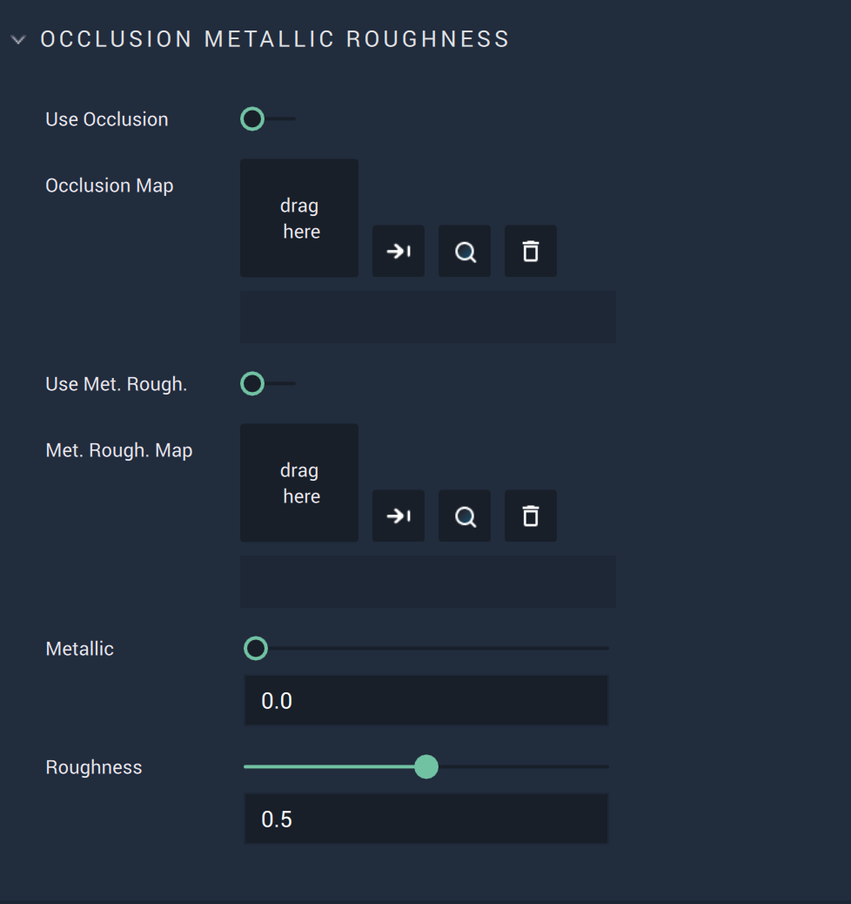

# ExtendendedPBR Model

This model offers more attributes than the **PBR Model**. It allows for selecting and editing:

* `Environment` 
* `Normal Mapping` 
* `Albedo Texture`, `Color`, and `Blending`
* `Specular Color` 
* and several aspects of `Occlusion Metallic Roughness`.

All these **Attributes** are described in greater detail below. 

## Attributes

### Material

This **Attribute** provides the `Name` of the **Material** as well as the `Shading model` type. It also sets the `Alpha` value if it is toggled on. 

The `Alpha` channel is additional to the RGB channels and adds a kind of transparency to the object by mixing the background and foreground colors. For example, if the `Alpha` value is set to 0.5, then this would result in a 50% mix of the object and its background, providing a somewhat see-through quality. 

### Environment Map

This enables the user to set a **Texture** which reflects the environment around an **Object**, meaning that the **Object** reflects the surface surrounding it (whether that be the background, another **Object**, or both combined.). 

Initially, there is only the **Attribute** `Overwrite Env.` which is toggled off by default. If it is toggled on, all of the other **Attributes** are revealed. 

`Environment Map` is the desired **Texture** to be used (a *equirectangular* or *cubemap* **Texture** of type *PNG*, *JPG*, *EXR*, or *HDR*). 

`Tint` provides the color of the tint. The **Texture’s** RGB channels (not alpha) are then multiplied by the chosen tint.

`Exposure` determines how bright the **Texture** should be with a value from 0 to infinity.  

`Rotation` sets the beginning of the image of the provided `Texture` to be "delayed" in the x or direction, moving it from left to right. The resulting "cut off" piece wraps around to the start of the image. Its range is from 0 degrees to 360 degrees. 

`Tilt` sets the beginning of the image of the provided `Texture` to be "delayed" in the y or direction, moving it from bottom to top. The resulting "cut off" piece wraps around to the start of the image. Its range is from -90 degrees to 90 degrees. 

`Projection Height` is where the ‘point of visualization’ starts. If set to 50%, this would be halfway from the bottom of the image and it would display upwards from there. To see a visual example of this, please refer to the video linked [here](https://www.youtube.com/watch?v=7axPpWTcFrw). 

### Normals 

A normal is a line perpendicular to the surface of some object. *Normal mapping* distorts these normals and simulates a surface with light and shadow, even if the object surface itself is flat. This is only possible with a light source. The `Normal Map` sets this surface and `Use Normal Map` toggles it on and off. 

### Albedo

`Color` of `Albedo` sets the base diffuse color of the model. 

`Texture` takes any image to add any desired visual information. 

Using `Blending`, the `Texture` and `Color` are combined. If `Blending` is set to 1 then 100% of the `Texture` is displayed on the **Object**. If 0.5, then it displays a 50/50 ratio of `Texture` and `Color`. 

### Specular

`Specular` is the point of reflection of the light source. `Color` sets the color of it. 

### Occlusion Metallic Roughness

`Use Occlusion` toggles occlusion on and off. 

`Occlusion Map` sets an image for occlusion. *Occlusion* itself delivers shadow properties. Considering the RGB channels, *Occlusion* only uses the red channel (keep this in mind when making `Texture` files). Even without a light source, the `Texture` will show up as a shadow and light on the **Object**, simulating a bright side and dark side. *Occlusion* makes it possible for the user to make a texture for an **Object** that simulates another **Object** throwing a shadow on the first **Object**.

`Use Met. Rough.` toggles metallic roughness on and off. 

`Met. Rough. Map` sets an image for metallic roughness to contribute to the overall texture of the metallic material. 

`Metallic` determines how much the surface simulates a metal-like quality, appearing shinier and harder or rougher and duller. 

`Roughness` determines how rough an **Object** is, limiting or strengthening reflectivity. 

### Property Names

It is possible to hover over each **Attribute** and access their property names to be used in code or **Nodes**. A complete list of these names is as follows:

* `Use Alpha`: use_alpha
* `Alpha`: alpha
* `Overwrite Env.`: env_overwrite
* `Environment Map`: environment_map
* `Tint`: env_tint
* `Exposure`: env_exposure
* `Rotation`: env_rotate
* `Tilt`: env_tilt
* `Projection Height`: env_projection_height
* `Use Normal Map`: use_normal_map
* `Normal Map`: normal_map
* `Albedo Map`: albedo_map
* `Color` (Albedo): albedo_color
* `Blending`: albedo_map_blending
* `Color` (Specular): specular_color
* `Use Occlusion`: use_occlusion_map
* `Occlusion Map`: occlusion_map
* `Use Met. Rough.`: use_metallic_roughness_map
* `Met. Rough. Map`: metallic_roughness_map
* `Metallic`: metallic
* `Rougness`: roughness