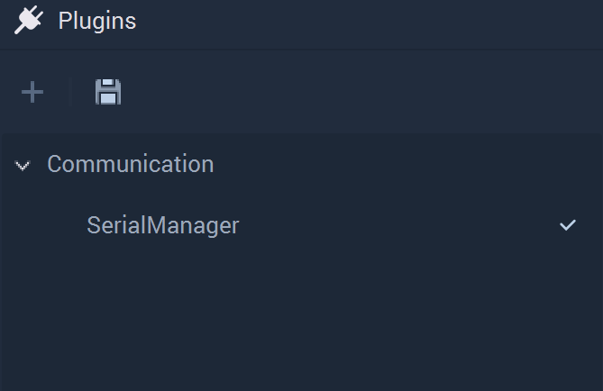
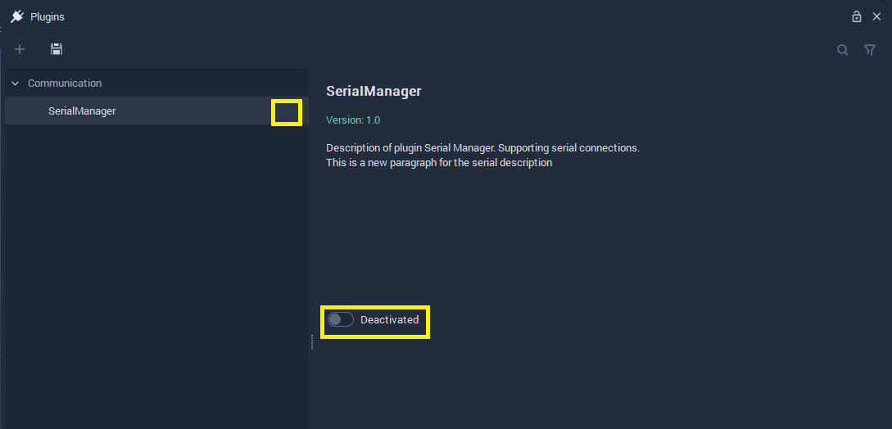

# Plugins Editor

The **Plugins Editor** allows one to activate or deactivate **Modules** within **Incari**. This provides the user with the foundation for a self-scalable structure, combining creativity and functionality by making **Incari** support the individual needs of each user. At the moment, this is specific to **Serial Communication**.

The **Plugins Editor** looks like this when it is opened: 

After clicking the arrow, **Communication** options are revealed. The checkmark is an important visualization of how the **Plugins** function. When a **Module** is activated, a checkmark is present next to the name. If deactivated, the checkmark disappears. This makes it easy to see which **Modules** are in use or not without needing to click each one. 

## SerialManager 

After clicking on **SerialManager**, its options will show. All **Serial Communication** related components are encompassed by the **SerialManager**. 

To refresh, **Seral Communication** is a form of data transmission where data is sent bit by bit. More information can be found [here](https://en.wikipedia.org/wiki/Serial_communication). Within **Incari**, this is done by using the [**Serial Nodes**](../toolbox/communication/serial/README.md). They add the necessary functionality to a **Project** that requires this type of communication. However, a user may decide they would rather deactivate this portion of **Incari** to heighten performance and stability. 

To do this, one needs to simply locate the toggle labeled `Activated` and click it once.  

**Incari** will alert the user by outputting this message to the screen:

The user must follow these instructions (save and restart **IncariStudio**) in order to succeed in deactivating the **SerialManager**. 

Once the user has followed these steps, they will see that when going back to the **Plugins Editor**, **SerialManager** no longer has a checkmark and the toggle is now labeled `Deactivated`. 

To activate again, the user just needs to repeat this by clicking `Deactivated` and saving and restarting again. 

