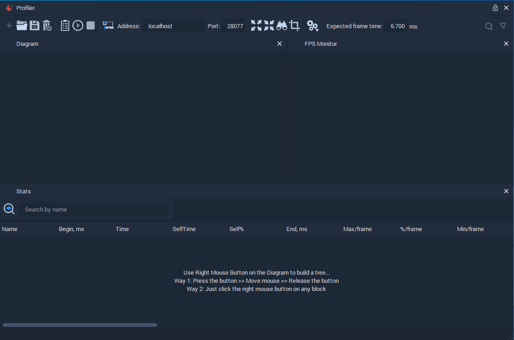

# Profiler View

## Overview

The **Profiler** allows to analyze the performance of **Logic Blocks**, which have to be set in the **Logic Editor** by using the **Profiler Start** and **Profiler Stop** **Nodes**.

For capturing with the **Profiler**, the **Project** simulation must be playing and the **Profiler** has to be connected with it via the port that has been set in the **Project Settings**.

Once the **Profiler** is connected, it allows to start and stop capturing with the buttons on the **Form** toolbar. After a capture has ended, its timeline is shown on the **Diagram** and there the **Profiler Blocks** can be selected. Their data will then appear on the **Stats** panel.

The **Profiler** window consists of four panels (**Form**, **Diagram**, **Stats**, **FPS Monitor**), which are explained in detail below. These panels can be shown or hidden by right-clicking on the top bar of any of them and selecting or deselecting them from the drop-down menu that appears.

## Form

## Diagram

## Stats

## FPS Monitor

## See Also

* [**Logic Editor**]
* [**Profiler Start**]
* [**Profiler Stop**]
* [**Project Settings**]

## External Links