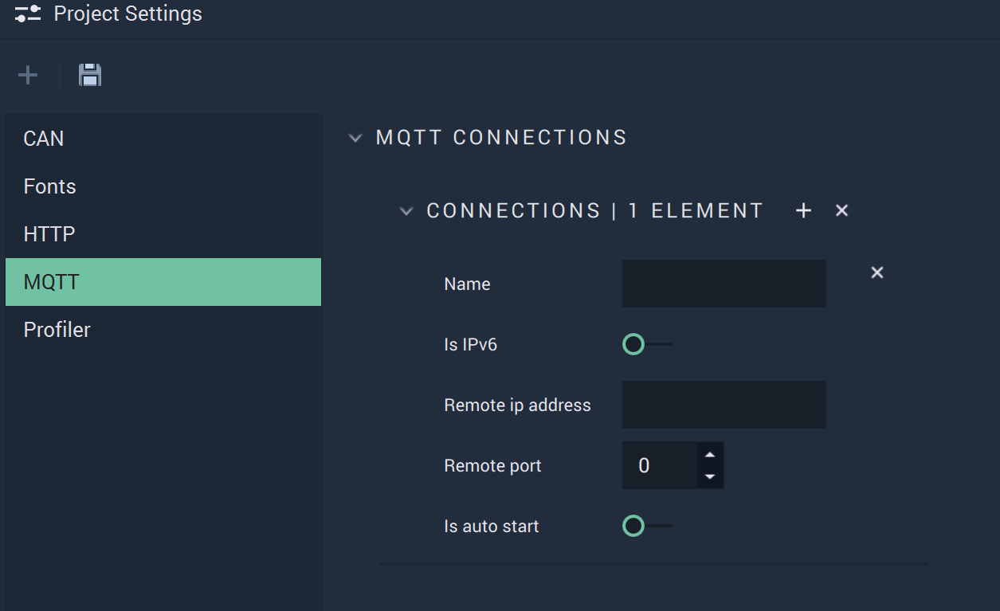
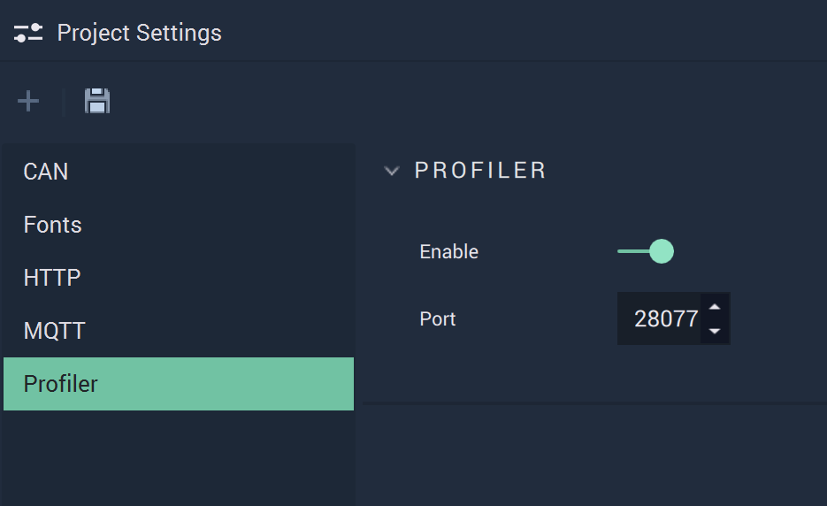

# Overview

The **Project Settings Module** is used to set up **Projects** that involve the different methods of **Communication** available in *Incari*, **Fonts**, or the **Profiler**. 

# CAN

The **CAN Attributes** cover the necessary data to provide functionality to the **CAN Nodes**. 

`Interface Name` is the identifying name of the *CAN* Bus. *Virtual CAN* is also possible within *Incari*.

`Baudrate` is the speed of the communication for the channel. More information about this metric can be found in the `External Links` section. 

`Channel Name` is the USB port that *CAN* is connected to on *Windows*.

A `DBC File` needs to be uploaded and selected. This `DBC File` is a vital part of the **CAN** protocol, as it stores all data regarding the connections between devices.

`Autostart` can be enabled or disabled and dictates when the channel is run (from the beginning of an application's life cycle or when the appropriate **Nodes** are used).

# Fonts

The **Fonts Attributes** let the user upload different types of **Fonts** to add personalized style to texts. 

`Family Name` is automatically filled in with the **Font's** name when a **Font** file is chosen. The text can also be edited manually. 

`Font Asset` is the **Font** file that is uploaded and selected for use. The **Font** file needs to be in the **Project's** **Asset Folder**.

# HTTP

The **HTTP Attributes** cover the necessary data to provide functionality to the **HTTP Nodes**.

`Name` is an identifying name of a *HTTP* server chosen at the user's discretion. This will show up in the **Nodes** as a choice for the `Configuration` **Attribute**.

`Is IPv6` can be enabled or disabled. *IPv6* is the newest version of the *Internet Protocol*. More information about *IPv6* can be found in the **External Links** section.

`Local port` is the port that the user wants to use for their *HTTP* server. More information on ports and port fowarding can be found in the **External Links** section.

`Is auto start` can be enabled or disabled and dictates when the server is run (from the beginning of an application's life cycle or when the appropriate **Nodes** are used).

# MQTT

The **MQTT Attributes** cover the necessary data to provide functionality to the **MQTT Nodes**.

`Name` is an identifying name of an *MQTT* connection chosen at the user's discretion. 

`Is IPv6` can be enabled or disabled. *IPv6* is the newest version of the *Internet Protocol*. More information about *IPv6* can be found in the **External Links** section.

`Remote ip address` is the IP address from which the connection originates. 

`Remote port` is the port number of the connection. 

`Is auto start` can be enabled or disabled and dictates when the connection is run (from the beginning of an application's life cycle or when the appropriate **Nodes** are used).

# Profiler

The **Profiler Attributes** cover the necessary data to provide functionality to the **Profiler Nodes**.

`Enable` enables or disables the **Profiler**, which can be edited in the **Profiler View Module**.

`Port` is the port number being used. 

# See Also

* [**Communication Nodes**](../toolbox/communication/README.md)

# External Links

* More information on the [*Baud metric*](https://en.wikipedia.org/wiki/Baud).
* More information on [*IPv6*](https://en.wikipedia.org/wiki/IPv6).
* More information on [*ports*](https://en.wikipedia.org/wiki/Port_%28computer_networking%29).
* More information on [*port fowarding*](https://en.wikipedia.org/wiki/Port_forwarding).