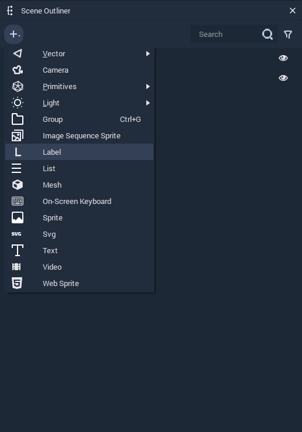
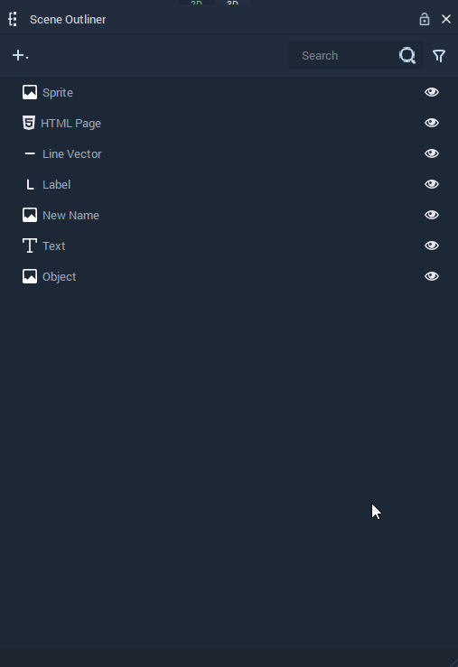

# Scene Outliner

## Overview

The **Scene Outliner** contains the list of every **Object** in the currently selected **Scene**, and can be used to organize, manage, create, delete and edit them.

## Creating

New **Objects** can be created in the following ways:

* Click on the plus  icon located at the top left corner of the **Scene Outliner** and select the **Object** to create.

* Right-click inside the **Scene Outliner**, select `Create` from the pop-up and click on the **Object**.

## Deleting

**Objects** can be deleted in the following ways:

* Right-click on an item and select the `Delete` button from the pop-up.
* Select an item and press `del`.

## Renaming

**Objects** can be renamed by right-clicking an item and selecting `Rename`. You can then type a new name and press **`⏎`**/`Return` to confirm the change.

## Show and Hide

**Objects** can be shown or hidden at the start of a **Scene**.

To hide an **Object**, click on the eye icon at the right of it.

And to show a hidden **Object**, click on the crossed eye icon at the right of it.

## See Also

* [**Scene**](../getting-started/project-objects/scene.md)
* [**Scene Objects**](../getting-started/scene-objects/)

