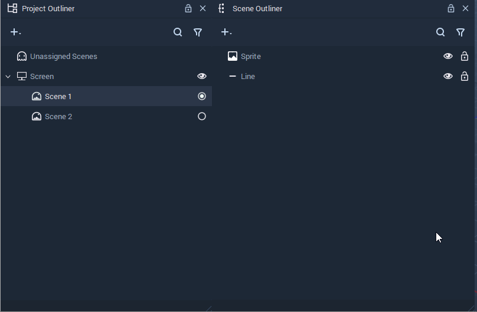
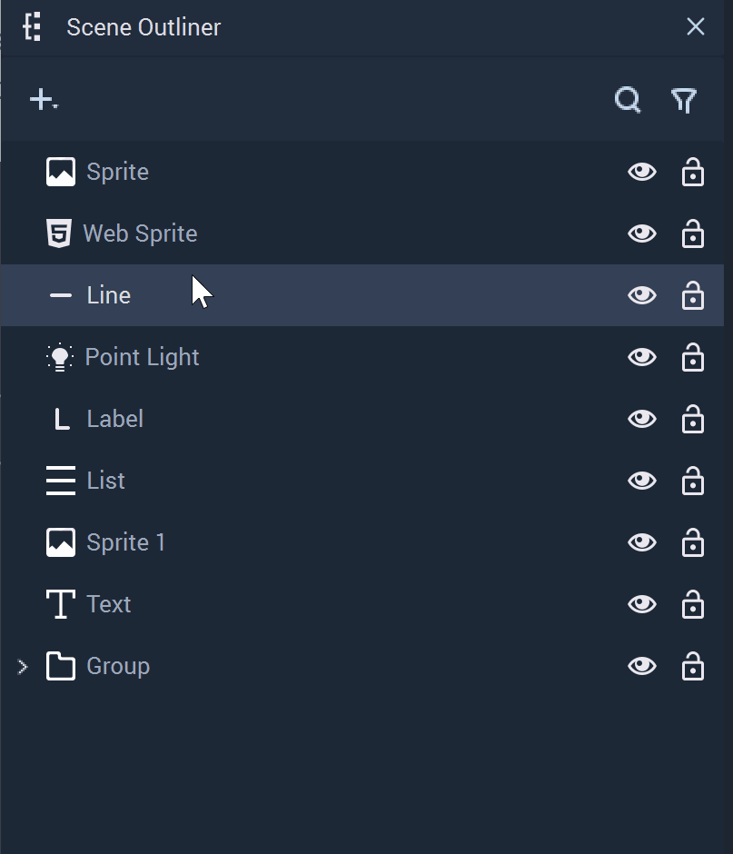
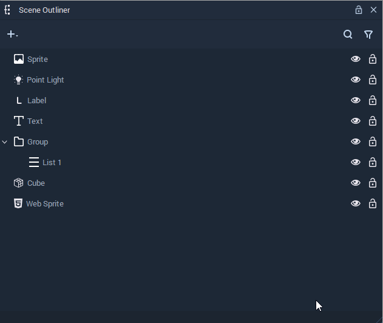
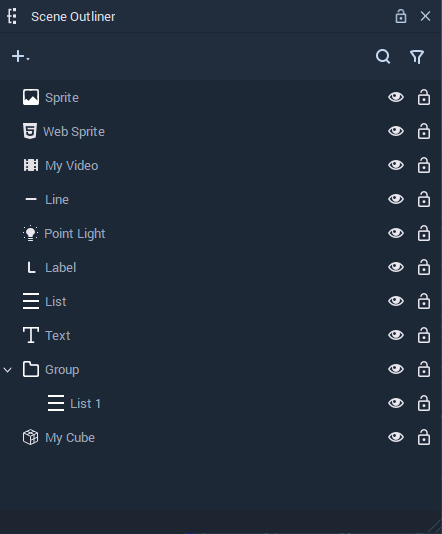

# Scene Outliner

The **Scene Outliner** contains the list of every [**Object**](../objects-and-types/scene-objects/) in the currently selected [**Scene**](../objects-and-types/project-objects/scene.md). It can be used to organize, manage, create, delete, and edit them.

<figure><figcaption>
Scene Outliner.
</figcaption></figure>

 

<figure><figcaption>
Pop-up menu with options to manage Objects.
</figcaption></figure>

This page describes all the options available in the **Scene Outliner** for managing **Objects** in a **Scene**:

* [**Create**](scene-outliner.md#create)
* [**Prefabs**](scene-outliner.md#prefabs)
* [**Duplicate**](scene-outliner.md#duplicate)
* [**Copy, Cut, and Paste**](scene-outliner.md#copy-cut-and-paste)
* [**Rename**](scene-outliner.md#rename)
* [**Delete**](scene-outliner.md#delete)
* [**Show and Hide**](scene-outliner.md#show-and-hide)
* [**Search**](scene-outliner.md#search)
* [**Filter**](scene-outliner.md#filter)

## Create

New **Objects** can be created in the following ways:

* Click on the plus  (4) (4) (4) (4) (4) (4) (4) (1) (1) (1) (2).PNG>) icon located at the top left corner of the **Scene Outliner** and select the **Object** to create.
* Right-click inside the **Scene Outliner**, select `Create` from the pop-up, and click on the **Object**.

<figure><figcaption>
Creating an Object with the plus icon.
</figcaption></figure>

 

<figure><figcaption>
Creating an Object from the pop-up menu.
</figcaption></figure>

## Prefabs

The pop-up menu that appears by right-clicking on the **Scene Outliner** offers three options relating to **Prefabs**.

* `Make prefab`: The selected **Objects** turn into a **Prefab**.
* `Unpack prefab`: The selected **Prefab Instance** is unpacked, thus the **Objects** that compose it remain in the **Scene** but no longer are a **Prefab Instance**. More information can be found [here.](../objects-and-types/prefabs/creating-and-using-prefabs.md#unpacking-a-prefab)
* `Edit prefab`: This will open the **Prefab View**, where the [**Prefab Asset**](../objects-and-types/prefabs/creating-and-using-prefabs.md#editing-the-prefab-asset) can be edited

<figure><figcaption>
Creating a Prefab from Objects in the Scene.
</figcaption></figure>

 

<figure><figcaption>
Unpacking a Prefab.
</figcaption></figure>

 

<figure><figcaption>
Creating an Object from the pop-up menu.
</figcaption></figure>

For more details, see the [**Prefabs**](../objects-and-types/prefabs/) section.

## Duplicate

An **Object** in the current **Scene** can be duplicated by right-clicking it on the **Scene Outliner** and selecting `Duplicate`.

## Copy, Cut, and Paste

**Objects** can be cut or copied and then pasted in another **Scene**.

## Rename

**Objects** can be renamed by right-clicking an item and selecting `Rename`. You can then type a new name and press **`⏎`**/`Return` to confirm the change.

## Delete

**Objects** can be deleted in the following ways:

* Right-click on an item and select the `Delete` button from the pop-up.
* Select an item and press `del`.

## Show and Hide

**Objects** can be shown or hidden at the start of a **Scene**.

To hide an **Object**, click on the eye icon at the right of it.

And to show a hidden **Object**, click on the crossed out eye icon at the right of it.

## Search

The `Search` option allows the user to search **Objects** in a **Scene** by name. To perform a search, click the magnifying glass icon on the top right, and write the name of the **Object** to search.

## Filter

The `Filter` option allows the user to filter **Objects** in a **Scene** by type. To apply a filter, click the filter icon on the top right, and select the types to filter from the drop-down menu. After a filter has been applied, it can be removed with the `Reset` button.

## Frame Selected

Sometimes one gets lost in a **Project**. It is now easier than ever to refocus on a particular **Object**. The user just needs to locate that **Object** in the **Scene Outliner**, right-click, and select `Frame Selected`. This can also be achieved by simply pressing the `F` key. 

## See Also

* [**Scene**](../objects-and-types/project-objects/scene.md)
* [**Scene Objects**](../objects-and-types/scene-objects/)
