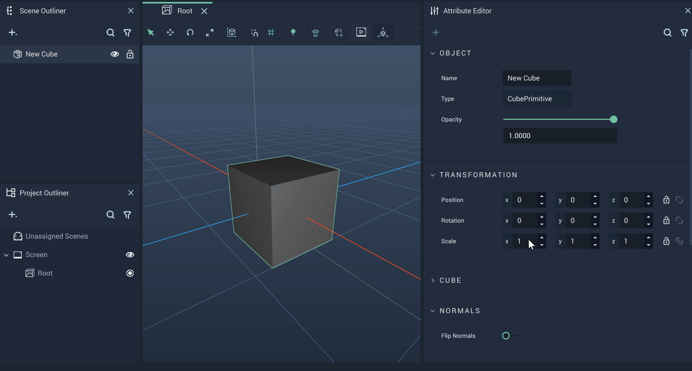
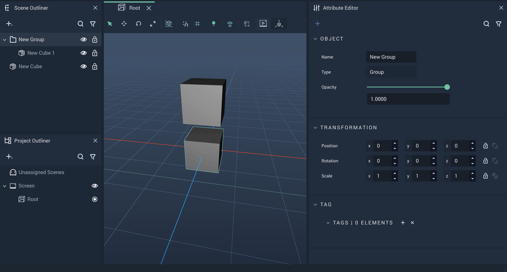
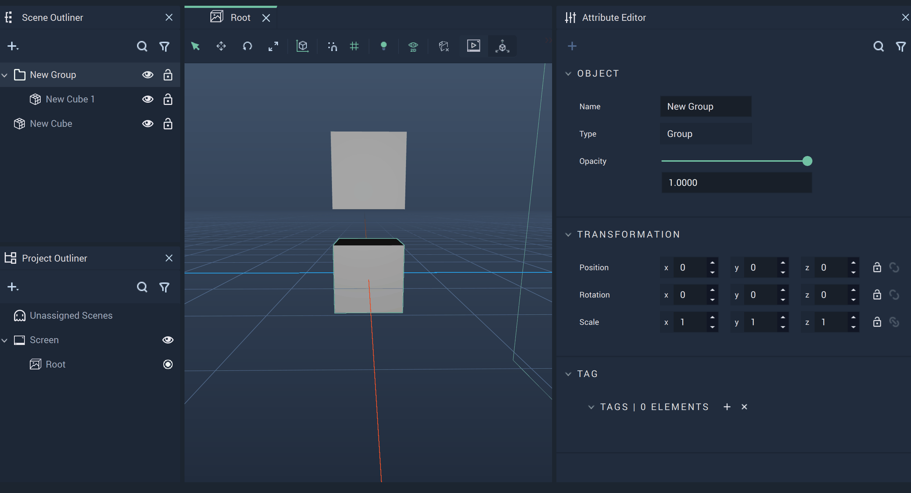

# Transformation

All **Objects** in **Incari** exist in _3D_ space, and have a set of **Attributes** to define their **Transformation** data. **Transformation** is divided into three **Vector3** type **Attributes**: `Position`, `Rotation`, and `Scale`.

This page offers overview descriptions of the three **Transformation** **Attributes** ([`Position`](#position), [`Rotation`](#rotation), [`Scale`](#scale)) and of one special case, that of [**Groups**](#groups).

Moreover, there are two modes for performing **Transformations**:

* [Global](global.md): **Objects** are transformed with respect to the **Scene** axes.
* [Local](local.md): Each **Object** is transformed with respect to its own axes.

## Position

`Position` is defined by three values, representing each of the three axes of a three dimensional Cartesian coordinate system.

In most _2D_ graphics applications, you will typically see a coordinate system with the origin \(0,0\) at the top-left corner of a document, and the X value increasing from left-to-right and the Y value increasing from top-to-bottom.

In **Incari**, coordinates are in 3D Euclidean space, with the origin \(0, 0, 0\) at the center, and the `x` value increasing from center-to-right, the `y` value increasing from center-to-top and the `z` value increasing from center-to-front.

Any point in space can be determined by these `x`, `y`, and `z` values.

## Rotation

The `Rotation` **Attribute** represents the Euler angle of rotation of an **Object** along each of the rotation axes. An **Object** can be rotated in either **Local** or **Global space**. In **Local space**, any adjustments will be made along its _own_ axes, not the axes of the **Scene** itself. On the other hand, rotations in **Global space** are performed with respect to the **Scene** axes. 

Axes can be thought of as being like three skewers going through the **Object** and intersecting at the **Object's** [**Pivot Point**](../rotation-pivot.md).

For more detail, see:

* [**Global rotation**](global.md#rotation)
* [**Local rotation**](local.md#rotation)

## Scale

`Scale` multiplies the size of an **Object** along its axes, relative to its **Origin**. By default, `Scale` is set to `x=1`, `y=1`, `z=1`, meaning that it is at 100% of its size on all axes.

## Groups

There is one special case that is worth noting, that of **Objects** that are part of a **Group**. In this case, the `Position` and `Rotation` **Attributes** of the **Objects** are relative to the `Position` and `Rotation` of the **Group**, respectively.

For this to be clearer, let us see two examples, one for the `Position` **Attribute** and one for the `Rotation` one.

Consider a **Group** containing one **Object**, a **Cube**. Setting the `Position` of the **Group** to `x=100` and the `Position` of the **Cube** to `x=100` will result in the **Cube** being located at `x=200` in the **Scene** space.

For an illustration of this, see the following example, in which there are two **Cubes**: one with `Position` `x=100` in a **Group** with `Position` `x=100` and another one that is not part of a **Group** and has `Position` `x=200`. For visualization purposes, the two **Cubes** have been set at different heights along the Y axis.

The same applies to rotations. Consider again a **Group** containing one **Object**, a **Cube**. Setting the `Rotation` of the **Group** to `x=30` and the `Rotation` of the **Cube** to `x=30` will result in the **Cube** being rotated 60 degrees with respect to the **Scene** coordinate system.

For an illustration of this, see the following example, in which there are two **Cubes**: one with `Rotation` `x=30` in a **Group** with `Rotation` `x=30` and another one that is not part of a **Group** and has its `Rotation` set to `x=60`. For visualization purposes, the two **Cubes** have been set at different heights along the Y axis.

