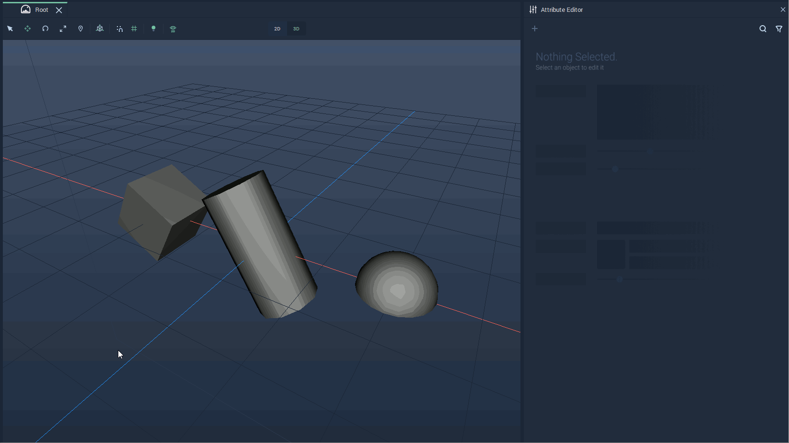
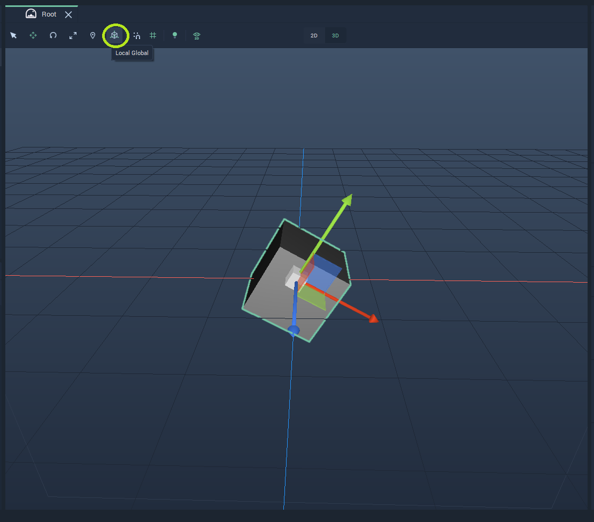
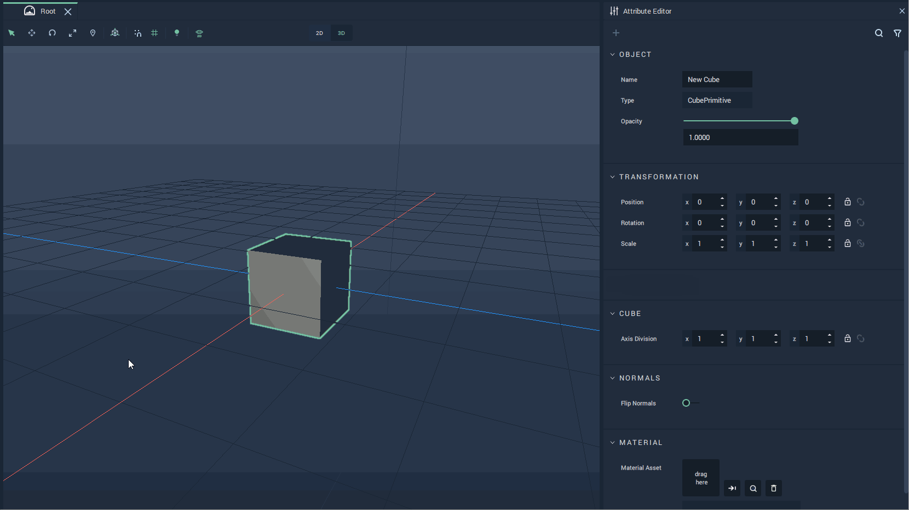
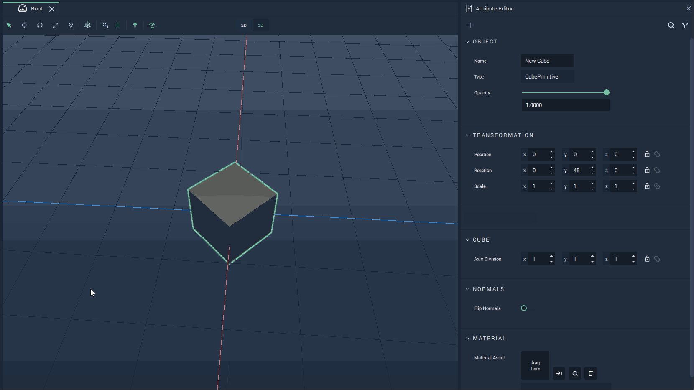
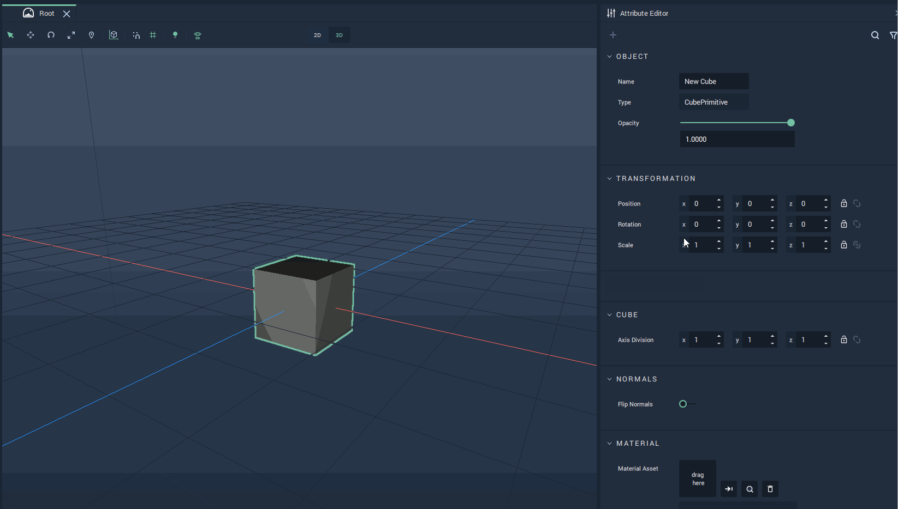
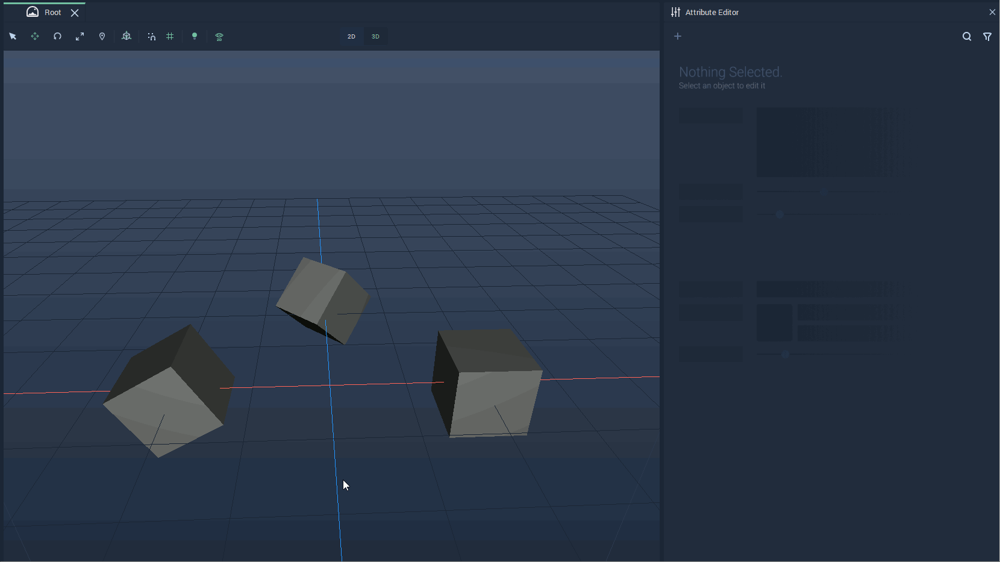
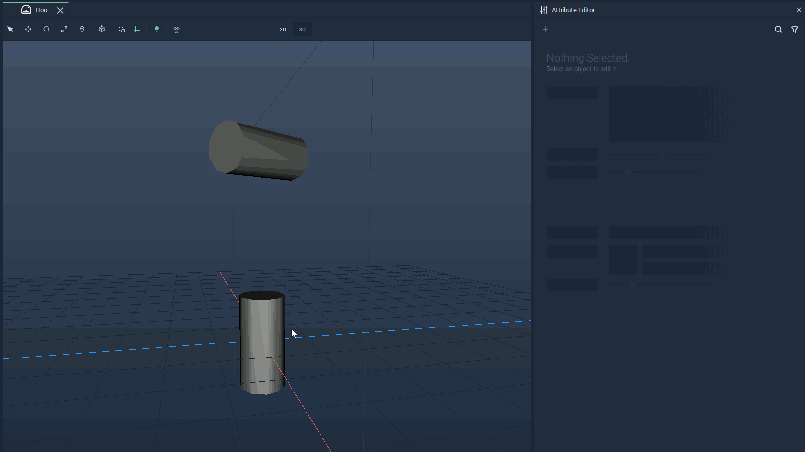
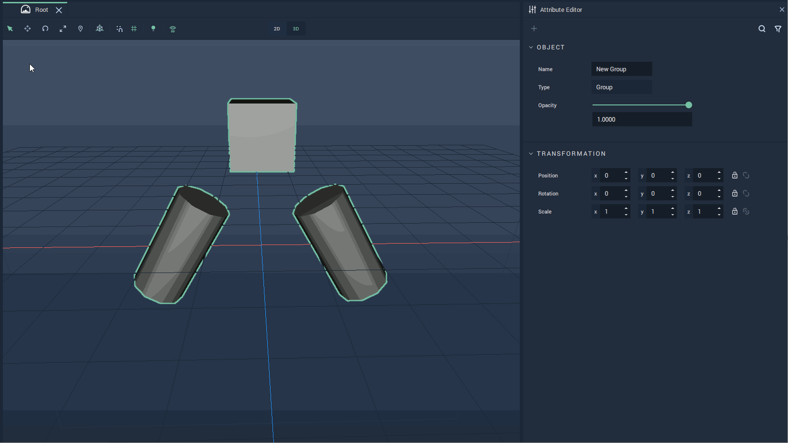

# Local Transformations

## Overview

**Local** **Transformations** are performed along the *principal axes* of an **Object**, which can be thought as the most natural axes for the rotation of an **Object**.

As an example, the **Local** axes for a cube, a cylinder, and a dome are:

**Local** **Transformations** for `Position` and `Rotation` are done directly in the **Scene Viewport** in **Local** mode. To switch to **Local** mode simply click on the `Local Global` icon on the top Menu of the **Viewport**.

The **Local** mode allows one to change the [`Position`](#position), [`Rotation`](#rotation), and [`Scale`](#scale) of an **Object**. It can also be used for [several **Objects**](#several-objects) and [**Groups**](#groups).

## Position

To modify an **Object's** **Position**, click on the `Translate` icon, second from the left on the top Menu. This will make a *gizmo* appear, showing the axes along which the **Object's** **Position** can be modified. In **Local** mode, the **Object's** **Local** axes are shown.

To move an **Object** along an axis, click on the preferred axis and drag the **Object**. It can also be moved in any direction by dragging the center of the *gizmo* or in a plane by dragging the square between two axes.

The example below shows an **Object** being moved along its **Local** axes.

## Rotation

To be able to rotate an **Object**, click on the `Rotate` icon, third from the left on the top Menu. This will make the *rotation gizmo* appear for the **Object**. Each circle represents an axis along which a rotation can be performed. For rotating the **Object**, click on a circle of the *gizmo* and drag towards the direction in which to perform the rotation. In **Local** mode, the **Object** is rotated with respect to its own **Local** axes.

The example below shows an **Object** being locally rotated. Note that as the **Object** is rotated, its **Local** axes also rotate.

## Scale

Scaling an **Object** can be done either in the **Scene Viewport** or in the **Object's** **Attributes**.

To scale an **Object** in the **Viewport**, simply locate the `Scale` icon fourth from the left on the top Menu. This will make the *scale gizmo* appear. Each axis ends in a small cube and pulling on these axes, after clicking with the mouse, will change the shape of the **Object**, as if molding it like clay. The **Object** is always scaled with respect to its **Local** axes. 

The example below shows a cube being scaled in the **Viewport**.

It is also possible to scale an **Object** from its **Attributes**. For this, modify the `Scale` values under `Transformation` in the **Attribute Editor**: with a right-click, a drop-down Menu for the step change opens; after choosing the step, change the value by scrolling or use the up and down arrows at the right of the value. It is also possible to directly set the value in the input box.

The following example shows the modification of the `Scale` values for a **Cube**.

## Several Objects

It is also possible to perform **Local** **Transformations** on several **Objects** at once. For this, simply select the **Objects** to modify either in the **Scene View** or in the **Scene Outliner**. It will show the *gizmo* positioned in the center of all the selected **Objects** and the axes direction of the last selected **Object**.

**Transformations** will then apply to all selected **Objects**.

The first example shows the **Transformation** *gizmo* of each individual **Object** and then how it looks when they are all selected.

The next two examples show the translation of two cubes and the rotation of two cylinders, respectively.

## Groups

Another way of performing **Transformations** over several **Objects** is by putting them into a **Group**. Then, performing **Transformations** over the **Group** will **Transform** the **Objects** that compose it as if they all were just parts of only one **Object**.

The example below shows a **Local** rotation and translation of a **Group** composed of two cylinders and a cube.

## External Links

* [*Principal Axes*](https://en.wikipedia.org/wiki/Moment_of_inertia#Principal_axes) on Wikipedia.
