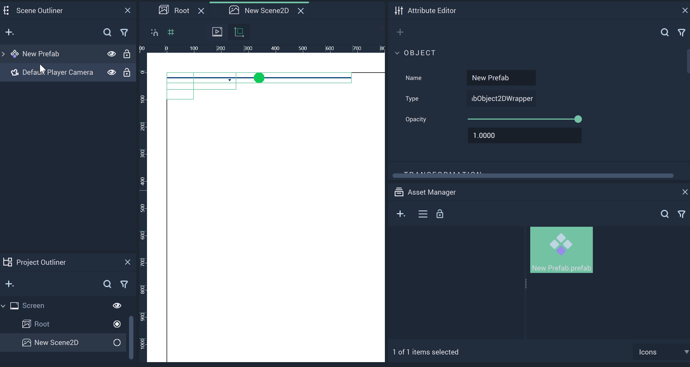
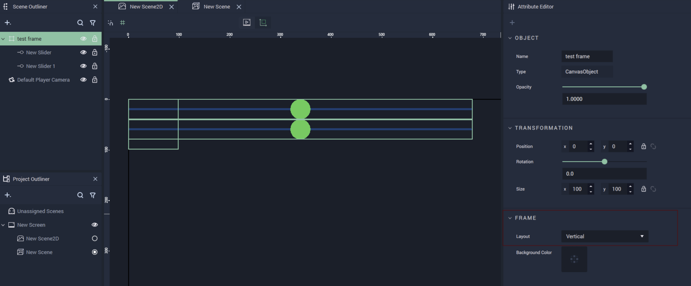
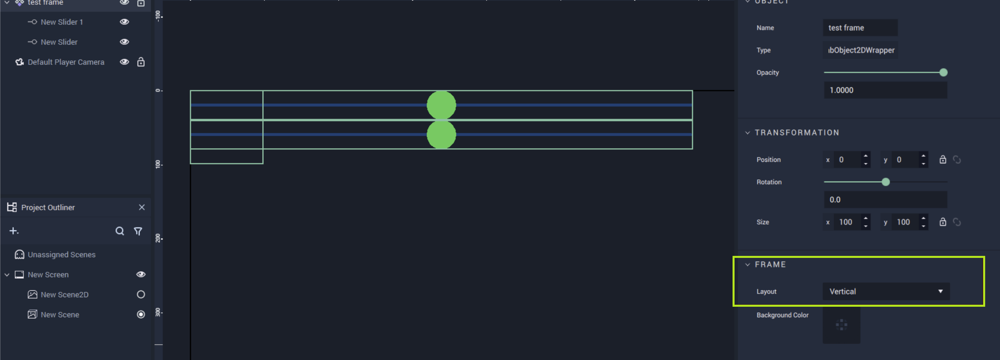
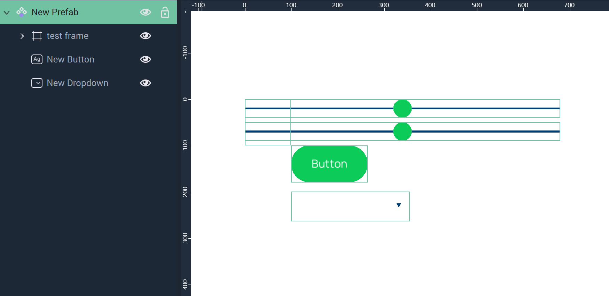
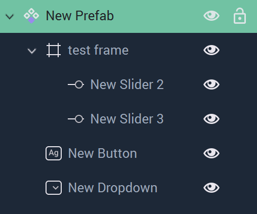

# Prefabs in Scene2Ds

## Creating Prefabs

To create a **Prefab**, go to the **Scene Outliner** and select the **Objects** that will compose the **Prefab**, then right-click and click on `Make Prefab`. This will create a **Prefab** consisting of the selected **Objects** and a new **Prefab** **Asset** will be generated in the **Asset Manager**.

New instances of the **Prefab** can be created by either duplicating the existing **Prefab** in the **Scene Outliner** or by dragging the **Prefab Asset** from the **Asset Manager** to the **Scene Outliner** or the **Scene**.

 

For creating **Prefabs** in **Scene2Ds**, there are two cases to consider: if **Objects** are already a part of a **Frame** or if they are standalone.

### Objects Within a Frame

Packing a **Prefab** in a **Scene2D** from an already existing **Frame** will create a new **Prefab** and put **Frame** *child* **Objects** into a **Prefab** (essentially a **Frame**), and not the original **Frame** itself. All the properties of the initial **Frame** will be copied into the newly created **Prefab**.

See an example below. Here, a **Prefab** is created from a **Frame** with a vertical `Layout` that contains two **Sliders**.

Note that the **Prefab** consists of the two **Sliders** that were *children* of the **Frame**, as well as the **Frame's** `Layout` property that was set to vertical. 

### Objects Outside of a Frame

Creating a **Prefab** from multiple **Objects** that are not already part of a **Frame** will result in a **Prefab** that is a new **Frame**. It will contain default properties and all the **Objects** that were packed into the **Prefab**.

See an example below:

## Editing the Prefab Asset

To edit the **Prefab** **Asset**, double-click the **Prefab** in the **Asset Manager**. This will open the **Prefab View** in both the **Scene Outliner** and **Attribute Editor**. It is also possible to right-click on the **Prefab** in the **Scene Outliner** and click the `Edit Prefab` button. 

 

The **Prefab** **View** is indicated by a purple circle. Changes made here affect all instances of the **Prefab**.

For the changes made in the **Prefab Asset** to take effect, it is necessary to save them by pressing the `Save prefab` button on the top right corner of the **Viewport**.

## Editing a Prefab Instance

Each **Instance** of a **Prefab** can be modified on its own and this overrides the **Attributes** from the **Prefab Asset**. To do this, simply edit the **Object** in the **Prefab** instance.

 

## Unpacking a Prefab

Unpacking a **Prefab** in a **Scene2D** will result in a new **Frame** that has all the properties that were set for the **Prefab**. The new **Frame** is essentially a copy of the **Prefab**. 

In the case of a **Prefab** that contains only one **Frame** as a *child*, the **Frame** will be moved to the position of the **Prefab** parent. 

When unpacked, the **Objects** of a **Prefab** will be moved to the same level in the **Scene Hierarchy** that the **Prefab** was on. This means that the *parent* of the **Prefab** is now the *parent* of the **Objects** and not the **Prefab**. The **Prefab Instance** is also deleted. 

Any edits given to **Objects** of a **Prefab** via overrides remain once unpacked. 

