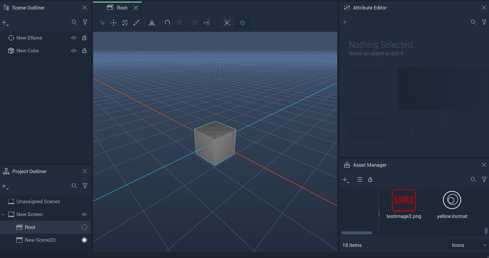
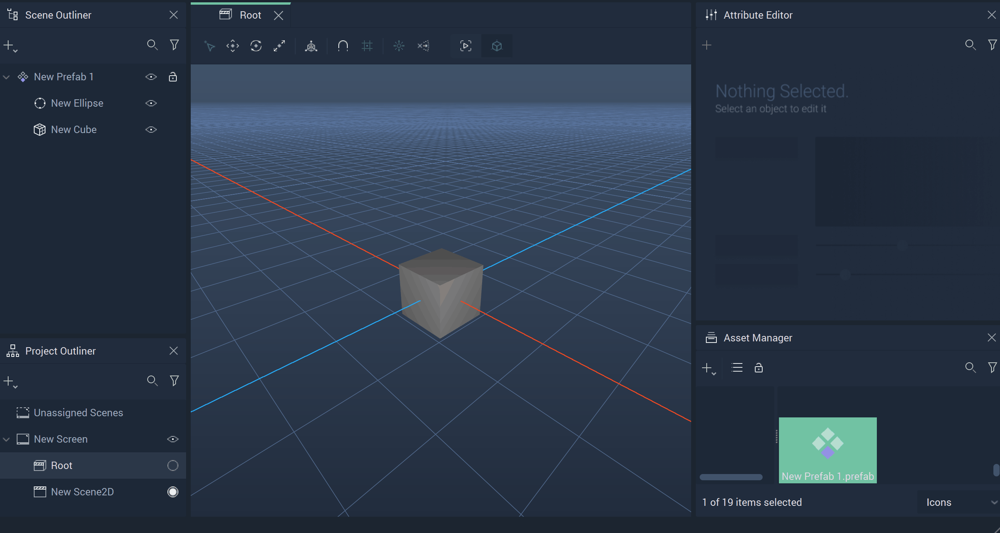
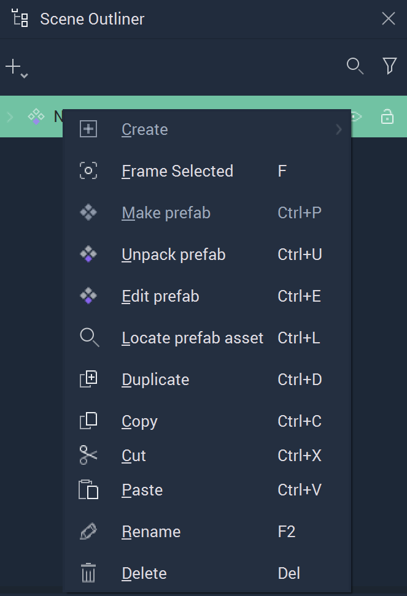
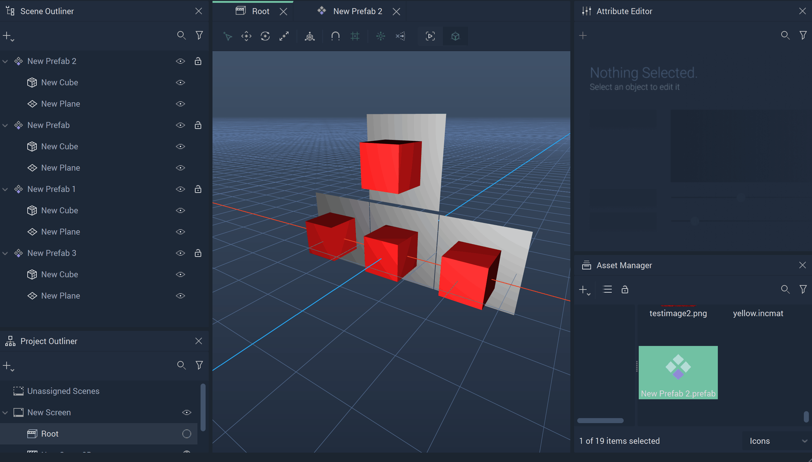
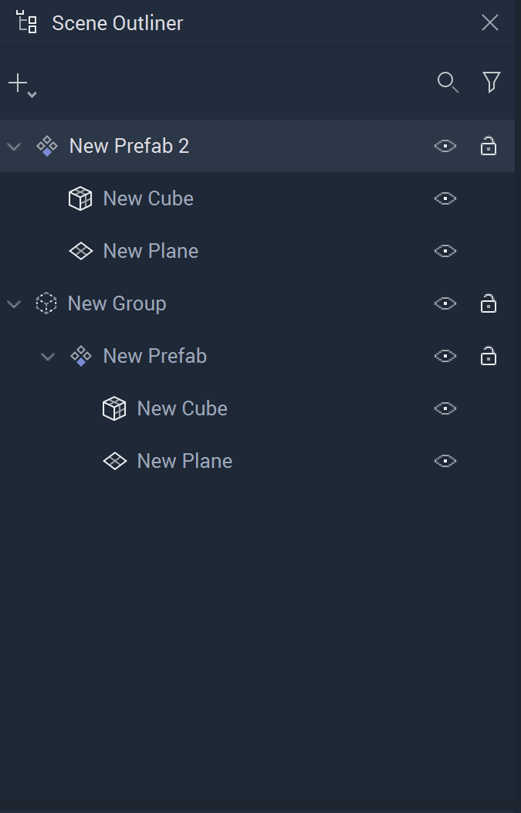

# Prefabs in Scenes

In order to use **Prefabs**, one must understand the different ways to manipulate them. This is detailed in the following sections:

* [Creating Prefabs](3D.md#creating-prefabs)
* [Editing the Prefab Asset](3D.md#editing-the-prefab-asset)
* [Editing a Prefab Instance](3D.md#editing-a-prefab-instance)
* [Unpacking a Prefab](3D.md#unpacking-a-prefab)

## Creating Prefabs

To create a **Prefab**, go to the **Scene Outliner** and select the **Objects** that will compose the **Prefab**, then right-click and click on `Make Prefab`. This will create a **Prefab** consisting of the selected **Objects** and a new **Prefab** **Asset** will be generated in the **Asset Manager**.

New instances of the **Prefab** can be created by either duplicating the existing **Prefab** in the **Scene Outliner** or by dragging the **Prefab Asset** from the **Asset Manager** to the **Scene Outliner** or the **Scene**.

## Editing the Prefab Asset

To edit the **Prefab** **Asset**, double-click the **Prefab** in the **Asset Manager**. This will open the **Prefab View** in both the **Scene Outliner** and **Attribute Editor**. It is also possible to right-click on the **Prefab** in the **Scene Outliner** and click the `Edit Prefab` button. 

 

The **Prefab** **View** is indicated by a purple circle. Changes made here affect all instances of the **Prefab**.

For the changes made in the **Prefab Asset** to take effect, it is necessary to save them by pressing the `Save prefab` button on the top right corner of the **Viewport**.

## Editing a Prefab Instance

Each **Instance** of a **Prefab** can be modified on its own and this overrides the **Attributes** from the **Prefab Asset**. To do this, simply edit the **Object** in the **Prefab** instance.

 

## Unpacking a Prefab

A **Prefab** can be unpacked, meaning that it can be taken from its **Prefab** form and converted back into a normal **Object**, or **Objects**. If a **Prefab** contained multiple **Objects**, they will become separated and are treated as individual again. To unpack a **Prefab**, simply right-click on it in the **Scene Outliner** and click `Unpack prefab`.

When unpacked, the **Objects** of a **Prefab** will be moved to the same level in the **Scene Hierarchy** that the **Prefab** was on. This means that the *parent* of the **Prefab** is now the *parent* of the **Objects** and not the **Prefab**. The **Prefab Instance** is also deleted. 

Any edits given to **Objects** of a **Prefab** via overrides remain once unpacked. 
