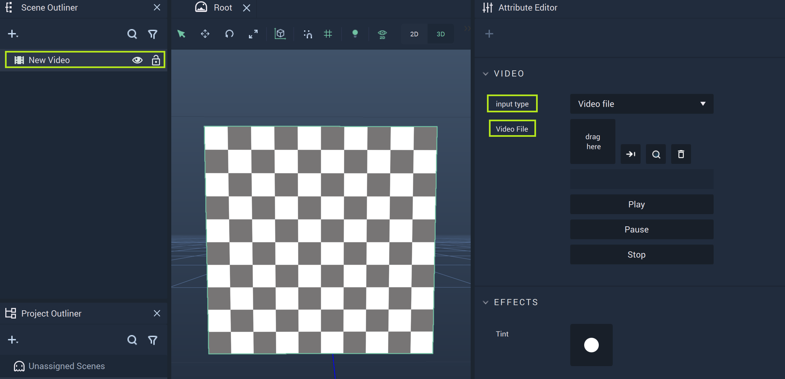

# Video

A **Video Object**, located under the **3D** section of the **Scene Outliner**, displays a video once a file is selected in the `Video File` **Attribute** or a `Camera input` camera is selected. 0 usually refers to the webcam of a laptop. 

As can be seen in the image above, the **Video Object** has an **Attribute `inpute type`. Here, `Video file` is selected, but `Camera input` is also possible. 

Once a file is selected, it is displayed in the viewport of the **Scene Outliner**. It can be played, paused, and stopped. Alternatively, the `Camera` would be selected for `Camera input`. This would be 0, 1, 2, and so on, depending on the coding of the devices connected to the user's machine. 

Additionally, there are several **Nodes** attributed to **Video Objects**. More information can be found [here](../../../toolbox/incari/video/README.md) and [here.](../../../toolbox/events/video/README.md)

