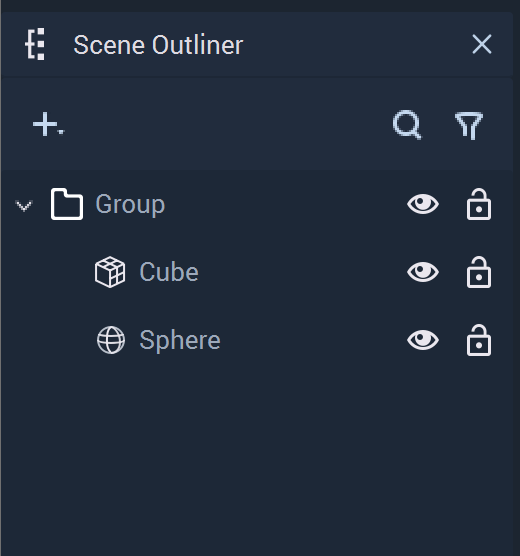
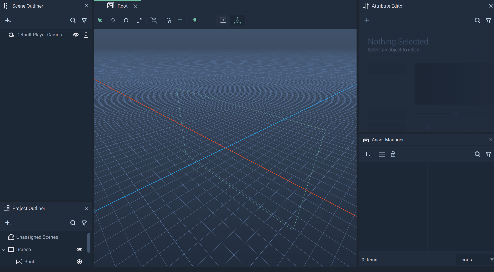
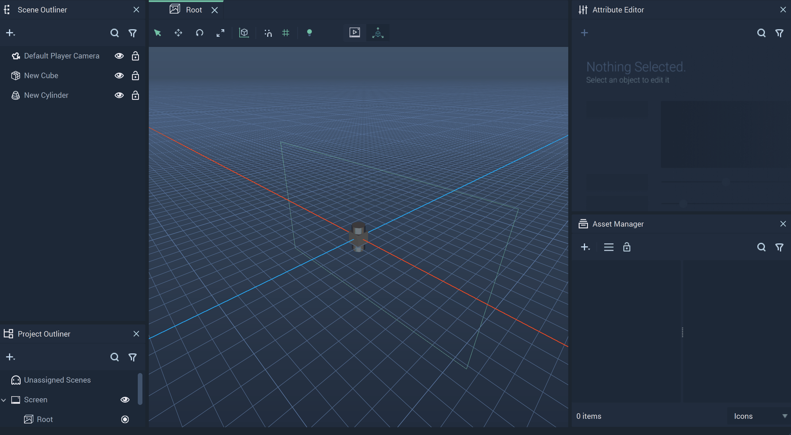
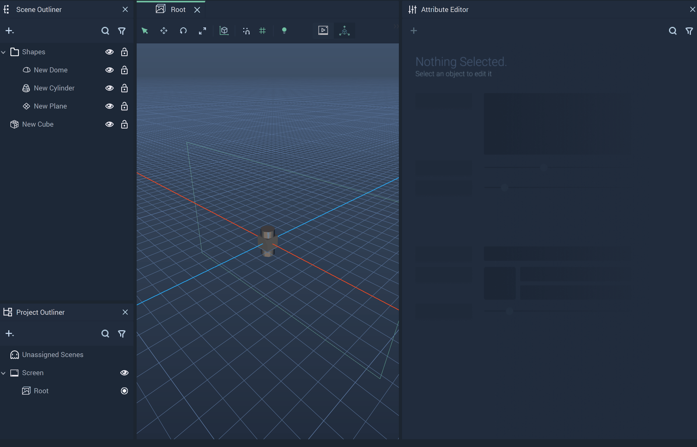
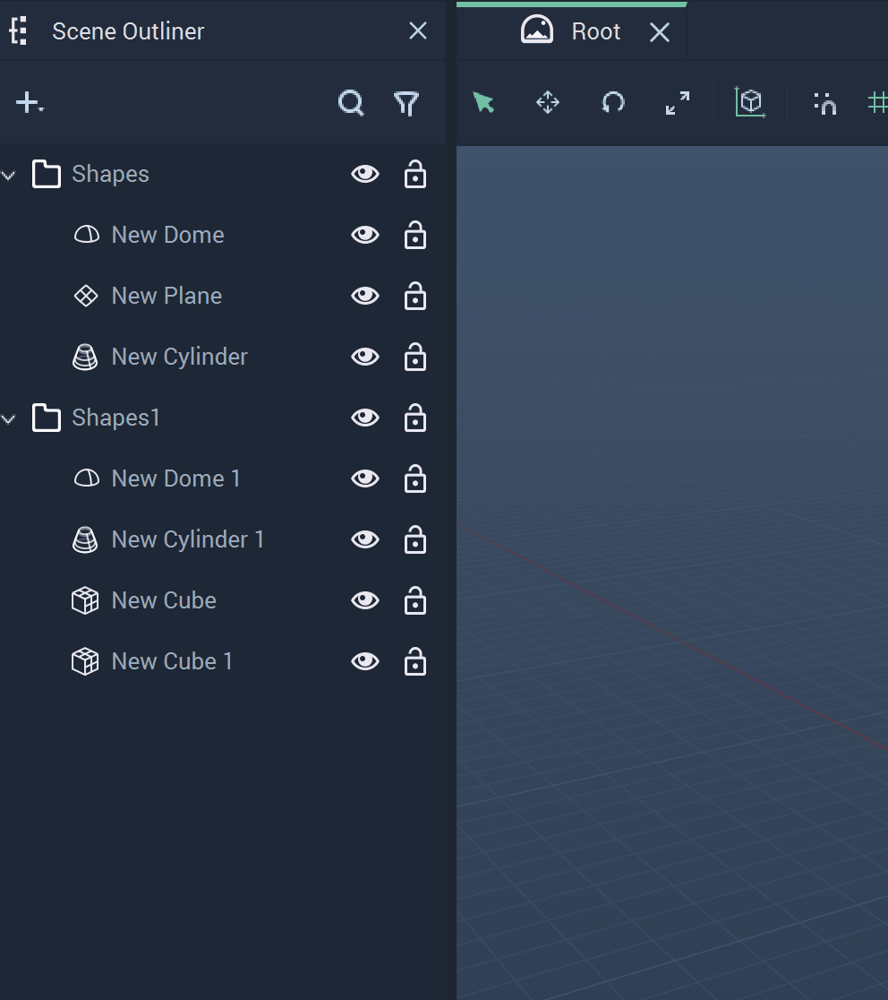
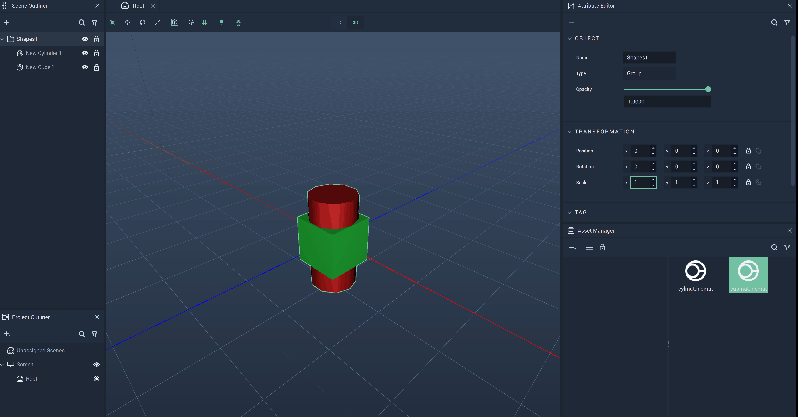

# Group

This page will describe **Groups** in **Incari**. The **Group** **Object** works like a folder, as it allows you to structure and organize **Objects**, making **Scenes** with high amounts of different **Objects** more manageable.

To jump ahead to a section, refer to the table of contents below:

* [Create](group.md#create)
* [Delete](group.md#delete)
* [Transformation](group.md#transformations)

## Create

There are a couple of ways to create **Groups**. 

* Locate the drop-down Menu by clicking the plus-sign in the **Scene Outliner**. Then click **Group** and add any other **Objects** to it. 

* Select multiple **Objects** and right-click on `Create`. Select **Group**. 

* Right-click inside the **Scene** **Outliner**, select `Create` from the pop-up, and click on **Group**. Now **Objects** can be added one-by-one.

## Delete

A **Group** can be deleted in its entirety or one **Object** at a time. 

* To delete a **Group**, right-click the **Group** and select `Delete`.
* To delete one **Object** in a **Group**, simply right-click on that particular **Object** and select `Delete`. 

## Transformations

A useful function of the **Group** **Object** is that it allows you to transform multiple **Objects** relative to a single **Pivot Point**, as if they were are a single **Object**.

Like any other **Scene Object**, we can manipulate its [**Transformation Attributes**](../attributes/common-attributes/transformation/README.md).

