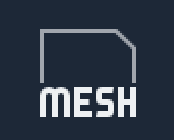

# Mesh

## Overview

In other *3D* applications, it is quite common to apply materials and textures directly to a *3D* _mesh_. In **Incari**, though, we have a specific **Mesh Object** which contains separate references to the **3D Asset** \(the _mesh_ data\) and **Incari's** own **Material** file, which contains **Shade** and **Texture** information.

Like any other **Scene Object**, we can manipulate the **Position**, **Rotation** and **Scale** of a **Mesh** using the **Transformation Attributes** and adjusting its **Rotation Pivot**.

## Mesh Asset

The `Mesh Asset` **Attribute** contains a reference to a 3D file in your **Asset Manager**. We currently have limited support for `.3ds`, `.ply`, `.dae` and `.fbx` files, however we recommend using `.obj`, since the importer has been widely tested and rarely has any issues.

When you drag and drop a _mesh_ from the **Asset Manager** into your **Scene** a **Mesh Object** is automatically created. If you need to assign the **Asset** manually, however, you can simply drag and drop the **Asset** onto the **Asset** slot of the **Attribute**.

## Material Asset

The `Material Asset` **Attribute** is used to apply a **Material Asset** to a **Mesh**. **Materials** can be created in the **Asset Manager** and edited in the **Material Editor**.

To assign a **Material Asset** to the **Attribute**, drag and drop it onto the **Asset** slot of the **Attribute**.

