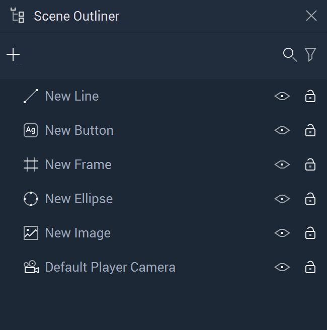
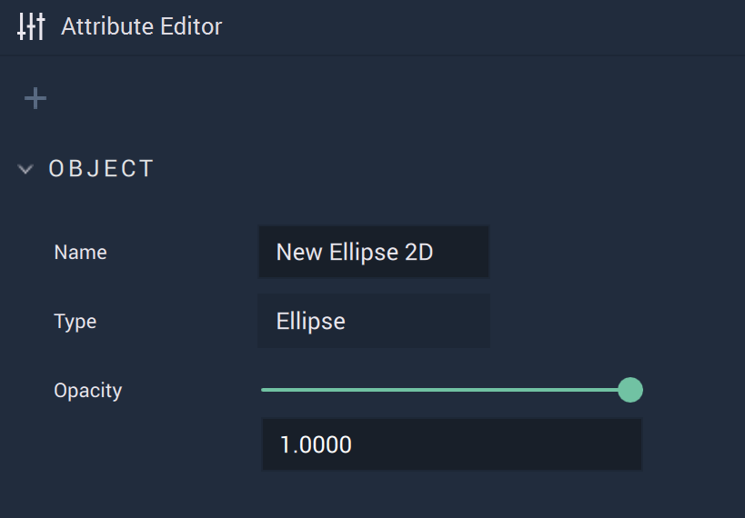
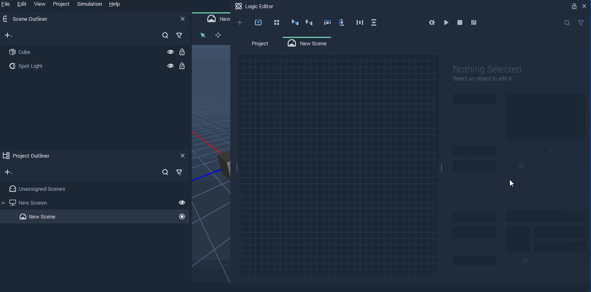
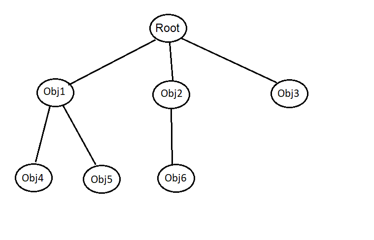
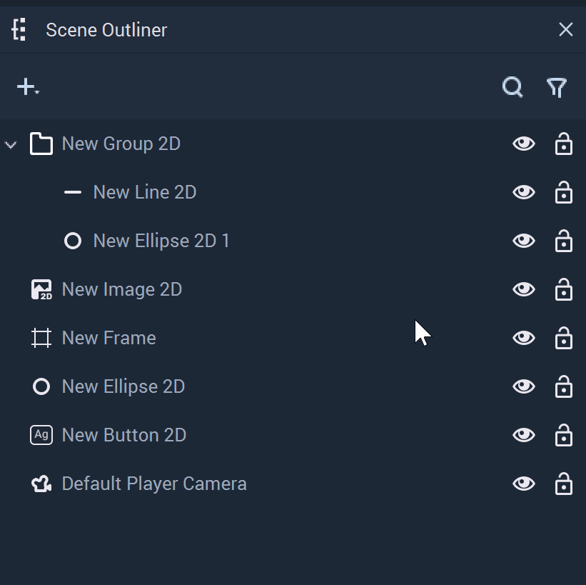
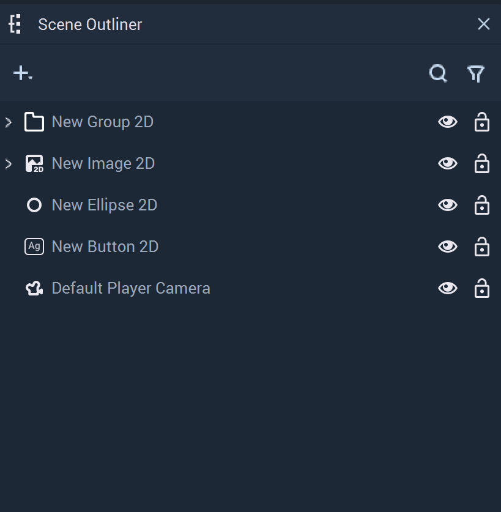
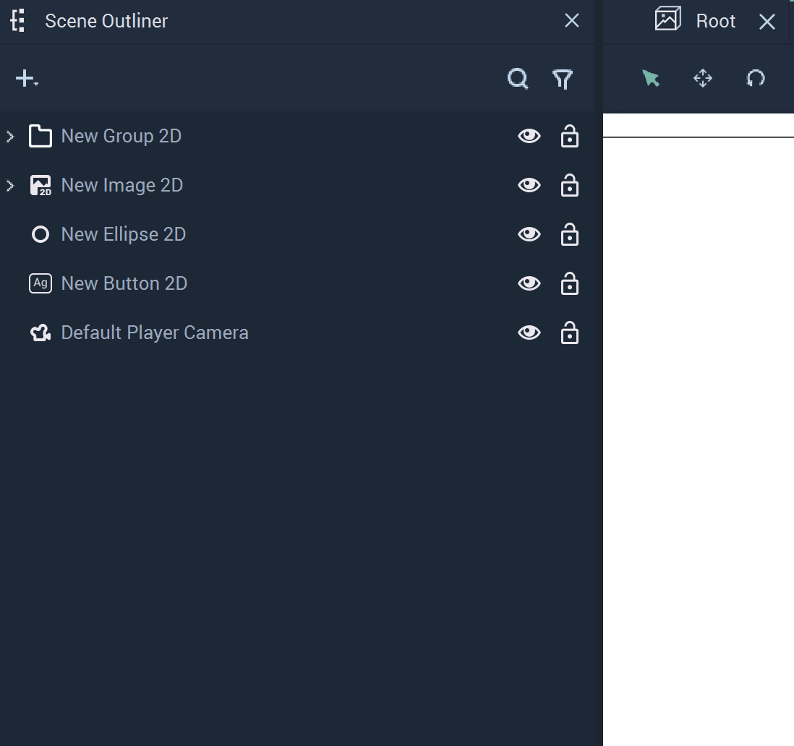

# Scene2D Objects

 **Scene2Ds** also have several **Objects**. "**Object**" is a broad term used to describe a number of different components, each with their own purpose, behaviors, and characteristics.

For in-depth descriptions of each type of **Object**, see the [**Table of Contents**](#contents) below.

## Managing Objects

**Objects** in a **Scene2D** are managed in the **Scene Outliner**. There they can be created, deleted, edited, and organized. For more detail, see the [**Scene Outliner**](../../modules/scene-outliner.md) section. They are effectively the same processes that govern **Scene Objects**. 

## Attributes

**Attributes** define specific characteristics of entities in **Incari** and can be modified in the [**Attribute Editor**](../../modules/attribute-editor.md). Particularly, there are several sets of **Attributes** that are shared throughout **Objects**. These are explained in detail in the [**Common Attributes**](../attributes/common-attributes/) section:

* [`Object`](../attributes/common-attributes/object.md): The `Name`, `Type`, and `Opacity` of an **Object** are shown here.
* [`Tag`](../attributes/common-attributes/tag.md): _Metadata_ that serves as an identifier for an **Object** or several of them.
<!--* [`Sprite`](../attributes/common-attributes/sprite.md): They determine how an **Object** is visualized in a **Scene**.-->
* [`Transformation`](../attributes/common-attributes/transformation/README.md): They define the _position_ and _rotation_ of an **Object** in a **Scene2D**.

<!--

<figure><figcaption>
Object Attributes.
</figcaption></figure>
<figure><figcaption>
Tag Attributes.
</figcaption></figure>

<figure><figcaption>
Sprite Attributes.
</figcaption></figure>
<figure><figcaption>
Transformation Attributes.
</figcaption></figure>

-->

<!--**Prefabs** are an important and useful type of **Object**. They are composed of a combination of **Objects** and allow the user to create several **Instances** of this combination, enact changes across all of them, or apply individual characteristics via overrides. For more information, see the [**Prefabs**](../prefabs/README.md) section.

## Objects in Logic

In the [**Logic**](../../modules/logic-editor/README.md), it might be necessary to make references to specific **Objects**. For this, each **Object** in a **Scene** gets assigned an **Object ID**, which is a unique identifier. The **Object ID** of an **Object** can be obtained from said **Object's** **Node**, which is created by dragging an **Object** from the **Scene Outliner** to the **Logic Editor**.

For handling and modifying **Objects** in the **Logic**, there is a special category of [**Nodes**](../../modules/logic-editor/README.md#nodes): the [**Object Nodes**](../../toolbox/incari/object/README.md). These **Nodes** allow the user to obtain and set **Attribute** values for **Objects**, and they receive as input the **Object ID** of the target **Object**.

## Structure in a Scene

**Objects** in a **Scene** are organized in a _tree_. This means that every **Object** except for the [**Root Object**](#root-object) has a _parent_ and all **Objects** may have _children_. 

The picture below shows an example. Here, `Object1` is the *parent* of `Object4` and `Object5`, `Object2` is the *parent* of `Object6`, and `Object3` has no *children*.
 

<!--  -->

<!-- 

<figure><figcaption>

</figcaption></figure>
<figure><figcaption>

</figcaption></figure>

 -->

### Structure in a Scene 

As in **Scenes**, **Objects** in **Scene2Ds** fall under a certain hierarchy. All **Objects** are children of the [**Root Object**](#root-object), but only one **Object** type can be a *parent* itself. These are **Frames**. No other **Objects** can contain *children* in **Scene2Ds**. 

### Root Object

Every **Scene2D** has a **Root Object**, which is the _parent_ of all **Objects** that are on the first hierarchy level. Thus, all **Objects** in a **Scene2D** are _descendants_ of the **Root Object**. To obtain the **Object ID** of the **Root Object**, use the [**Get Root** **Node**](../../toolbox/incari/object/get-root.md).

<!--### Managing the Structure of Objects in a Scene2D

In the **Scene Outliner**, there are three ways to make an **Object** the child of another:

* Drag an existing **Object** and drop it on top of the **Object** that will be the *parent*.

* Select the **Object** that will be the *parent* and create a new **Object** by clicking the plus  (4) (4) (4) (4) (4) (4) (4) (1) (2) (1).PNG>) icon on the top left and selecting the **Object** to create as a *child*.

* Right-click the **Object** that will be the *parent*, click on `Create` on the drop-down menu that appears and select the **Object** to create as a *child*.

Moreover, **Objects** in the **Scene Outliner** can be dragged and dropped anywhere in the **Scene2D** structure.

-->
### Nodes 

There are a few **Nodes** that allow the user to obtain and use information about the structure of **Objects** in a **Scene2D**. These are:

* [**Get Children**](../../toolbox/incari/object/get-children.md): Returns the *children* of an **Object**.
* [**Get Parent**](../../toolbox/incari/object/get-parent.md): Returns the *parent* of an **Object**.
* [**Has Children**](../../toolbox/incari/object/has-children.md): Returns a **Boolean** indicating whether an **Object** has *children*.

For more information about *trees*, visit the [Tree (data structure)](https://en.wikipedia.org/wiki/Tree_(data_structure)) page on *Wikipedia*.

## Contents

* [Audio 2D](audio2d.md)
* [**Camera**](camera2d.md)
* [**Frame**](frame.md)
* [**GUI**](gui/README.md)
* [**Group**](group2d.md)
* [**Image**](image.md)
* [**Vector**](figma/README.md)