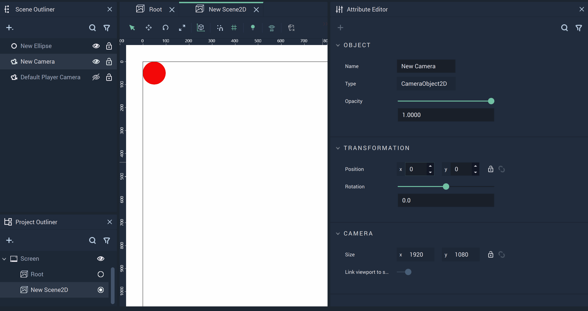
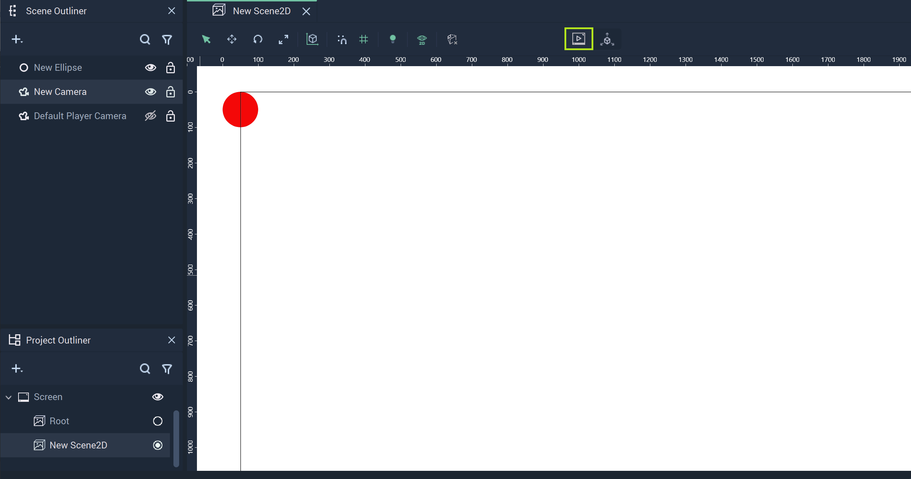

# Camera 2D

The **Camera Object** effectively decides what is visible of a **Scene2D** when switched to `Player View`. The user can control this with its **Attributes**. 

Altering a **Camera's** `Position` and `Rotation` may change how **Objects** are displayed in `Player View`, cutting off parts of an **Object** if they fall outside the **Camera's** bounds. As default, all of these values are set to 0. These can be used to shift the bounds of a **Camera**. 

Before `Player View` is enabled, the bounds of the **Camera** as well as the entire **Object** are visible in `Editor View`. `Player View` is highlighted at the top of the image. 

Once `Player View` is activated, only half of the **Ellipse** is visible and the boundary lines of the **Camera** disappear. 

The `Size` configures the dimensions of the **Camera's** bounds, the default of which is `1920x1080`. This can be used to reduce or extend the bounds of a **Camera**. 