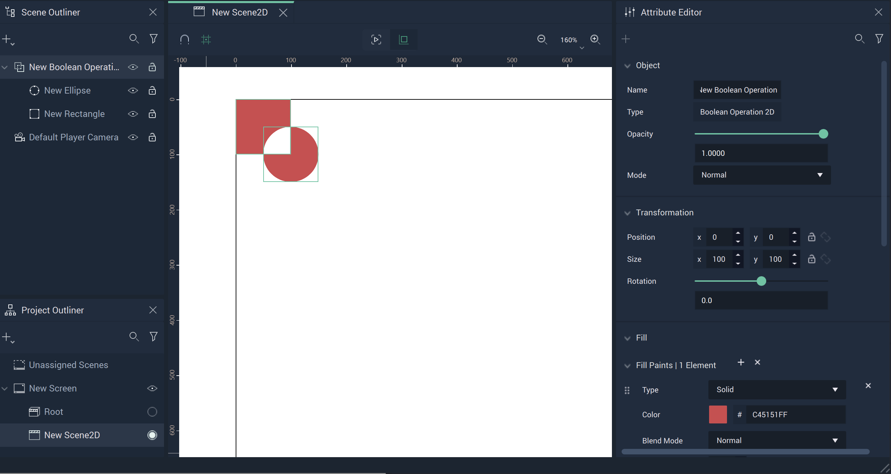
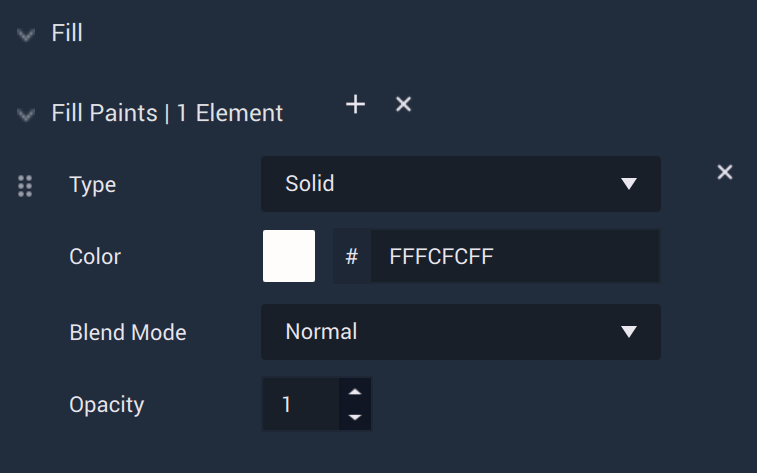
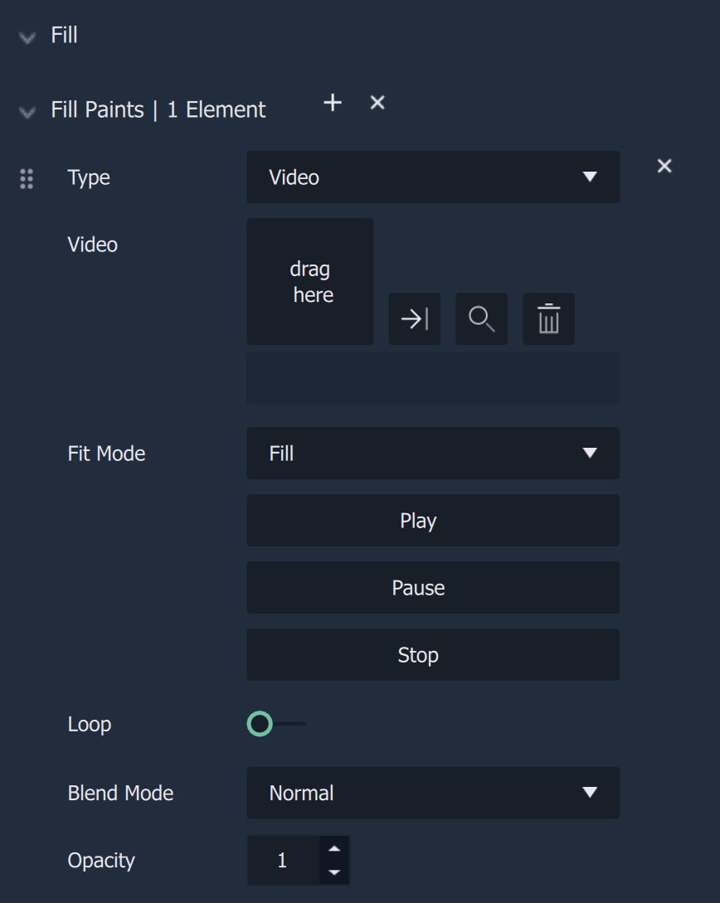
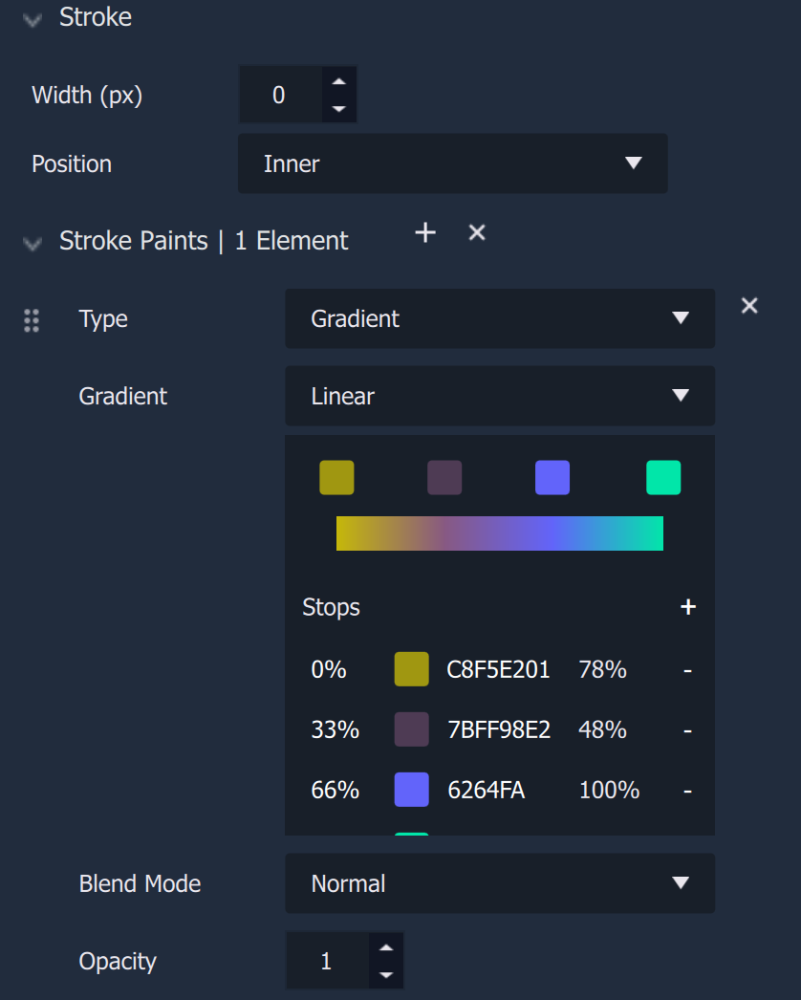
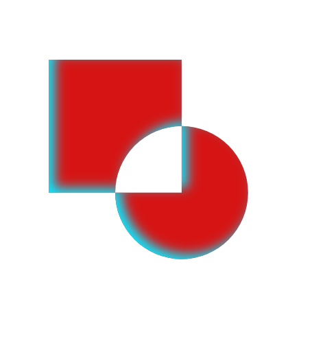
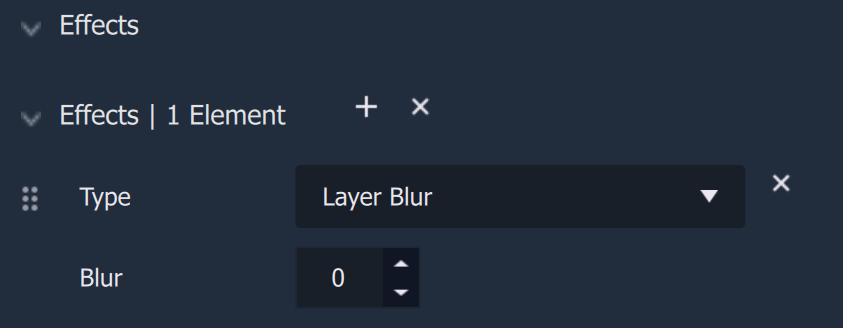
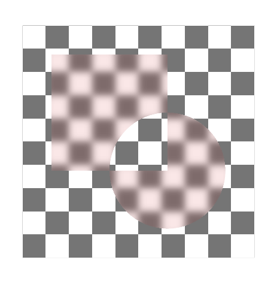
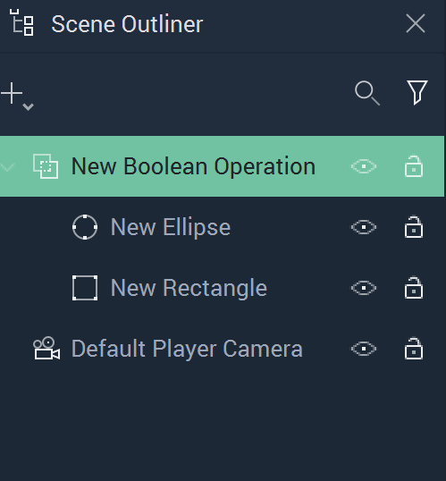
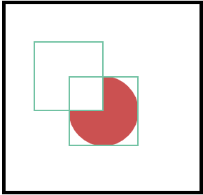
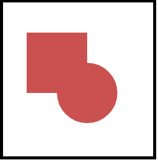

#  Boolean Operation 

The **Boolean Operation** in **Incari** provides similar functionality as its equivalent in *Figma*. It acts as *parent* to its *child* **Objects**. Any visual aspects are controlled completely by the **Boolean Operation**; the visual properties of the *children* do not have any precendent, such as a *child's* `Fill`. 

There are several **Attributes** which allow the user heightened customizability and control. 

* [**Transformation**](figmabooleanoperation.md#transformation)
* [**Blending**](figmabooleanoperation.md#blending)
* [**Fill**](figmabooleanoperation.md#fill)
* [**Stroke**](figmabooleanoperation.md#stroke)
* [**Effects**](figmabooleanoperation.md#effects)
* [**Mask**](figmabooleanoperation.md#mask)
* [**Operation**](figmabooleanoperation.md#operation)
* [**Tag**](figmabooleanoperation.md#tag)

# Attributes

## Transformation

The `Transformation` **Attributes** deal with placement, rotation, and size in *XY* space. More information can be found [here](../../attributes/common-attributes/transformation/README.md).

## Blending

This **Attribute** lets the user set a `Blend Mode` as a base property of the **Ellipse**. These are established on common formulas, examples of each can be accessed [here](http://www.simplefilter.de/en/basics/mixmods.html). An **Object's** `Blend Mode` can also be set with the [**Set Blend Mode Node**](../../../toolbox/incari/object2d/setblendmode.md).

## Fill

The `Fill` **Attributes** consist of different items called `Elements`. Each `Element` contains a `Type`. This can be either `Solid`, `Gradient`, `Image`, or `Video` and changes some of the available **Attributes** under this category.

If there is more than one `Fill Element`, the most recent one will take precedent over the others (unless some `Blend Mode` is applied).

### Solid

When `Solid` is selected, `Color` is visible. 

* `Color` is a color selector that lets the user pick the `Fill's` color. 

* Similar to the base property described previously, `Blend Mode` here affects the `Fill Elements` only. These are established on common formulas, examples of each can be accessed [here](http://www.simplefilter.de/en/basics/mixmods.html). It can also be set with the [**Set Blend Mode Node**](../../../toolbox/incari/object2d/setblendmode.md).

* `Opacity` refers to how opaque or transparent the `Fill` appears. This is represented by an integer between 0 and 1.

Please note that when a new `Fill` is added, it is added to the top of the *fill* list and the **Object** will be updated to display this `Fill`.  

### Gradient

When `Gradient` is selected, `Gradient` is visible. 

* `Gradient` decides the style of gradient, which can be either `Linear`, `Radial`, `Angular`, or `Diamond`.
  
* The `Gradient` color selector has a row of squares going left to right as well as a column going top to bottom. These correspond 1:1 with each other, so in the image above the mustard yellow squares are the same color. The user can drag the squares in the row to change the order of the gradient's colors. Clicking anywhere in the bar will add a square in both the row and column of colors. The user can change the color of a square by clicking it, which opens the color picker. 

* Similar to the base property described previously, `Blend Mode` here affects the `Fill Elements` only. These are established on common formulas, examples of each can be accessed [here](http://www.simplefilter.de/en/basics/mixmods.html). It can also be set with the [**Set Blend Mode Node**](../../../toolbox/incari/object2d/setblendmode.md).

* `Opacity` refers to how opaque or transparent the `Fill` appears. This is represented by an integer between 0 and 1.

### Image

 

When `Image` is selected, `Image` and `Fit Mode` are visible. 

* `Image` is the desired **Texture** file.
  
* `Fit Mode` determines how the **Texture** is displayed. These can be `Fill`, `Fit`, `Crop`, and `Tile`. `Tile` has the additional **Attribute** of `Scale Factor`, which augments the tesselation. 

* Similar to the base property described previously, `Blend Mode` here affects the `Fill Elements` only. These are established on common formulas, examples of each can be accessed [here](http://www.simplefilter.de/en/basics/mixmods.html). It can also be set with the [**Set Blend Mode Node**](../../../toolbox/incari/object2d/setblendmode.md).

* `Opacity` refers to how opaque or transparent the `Fill` appears. This is represented by an integer between 0 and 1.

### Video

 

When `Video` is selected, `Video` and `Fit Mode` are visible. 

* `Video` is the desired **Video** file.
  
* `Fit Mode` determines how the **Video** is displayed. These can be `Fill`, `Fit`, `Crop`, and `Tile`. `Tile` has the additional **Attribute** of `Scale Factor`, which augments the tesselation.
   
* Below `Fit Mode` are three options: `Play`, `Pause`, and `Stop`. `Play` starts the video in the **Scene2D**, `Pause` halts it at the frame it is currently on, and `Stop` halts it and reset it to the beginning. 

* `Loop` is a *Bool* that when toggled on, makes the video repeat itself once it finishes. This is continous. 

* Similar to the base property described previously, `Blend Mode` here affects the `Fill Elements` only. These are established on common formulas, examples of each can be accessed [here](http://www.simplefilter.de/en/basics/mixmods.html). It can also be set with the [**Set Blend Mode Node**](../../../toolbox/incari/object2d/setblendmode.md).

* `Opacity` refers to how opaque or transparent the `Fill` appears. This is represented by an integer between 0 and 1.

## Stroke

The `Stroke` **Attributes** consist of different items called `Elements`. Each `Element` contains a `Type`. This can be either `Solid` or `Image` and changes some of the available **Attributes** under this category. There are also two fixed **Attributes** outside of the `Elements`. These are:

* `Width`, which is how wide (in pixels) each `Stroke` will appear. This applies to each `Stroke Element`. 
* `Position`, which determines what part of the outline identifies the outside of the **Object**. For example, if `Inner` is selected, then the outside of the `Stroke` is the outside of the **Object**. If `Center` is selected, then the `Stroke's` center is the outside of the **Object**. If `Outer` is selected, then the inside of the `Stroke` is the outside of the **Object**.

### Solid 

When `Solid` is selected, `Color` is visible. 

* `Color` is a color selector that lets the user pick the `Stroke's` color. 

* Similar to the base property described previously, `Blend Mode` here affects the `Stroke Elements` only. These are established on common formulas, examples of each can be accessed [here](http://www.simplefilter.de/en/basics/mixmods.html). It can also be set with the [**Set Blend Mode Node**](../../../toolbox/incari/object2d/setblendmode.md).

* `Opacity` refers to how opaque or transparent the `Stroke` appears. This is represented by an integer between 0 and 1.

### Gradient

When `Gradient` is selected, `Gradient` is visible. 

* `Gradient` decides the style of gradient, which can be either `Linear`, `Radial`, `Angular`, or `Diamond`.
  
* The `Gradient` color selector has a row of squares going left to right as well as a column going top to bottom. These correspond 1:1 with each other, so in the image above the mustard yellow squares are the same color. The user can drag the squares in the row to change the order of the gradient's colors. Clicking anywhere in the bar will add a square in both the row and column of colors. The user can change the color of a square by clicking it, which opens the color picker. 

* Similar to the base property described previously, `Blend Mode` here affects the `Stroke Elements` only. These are established on common formulas, examples of each can be accessed [here](http://www.simplefilter.de/en/basics/mixmods.html). It can also be set with the [**Set Blend Mode Node**](../../../toolbox/incari/object2d/setblendmode.md).

* `Opacity` refers to how opaque or transparent the `Stroke` appears. This is represented by an integer between 0 and 1.

### Image 

When `Image` is selected, `Image` and `Fit Mode` are visible. 

* `Image` is the desired **Texture** file.
  
* `Fit Mode` determines how the **Texture** is displayed. These can be `Fill`, `Fit`, `Crop`, and `Tile`. `Tile` has the additional **Attribute** of `Scale Factor`, which augments the tesselation. 

* Similar to the base property described previously, `Blend Mode` here affects the `Stroke Elements` only. These are established on common formulas, examples of each can be accessed [here](http://www.simplefilter.de/en/basics/mixmods.html). It can also be set with the [**Set Blend Mode Node**](../../../toolbox/incari/object2d/setblendmode.md).

* `Opacity` refers to how opaque or transparent the `Fill` appears. This is represented by an integer between 0 and 1.

### Video

 

When `Video` is selected, `Video` and `Fit Mode` are visible. 

* `Video` is the desired **Video** file.
  
* `Fit Mode` determines how the **Video** is displayed. These can be `Fill`, `Fit`, `Crop`, and `Tile`. `Tile` has the additional **Attribute** of `Scale Factor`, which augments the tesselation.
   
* Below `Fit Mode` are three options: `Play`, `Pause`, and `Stop`. `Play` starts the video in the **Scene2D**, `Pause` halts it at the frame it is currently on, and `Stop` halts it and reset it to the beginning. 

* `Loop` is a *Bool* that when toggled on, makes the video repeat itself once it finishes. This is continous. 

* Similar to the base property described previously, `Blend Mode` here affects the `Stroke Elements` only. These are established on common formulas, examples of each can be accessed [here](http://www.simplefilter.de/en/basics/mixmods.html). It can also be set with the [**Set Blend Mode Node**](../../../toolbox/incari/object2d/setblendmode.md).

* `Opacity` refers to how opaque or transparent the `Stroke` appears. This is represented by an integer between 0 and 1.

## Effects

The `Effects` **Attribute** consists of different items called `Elements`. Each `Element` contains a `Type`. These are `Drop Shadow`, `Inner Shadow`, `Layer Blur`, and `Background Blur`. The available **Attributes** are described below:

### Drop Shadow and Inner Shadow

There are two *shadow* `Types`. `Drop Shadow` adds a *shadow* behind the **Object**. `Inner Shadow` adds a *shadow* within the **Object**.

* `Offset` sets the location of the *shadow* in relation to the **Object**. 

* `Blur` modifies the softness of the shadow. When there is no blur, the shadow appears completely solid with rigid lines. When blur is applied, the shadow becomes transfused.  

* `Spread` inflates or deflates the shadowshape on which the blur is applied. 

* `Color` changes the color of the shadow.

* `Blend Mode` affects the `Effects Elements` only. These are established on common formulas, examples of each can be accessed [here](http://www.simplefilter.de/en/basics/mixmods.html). It can also be set with the [**Set Blend Mode Node**](../../../toolbox/incari/object2d/setblendmode.md).

### Layer Blur and Background Blur 

There are two *blur* `Types`. `Layer Blur` blurs the **Object** itself and `Background Blur` applies a blur to whatever is directly behind the **Object**. This latter blur type is better seen when the **Object's** opacity or `Fill` opacity has been reduced. 

* `Blur` increases the severity of the blur effect. 

## Mask 

A **Mask** is an **Object** that shows a certain area of another **Object** while concealing the rest. Any **Object** (e.g., an **Ellipse**, **Rectangle**, **Frame**, **Group**, or **Text**) can be used as a **Mask**. 

For easier visualization, think of the **Mask** as a cookie cutter while the masked **Object** is the dough: the cookie cutter shows only a part and discards the rest.

The `Type` **Attribute** has three options:

* `None` - nothing is applied. 
* `Alpha` - the **Mask** has an opacity level (alpha channel) determining with which level of opacity (or transparency) the masked **Object** is revealed: 0% opacity reveals nothing, 100% opacity is equivalent to a **Mask** with `Vector` type.
* `Vector` - only modifies the shape outline of the masked **Object**
* `Luminance` - allows the user to utilize brightness to determine the effect of the **Mask**; the brighter the area of a **Mask**, the more that is revealed and the darker the area, the less that is revealed.

`Object` allows the user to select what should be the masked **Object**.

`Apply Mask` is a toggle that applies the **Mask** when set to on, and disables the **Mask** when set to off. 

## Operation

The `Operation` **Attribute** implements the four functions:

* [Exclude](figmabooleanoperation.md#exclude)
* [Intersect](figmabooleanoperation.md#intersect)
* [Subtract](figmabooleanoperation.md#subtract)
* [Union](figmabooleanoperation.md#union)

Thie *child* **Objects** form the shape that will be the core of what is displayed throught the different operations. The *base* **Object** is always the last *child* **Object** in the **Scene Outliner**. In the image below, the *base* **Object** is the **Rectangle**.

### Exclude

`Exclude` displays all *child* **Objects** but removes any overlapping parts of other *children* from the *base* **Object**. Since the **Rectangle** is the base **Object** in the example above, the overlapping section of the **Ellipse** (the other *child* **Object**) is removed.  

### Intersect

`Intersect` displays *only* the parts of the other *children* **Objects** which overlap with the *base* **Object**. Here, the top-left quadrant of the **Ellipse** (which is represented by the right bounding box) overlaps with the **Rectangle** (which is represented by the left bounding box). Their intersection remains visible.

### Subtract

`Subtract` removes the *base* **Object** completely, even the parts which overlap with the other *children*. Since the **Rectangle** is the *base* **Object** in the example above and it's bottom-right quarter overlaps the **Ellipse**, this is removed as well. 

### Union 

`Union` combines all *children* as a single **Object**. In this example, there are only two **Objects**: an **Ellipse** and a **Rectangle**. There are no separating lines anymore and both take the color given to the **Boolean Operation** (in this case, red).

## Tag

This **Attribute** manages the *tags* for the **Button**. See more on *tags* [here.](../../attributes/common-attributes/tag.md)

