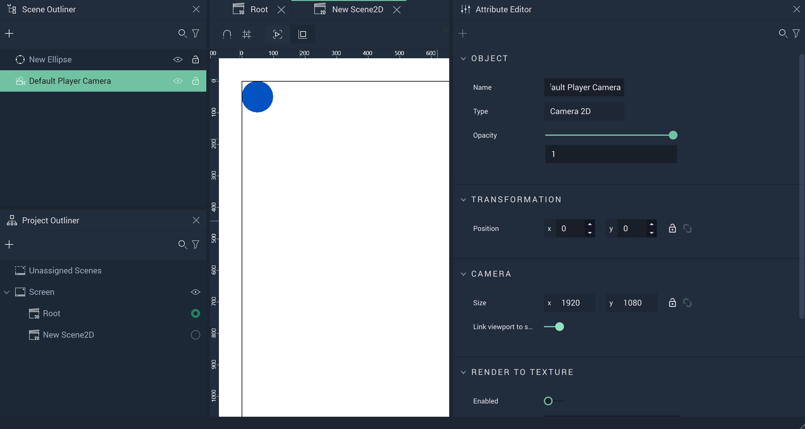
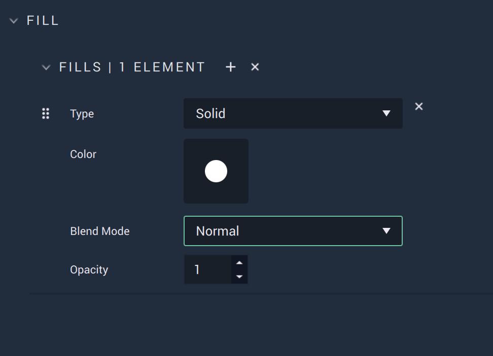

# Ellipse

The **Ellipse** in **Incari** provides similar functionality as its equivalent in *Figma*. 

There are several **Attributes** which allow the user heightened customizability and control. 

* [**Transformation**](figmaellipse.md#transformation)
* [**Blending**](figmaellipse.md#blending)
* [**Fill**](figmaellipse.md#fill)
* [**Stroke**](figmaellipse.md#stroke)
* [**Ellipse**](figmaellipse.md#ellipse)
* [**Mask**](figmaellipse.md#mask)
* [**Style**](figmaellipse.md#style)
* [**Tag**](figmaellipse.md#tag)

# Attributes

## Transformation

The `Transformation` **Attributes** deal with placement, rotation, and size in *XY* space. More information can be found [here](../../attributes/common-attributes/transformation/README.md).

## Blending

This **Attribute** lets the user set a `Blend Mode` as a base property of the **Ellipse**. These are established on common formulas, examples of each can be accessed [here](http://www.simplefilter.de/en/basics/mixmods.html). An **Object's** `Blend Mode` can also be set with the [**Set Blend Mode Node**](../../../toolbox/incari/object2d/setblendmode.md).

## Fill

The `Fill` **Attributes** consist of different items called `Elements`. Each `Element` contains a `Type`. This can be either `Solid` or `Image` and changes some of the available **Attributes** under this category.

### Solid

When `Solid` is selected, `Color` is visible. 

* `Color` is a color selector that lets the user pick the `Fill's` color. 

* Similar to the base property described previously, `Blend Mode` here affects the `Fill Elements` only. These are established on common formulas, examples of each can be accessed [here](http://www.simplefilter.de/en/basics/mixmods.html). It can also be set with the [**Set Blend Mode Node**](../../../toolbox/incari/object2d/setblendmode.md).

* `Opacity` refers to how opaque or transparent the `Fill` appears. This is represented by an integer between 0 and 1.

### Image

 

When `Image` is selected, `Image` and `Fit Mode` are visible. 

* `Image` is the desired **Texture** file.
  
* `Fit Mode` determines how the **Texture** is displayed. These can be `Fill`, `Fit`, `Crop`, and `Tile`. `Tile` has the additional **Attribute** of `Scale Factor`, which augments the tesselation. 

* Similar to the base property described previously, `Blend Mode` here affects the `Fill Elements` only. These are established on common formulas, examples of each can be accessed [here](http://www.simplefilter.de/en/basics/mixmods.html). It can also be set with the [**Set Blend Mode Node**](../../../toolbox/incari/object2d/setblendmode.md).

* `Opacity` refers to how opaque or transparent the `Fill` appears. This is represented by an integer between 0 and 1.

## Stroke

The `Stroke` **Attributes** consist of different items called `Elements`. Each `Element` contains a `Type`. This can be either `Solid` or `Image` and changes some of the available **Attributes** under this category. There are also two fixed **Attributes** outside of the `Elements`. These are:

* `Width`, which is how wide (in pixels) each `Stroke` will appear. This applies to each `Stroke Element`. 
* `Position`, which determines 

When `Solid` is selected, `Color` is visible. 

* `Color` is a color selector that lets the user pick the `Fill's` color. 

* Similar to the base property described previously, `Blend Mode` here affects the `Stroke Elements` only. These are established on common formulas, examples of each can be accessed [here](http://www.simplefilter.de/en/basics/mixmods.html). It can also be set with the [**Set Blend Mode Node**](../../../toolbox/incari/object2d/setblendmode.md).

* `Opacity` refers to how opaque or transparent the `Stroke` appears. This is represented by an integer between 0 and 1.

## Ellipse

## Mask 

## Style 

The `Style` **Attributes** allow for more customizability. This can override any stylesheet provided in the [**Project Settings**](../../../modules/project-settings/style.md) or a [**Scene2D**](../../project-objects/scene2d.md). 

To address these in the **Logic**, please refer to the [**Object 2D Nodes**](../../../toolbox/incari/object2d/README.md).

* `CSS Classes` contain the *CSS* class names of the **Object**. 

* `Stylesheet` contains the *CSS* stylesheet of the **Object**.

## Tag

This **Attribute** manages the *tags* for the **Button**. See more on *tags* [here.](../../attributes/common-attributes/tag.md)

