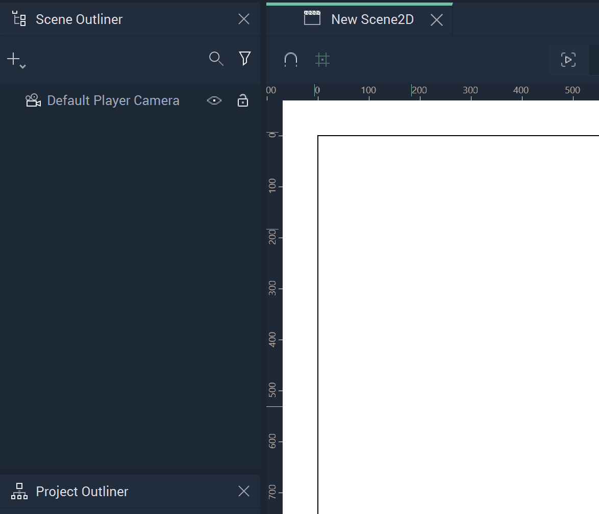
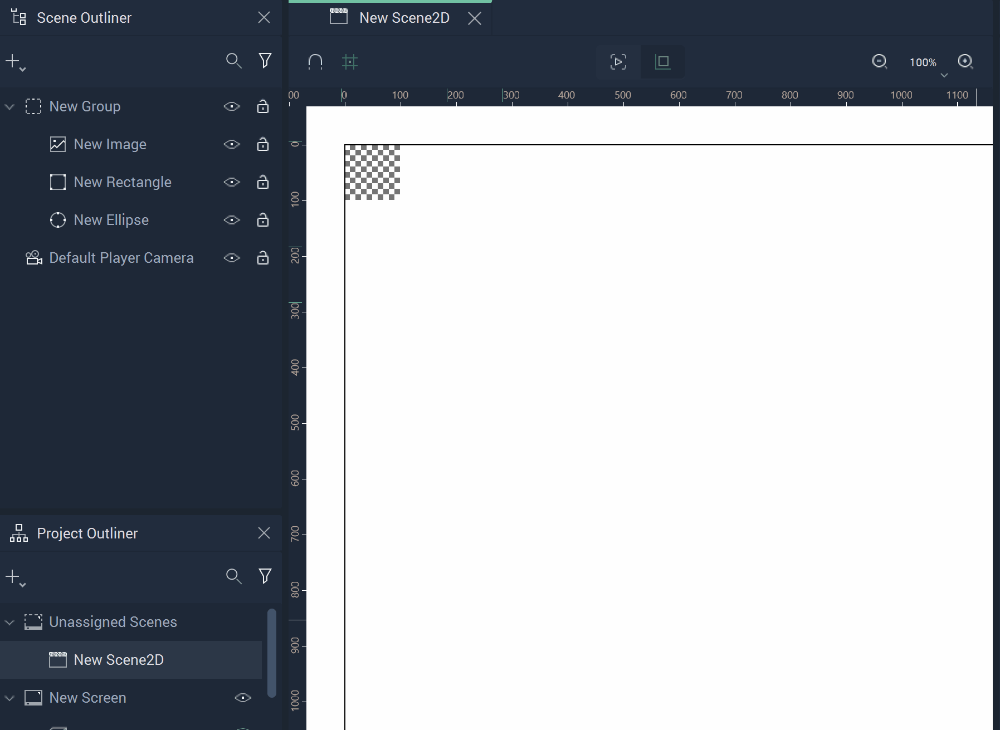
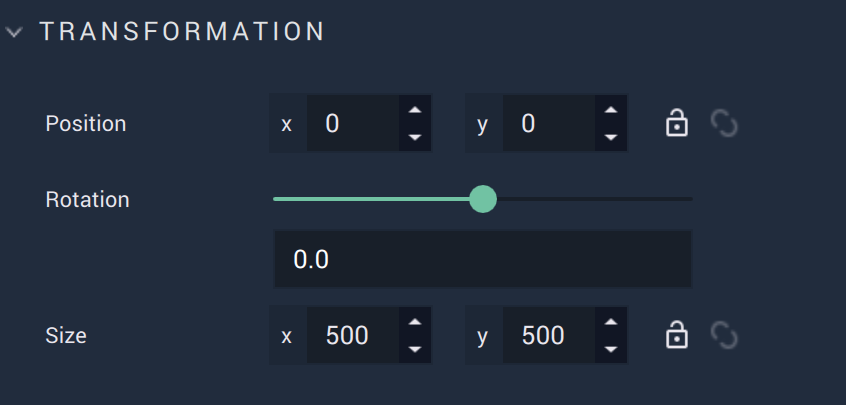
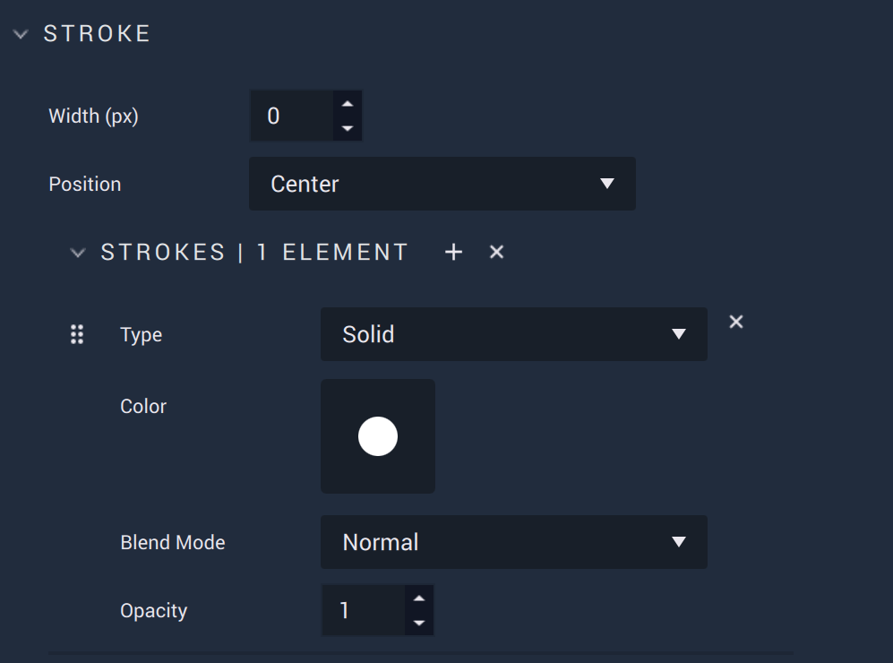

# Group 

This page will describe **Groups** in **Scene2Ds**. The **Group** **Object** works like a folder, as it allows the user to structure and organize **Objects**, making **Scenes** with high amounts of different **Objects** more manageable. It is one of the only **Objects** in **Scene2Ds** which can be a *parent*, besides [**Frames**](frame.md) and [**Boolean Operations**](figma/figmabooleanoperation.md).  

To jump ahead to a section, refer to the table of contents below:

* [Create](group.md#create)
* [Delete](group.md#delete)
* [Transformation](group.md#transformations)

## Create

There are a couple of ways to create **Groups**. 

* Locate the drop-down Menu by clicking the plus-sign in the **Scene Outliner**. Then click **Group** and add any other **Objects** to it. 

* Select multiple **Objects** and right-click on `Create`. Select **Group**. 

* Right-click inside the **Scene** **Outliner**, select `Create` from the pop-up, and click on **Group**. Now **Objects** can be added one-by-one.

## Delete

A **Group** can be deleted in its entirety or one **Object** at a time. 

* To delete a **Group**, right-click the **Group** and select `Delete`.
* To delete one **Object** in a **Group**, simply right-click on that particular **Object** and select `Delete`. 

## Transformations

A useful function of the **Group** **Object** is that it allows you to transform multiple **Objects** relative to a single **Pivot Point**, as if they were a single **Object**.

Like any other **Scene Object**, we can manipulate its [**Transformation Attributes**](../attributes/common-attributes/transformation/README.md), albeit only in the X and Y directions.

## Attributes

### Transformation

The `Transformation` **Attributes** deal with placement, rotation, and size in *XY* space. More information can be found [here](../attributes/common-attributes/transformation/README.md).

 

<!--### Blending 

This **Attribute** lets the user set a `Blend Mode` as a base property of the **Ellipse**. These are established on common formulas, examples of each can be accessed [here](http://www.simplefilter.de/en/basics/mixmods.html). An **Object's** `Blend Mode` can also be set with the [**Set Blend Mode Node**](../../toolbox/incari/object2d/setblendmode.md).

### Stroke

The `Stroke` **Attributes** consist of different items called `Elements`. Each `Element` contains a `Type`. This can be either `Solid` or `Image` and changes some of the available **Attributes** under this category. There are also two fixed **Attributes** outside of the `Elements`. These are:

* `Width`, which is how wide (in pixels) each `Stroke` will appear. This applies to each `Stroke Element`. 
* `Position`, which determines what part of the outline identifies the outside of the **Object**. For example, if `Inner` is selected, then the outside of the `Stroke` is the outside of the **Object**. If `Center` is selected, then the `Stroke's` center is the outside of the **Object**. If `Outer` is selected, then the inside of the `Stroke` is the outside of the **Object**.

When `Solid` is selected, `Color` is visible. 

* `Color` is a color selector that lets the user pick the `Stroke's` color. 

* Similar to the base property described previously, `Blend Mode` here affects the `Stroke Elements` only. These are established on common formulas, examples of each can be accessed [here](http://www.simplefilter.de/en/basics/mixmods.html). It can also be set with the [**Set Blend Mode Node**](../../toolbox/incari/object2d/setblendmode.md).

* `Opacity` refers to how opaque or transparent the `Stroke` appears. This is represented by an integer between 0 and 1.

When `Image` is selected, `Image` and `Fit Mode` are visible. 

* `Image` is the desired **Texture** file.
  
* `Fit Mode` determines how the **Texture** is displayed. These can be `Fill`, `Fit`, `Crop`, and `Tile`. `Tile` has the additional **Attribute** of `Scale Factor`, which augments the tesselation. 

* Similar to the base property described previously, `Blend Mode` here affects the `Stroke Elements` only. These are established on common formulas, examples of each can be accessed [here](http://www.simplefilter.de/en/basics/mixmods.html). It can also be set with the [**Set Blend Mode Node**](../../toolbox/incari/object2d/setblendmode.md).

* `Opacity` refers to how opaque or transparent the `Fill` appears. This is represented by an integer between 0 and 1.-->

### Mask 

A **Mask** is an **Object** that shows a certain area of another **Object** while concealing the rest. Any **Object** (e.g., an **Ellipse**, **Rectangle**, **Frame**, **Group**, or **Text**) can be used as a **Mask**. 

For easier visualization, think of the **Mask** as a cookie cutter while the masked **Object** is the dough: the cookie cutter shows only a part and discards the rest.

The `Type` **Attribute** has three options:

* `None` - nothing is applied. 
* `Alpha` - the **Mask** has an opacity level (alpha channel) determining with which level of opacity (or transparency) the masked **Object** is revealed: 0% opacity reveals nothing, 100% opacity is equivalent to a **Mask** with `Vector` type.
* `Vector` - only modifies the shape outline of the masked **Object**
* `Luminance` - allows the user to utilize brightness to determine the effect of the **Mask**; the brighter the area of a **Mask**, the more that is revealed and the darker the area, the less that is revealed.

`Object` allows the user to select what should be the masked **Object**.

`Apply Mask` is a toggle that applies the **Mask** when set to on, and disables the **Mask** when set to off. 

### Style

The `Style` **Attributes** allow for more customizability. This can override any stylesheet provided in the [**Project Settings**](../../modules/project-settings/style.md) or a [**Scene2D**](../project-objects/scene2d.md). 

To address these in the **Logic**, please refer to the [**Object 2D Nodes**](../../toolbox/incari/object2d/README.md).

* `CSS Classes` contain the *CSS* class names of the **Object**. 

* `Stylesheet` contains the *CSS* stylesheet of the **Object**.

### Tag 

This **Attribute** manages the *tags* for the **Button**. See more on *tags* [here.](../attributes/common-attributes/tag.md)

