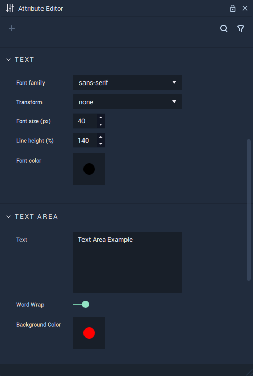
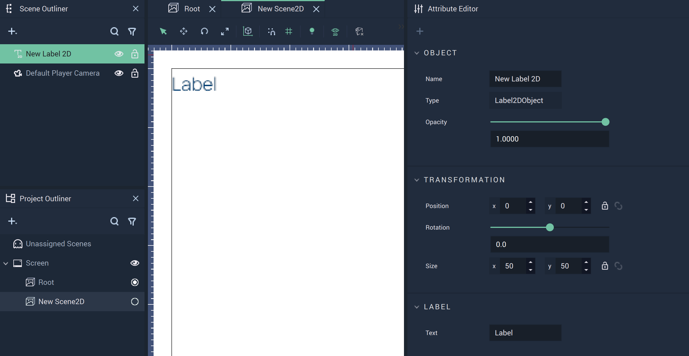
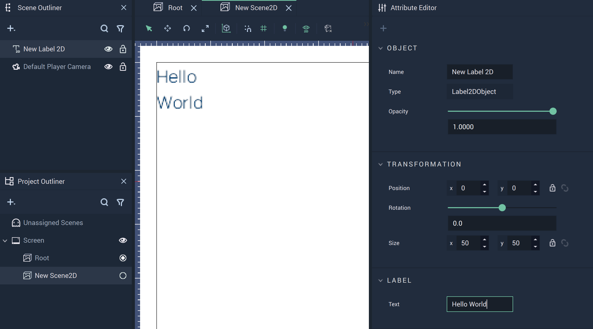

# GUI

A *GUI*, or graphical user interface, uses graphics to let a user interact with an interface. In **Incari**, there are several simple features which are available to create and edit in **Scene2Ds**. They are:

<!-- no toc -->
* [**Button**](#button)
* [**Dropdown**](#dropdown)
* [**Slider**](#slider)
* [**Text**](#text)
* [**Text Area**](#text-area)
* [**Toggle**](#toggle) 

## Button

The **Button** **GUI** **Object** is a simple icon to attach **Logic** to. Its text, placement, and size can be altered in the **Attribute Editor**. 

## Dropdown

The **Dropdown** is a **GUI** **2D Object** that allows the user to create a *dropdown menu*. The options in the menu, together with the colors and size, can be customized in the **Attributes**.

The following is a simple example of a **Dropdown** with three options:

The `Options` **Attribute** defines the options in the **Dropdown**:

Finally, this **Dropdown** looks like this when the **Project** is run:

## Slider

The **Slider** is a **GUI** **2D Object** that allows the user to create a customizable slider selector. Its **Attributes** offer the options to customize the **Slider**.

The **Slider Attributes** offer the user options to customize the slider:

Finally, the **Slider** works like this when the **Project** is run:

## Text

The **Text** **Object** allows the user to add text to their **Project**. It can be completely customized in the **Text Attributes**.

## Text Area

The **Text Area** **Object** allows the user to add text with a background to their **Project**. It can be completely customized in the **Text** and **Text Area Attributes**.

## Toggle

The **Toggle** **Object** is a **2D GUI Object** that has two states: checked or unchecked. Its initial state and colors can be customized in the **Attributes**.

              

<!-- ## Label

A **Label Object** essentially acts as a text box for a label. Any text can be added to the **Label** using the `Label` **Attribute** in the **Attribute Editor**. 

Initially, the **Label** displays the text `Label`.

Locating the `Text` **Attribute**, any text can be inputted to provide clear information for a *User Interface*. Here, the test text `Hello World` is supplied. 

There is also the **Get LabelText Node**. More information can be found [here.](../../../toolbox/incari/vector/label/README.md) -->