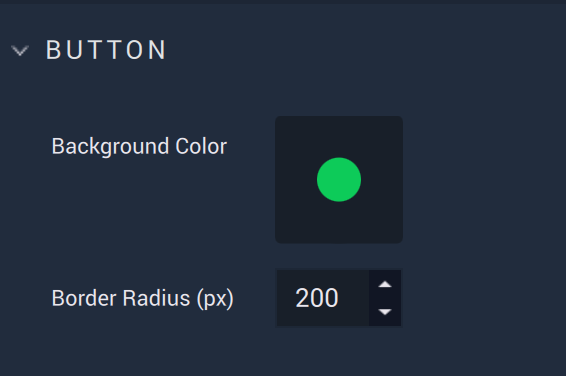

# Button

The **Button** **GUI** **Object** is a simple icon to attach **Logic** to. It can be configured so that something occurs when it is clicked in tandem with using the [**Mouse Nodes**](../../../toolbox/events/mouse/README.md). A **Button's** text, placement, and size can be altered using the [**Attributes**](button.md#attributes). 

## Attributes

The **Object's** **Attributes** can be used to fully customize the **Object**. Explained below, they are:

* [**Transformation**](button.md#transformation)
* [**Text**](button.md#text)
* [**Button**](button.md#button)
* [**Code**](button.md#code)
* [**Tag**](button.md#tag)
  
### Transformation

The `Transformation` **Attributes** deal with placement, rotation, and size in *XY* space. More information can be found [here](../../attributes/common-attributes/transformation.md).

### Text

The `Text` **Attributes** customize the textual elements of a **Button**.

* `Text` is the text itself which will be displayed on the **Button**. Please note that only text which fits within the confines of the **Button** will be displayed. Size the **Button** accordingly. 

* `Font family` offers three different font types: `monospace`, `sans-serif`, and `serif`. More fonts can be added by the user in [**Project Settings**](../../../modules/project-settings/fonts.md)

* `Transform` can easily change certain text aesthetics without requiring the user to change the `Text` **Attribute** itself. `Capitalize` makes the first letter capital, `uppercase` makes all letters capital, and `lowercase` makes all letters lowercase. 

* `Font size (px)` determines the size of the font in pixels.

* `Font color` decides the color of the **Button's** text.

### Button

The `Button` **Attributes** provide crucial visual aspects for a **Button Object**.

* `Background Color` determines the color of the **Button** itself. In the example image above, it is green. 

* `Border radius (px)` decides to what extent the corners and edges of the **Button** are rounded. 

### Code

The `Code` **Attributes** allow for more customizability. This can override any stylesheet provided in the [**Project Settings**](../../../modules/project-settings/style.md) or a [**Scene2D**](../../project-objects/scene2d.md). 

To address these in the **Logic**, please refer to the [**Object 2D Nodes**](../../../toolbox/incari/object2d/README.md).

* `Class names` contain the *CSS* class names of the **Object**. 

* `Stylesheet` contains the *CSS* stylesheet of the **Object**.

### Tag

This **Attribute** manages the *tags* for the **Button**. See more on *tags* [here.](../../attributes/common-attributes/tag.md)