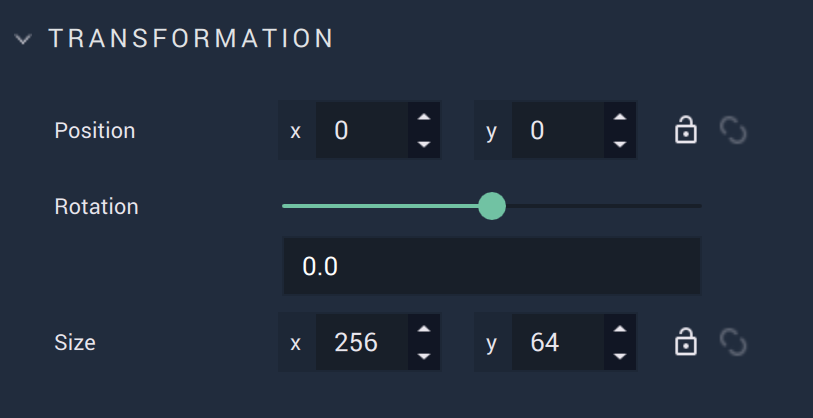
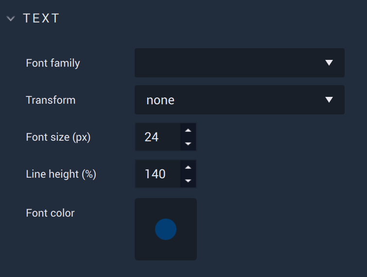
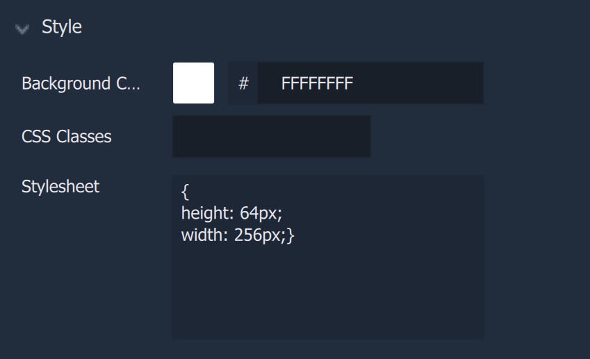

# Dropdown

The **Dropdown** is a **GUI** **2D Object** that allows the user to create a *dropdown menu*. The options in the menu, together with the colors and size, can be customized in the [**Attributes**](dropdown.md#attributes).

## Attributes

The **Object's** **Attributes** can be used to fully customize the **Object**. Explained below, they are:

* [**Transformation**](dropdown.md#transformation)
* [**Dropdown**](dropdown.md#dropdown)
* [**Text**](dropdown.md#text)
* [**Font**](dropdown.md#)
* [**Code**](dropdown.md#code)
* [**Tag**](dropdown.md#tag)

### Transformation

The `Transformation` **Attributes** deal with placement, rotation, and size in *XY* space. More information can be found [here](../../attributes/common-attributes/transformation/README.md).

### Dropdown

The `Dropdown` **Attributes** provide crucial data for a **Dropdown Object**. The `Options` have two types: `Static Text` and `Translation`. This can be switched using the text or translation icons to the right, in that order. 

* `Active index` determines which `Option` is shown at the front of the **Dropdown**. Remember that the first element has the index of 0. 

* `Options` provides the elements which will populate the **Dropdown**. Here there are three elements called `one`, `two`, and `phrase`. The first two are of type `Static Text`, where the user simply types the desired text. The third is of type `Translation`, which lets the user choose the key of the current language (which is established in the [**Project Settings**](../../../modules/project-settings/localization.md)). In the image above, the selected key is `phrase`.

In the above image, because the `Active index` is set to 0, 'one' would be element shown at the front of the **Dropdown**. 

### Text

The `Text` **Attributes** customize the textual elements of a **Dropdown**. 

* `Color` decides the color of the **Dropdown's** text.

* `Transform` can easily change certain text aesthetics without requiring the user to change the `Options` **Attributes** themselves. `Capitalize` makes the first letter capital, `uppercase` makes all letters capital, and `lowercase` makes all letters lowercase.  

* `Line height (%)` determines the placement of the text within the **Dropdown**. 

### Font

The `Font` **Attributes** focus on the details of the **Drowpdown's** text. Please note that while **Dropdowns** are capable of handling [*variable fonts*](../../../modules/project-settings/fonts.md#variable-fonts), only the default style will be used, as the configurable **Attributes** are not available for this **Object**.

* `Family` offers two different font types: `Manrope` and `Source Code Pro`. More fonts can be added by the user in [**Project Settings**](../../../modules/project-settings/fonts.md).

* `Size` determines the size of the font in pixels.

### Style

The `Style` **Attributes** allow for more customizability. This can override any stylesheet provided in the [**Project Settings**](../../../modules/project-settings/style.md) or a [**Scene2D**](../../project-objects/scene2d.md). 

To address these in the **Logic**, please refer to the [**Object 2D Nodes**](../../../toolbox/incari/object2d/README.md).

* `Background Color` decides the color of the **Dropdown's** background.
  
* `CSS Classes` contain the *CSS* class names of the **Object**. 

* `Stylesheet` contains the *CSS* stylesheet of the **Object**.

### Tag

This **Attribute** manages the *tags* for the **Dropdown**. See more on *tags* [here.](../../attributes/common-attributes/tag.md)

## Example

The following is a simple example of a **Dropdown** with three options:

The `Options` **Attribute** defines the options in the **Dropdown**:

Finally, this **Dropdown** looks like this when the **Project** is run:

