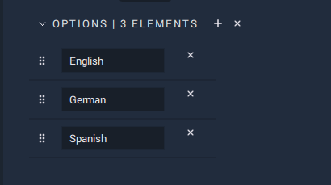

# Dropdown

The **Dropdown** is a **GUI** **2D Object** that allows the user to create a *dropdown menu*. The options in the menu, together with the colors and size, can be customized in the **Attributes**.

The following is a simple example of a **Dropdown** with three options:

The `Options` **Attribute** defines the options in the **Dropdown**:

Finally, this **Dropdown** looks like this when the **Project** is run:

## Attributes

### Transformation

The `Transformation` **Attributes** deal with placement, rotation, and size in *XY* space. More information can be found [here](../../attributes/common-attributes/transformation.md).

### Text

There are several **Attributes** here which help customize the textual elements of a **Dropdown**. 

`Font family` offers three different font types: `monospace`, `sans-serif`, and `serif`.

`Transform` can easily change certain text aesthetics without requiring the user to change the `Text` **Attribute** itself. `Capitalize` makes the first letter capital, `uppercase` makes all letters capital, and `lowercase` makes all letters lowercase.  

`Font size (px)` determines the size of the font in pixels.

`Line height (%)` determines the placement of the text within the **Dropdown**. 

`Font color` decides the color of the **Dropdown's** text.

### Dropdown

`Active index` determines which `Option` is shown at the front of the **Dropdown**. Remember that the first element has the index of 0. 

`Background Color`decides the color of the **Dropdown's** background.

`Options` provides the elements which will populate the **Dropdown**. Here there are three elements called `one`, `two`, and `three`. 

Because the `Active index` is set to 1, 'two' would be element shown at the front of the **Dropdown**. 

### Code

`Class names` contain the *CSS* class names of the **Object**. 

`Stylesheet` contains the *CSS* stylesheet of the **Object**.

### Tag

This **Attribute** manages the *tags* for the **Dropdown**. See more on *tags* [here.](../../attributes/common-attributes/tag.md)